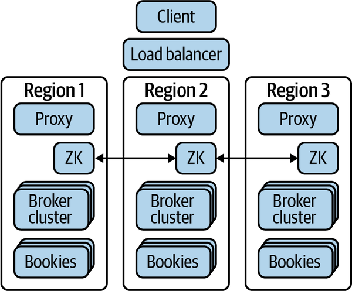
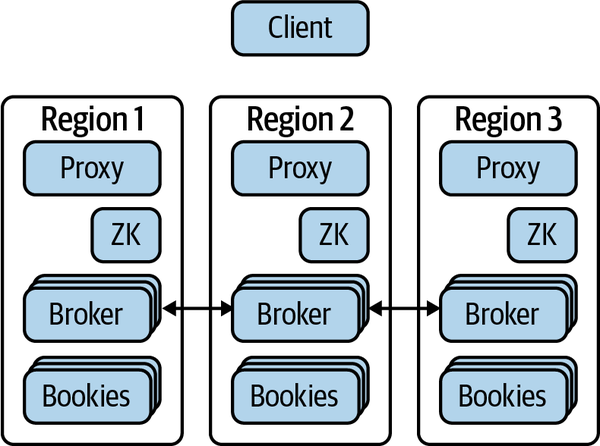
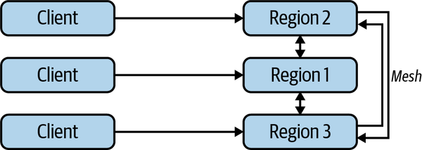
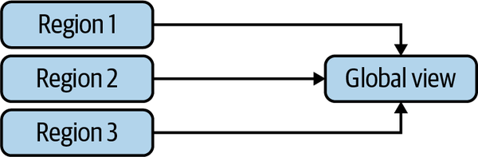
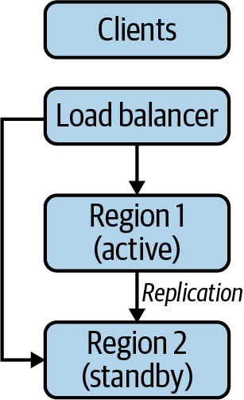
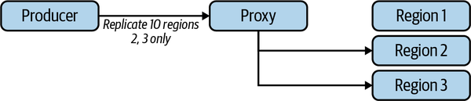

# Appendix C. Geo-Replication

Geo-replication is the process of replicating (copying) data across multiple regions or multiple datacenters. I didn’t talk much about geo-replication in the book because there is a considerable amount to cover on Pulsar and fitting this in was hard. I decided to include it in this appendix because I still feel it’s important. Typically, geo-replication has one of two motivating factors:

- Preparation for disaster recovery scenarios
- Localizing data or making global data available everywhere

Applications that run on the internet are subjected to many conditions by which they can fail. Applications run on physical hardware that sits in a datacenter. Datacenters[^i] can lose power, lose connectivity to the internet, be flooded, or have their hardware fail. The way datacenters combat these problems is by enabling applications to run across multiple datacenters (regions), or multiple places within a datacenter (availability zones). The datacenter can guarantee some level of reliability for each zone and also each region. By spreading your application across regions and zones, you can decrease the likelihood that you will encounter a failure that results in your applications being unavailable.

[^i]: When I say “datacenters” I mean either the public cloud or private datacenters.

Many companies that start on the internet start by serving one geographic audience. Typically, it is the audience in the country of their founding. As the company gains traction and looks to expand its footprint, it may open offices and offer its product outside its home country. Oftentimes, this expansion requires deploying the application in a local cloud environment to reduce latency for new customers. This physical split of the application between countries can have some lasting consequences for the company. In order to get a global view of what’s happening with its data, it may have to do expensive, cross-datacenter replication. What can be done about this?

Geo-replication in Pulsar is built to address these problems directly when it comes to storing data in Pulsar. In this appendix I’ll talk briefly about how geo-replication works and how to get started with it in Pulsar.

# Synchronous Replication

In synchronous replication, each cluster has its own brokers, geographically distributed bookies, and a proxy, but all share a geographically distributed ZooKeeper cluster (see [Figure C-1](https://learning.oreilly.com/library/view/mastering-apache-pulsar/9781492084891/app03.html#in_this_synchronous_replication_setupco)). This is because the managed ledger (a mapping of topics and where they are stored) is kept in ZooKeeper.



*Figure C-1. In this synchronous replication setup, the bookies are shared across regions and ZooKeeper manages the ledgers. All writes will wait until acknowledgment from BookKeeper is received.*


One thing you may notice about this replication setup is that every write requires full sync and replication across the bookies. As you can imagine, that can be a slower operation and round-trip latency can suffer. That said, consistency across all regions will be strong.

# Asynchronous Replication

In asynchronous replication, each cluster manages its own resources (bookies, ZooKeeper instances, and brokers), but the brokers communicate with one another to determine where to replicate their data. One important difference is that the brokers can write data to their local instance of BookKeeper before replicating it to the other brokers (see [Figure C-2](https://learning.oreilly.com/library/view/mastering-apache-pulsar/9781492084891/app03.html#in_this_example_of_asynchronous_replica)). This makes for a faster operation but eventually an inherently more consistent state.



*Figure C-2. In this example of asynchronous replication across Pulsar clusters, the brokers manage communication for syncing data across regions, making for a faster but more asynchronous experience.*


[Table C-1](https://learning.oreilly.com/library/view/mastering-apache-pulsar/9781492084891/app03.html#comparing_async_and_sync_approaches_to) provides a summary of the differences between the two replication approaches.

|                    | Async            | Sync       |
| :----------------- | :--------------- | :--------- |
| **ZooKeeper**      | Region           | Global     |
| **BookKeeper**     | Region           | Global     |
| **Brokers**        | Region           | Region     |
| **Sync mechanism** | Broker to broker | BookKeeper |
| **Consistency**    | Eventual         | Strong     |

# Replication Patterns

There are many ways to configure your cluster for replication. This section covers some of the more popular ones:

- Mesh
- Aggregation
- Standby
- Producer side

## Mesh

What most people think of with replication is synchronous replication, where every cluster has the same data as other clusters in the topology. In this method, clients can simply produce or consume from the closest geographic cluster and know their messages will be available to anyone in the cluster (see [Figure C-3](https://learning.oreilly.com/library/view/mastering-apache-pulsar/9781492084891/app03.html#in_this_mesh_replication_architectureco)).



*Figure C-3. In this mesh replication architecture, clients publish and consume from their nearest broker and replication is managed internally. Clients expect to always get a global state of the data within a time window.*


As discussed earlier, a mesh would be best accomplished with a synchronous approach to replication. You can expect some amount of read latency that you can measure with the metrics you learned about in [Chapter 12](https://learning.oreilly.com/library/view/mastering-apache-pulsar/9781492084891/ch12.html#operating_pulsar).

## Aggregation

For some cases, replication is about providing a combined view of several clusters. For many who work in data engineering, ETL is often the process of taking data from various sources and combining it into a single view. A company using Pulsar may have several independent clusters that serve specific geographic locations or use cases, but may need to replicate the data to a centralized Pulsar cluster for aggregated views and analytics. You can have independent clusters and route all of their data to a specific cluster (see [Figure C-4](https://learning.oreilly.com/library/view/mastering-apache-pulsar/9781492084891/app03.html#regions_operate_independent_pulsar_clus)).



*Figure C-4. Regions operate independent Pulsar clusters but replicate their data to a central cluster for a global view.*


Setting up this kind of aggregation can be managed by setting namespace- and cluster-level policies with the Admin API or Admin CLI:

```
/pulsar/bin/pulsar-admin tenants create E-payments \ #A 
--allowed-clusters us-west,us-east,us-central,internal 
/pulsar/bin/pulsar-admin namespaces create E-payments/us-east-payments #B 
/pulsar/bin/pulsar-admin namespaces create E-payments/us-west-payments 
/pulsar/bin/pulsar-admin namespaces create E-payments/us-central-payments 
/pulsar/bin/pulsar-admin namespaces set-clusters \ #C 
E-payments/us-east-payments --clusters us-east,internal 
/pulsar/bin/pulsar-admin namespaces set-clusters \ #D 
E-payments/us-west-payments --clusters us-west,internal 
/pulsar/bin/pulsar-admin namespaces set-clusters \ #E 
E-payments/us-central-payments --clusters us-central,internal
```

## Standby

So far, we’ve talked about cases where every cluster needs to receive data from the client. From a purely disaster recovery scenario, it is not needed or desired to have clients communicate with both clusters. For this scenario, we need one active cluster that is communicating with clients and another cluster in another region that is simply receiving and storing replicated data. A load balancer can be configured to accept traffic on the active cluster, and then Pulsar brokers can replicate data (either synchronously or asynchronously). In the event of a disaster, the standby cluster has most (in the async case) or all (in the sync case) of the data, and simply routing to the standby cluster and making it active will avert the disaster (see [Figure C-5](https://learning.oreilly.com/library/view/mastering-apache-pulsar/9781492084891/app03.html#an_active_cluster_receiving_messages_fr)).



*Figure C-5. An active cluster receiving messages from clients through a load balancer. In the case of a failure, the load balancer can route traffic to the standby cluster.*


## Admin- and Producer-Level Control

For one final note on geo-replication, let’s talk about how administrators and producers can control which namespaces and topics are replicated.

From the administrator side, we can determine which regions are part of our namespace:

```
$ /pulsar/bin/pulsar-admin namespaces set-clusters  
my-name-space --clusters us-east,us-west,turkey
```

In this command, I set `my-name-space` and assigned it to clusters located in `us-east`, `us-west`, and `turkey`. This gives me fine-grained control. Perhaps I don’t want to replicate every topic globally, or maybe there are laws forbidding data from leaving a certain geographic region.

From the producer level, I can also use my knowledge of available datacenters to restrict certain messages from going to a specific region. I can do so with the client library:

```
List<String> myDataCenterList = Lists.newArrayList("us-west", “us-east”); 
Message message = MessageBuilder.create() 
.setReplicationClusters(myDataCenterList) 
.build(); 
producer.send(message);
```

As someone who has worked with geo-replication in other technologies, I find it impressive that Pulsar gives you geo-replication control all the way down to the client (see [Figure C-6](https://learning.oreilly.com/library/view/mastering-apache-pulsar/9781492084891/app03.html#in_this_examplecomma_the_producer_choos)).



*Figure C-6. In this example, the producer chooses to replicate the message only to Regions 2 and 3. Region 1 does not get the message.*

# Summary

Apache Pulsar supports geo-replication via synchronous and asynchronous methods. Geo-replication is helpful for disaster recovery as well as building applications that share a global view of the data stored in BookKeeper. One thing that I hope was not lost in this appendix is the amount of administrative burden placed on operators of geo-replicated clusters. While the barrier to entry is lower than many other systems, it is much higher than managing a Pulsar cluster in a single region. The best way to get accustomed to geo-replication is practice. Tools like Kind make it easy to set up multiple Kubernetes clusters locally that you can use for replicating multiple regions. Additionally, using cloud platforms like AWS and Google Cloud offers the opportunity to deploy across multiple regions without much additional configuration.

