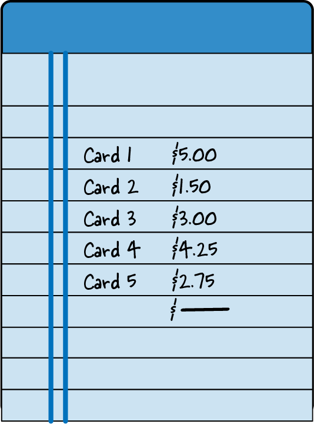
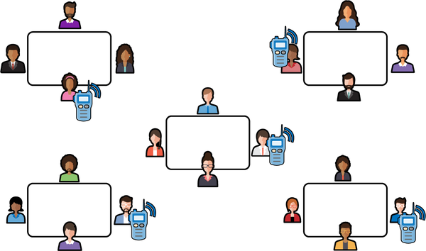
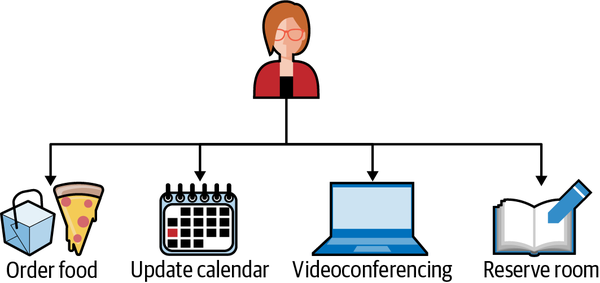
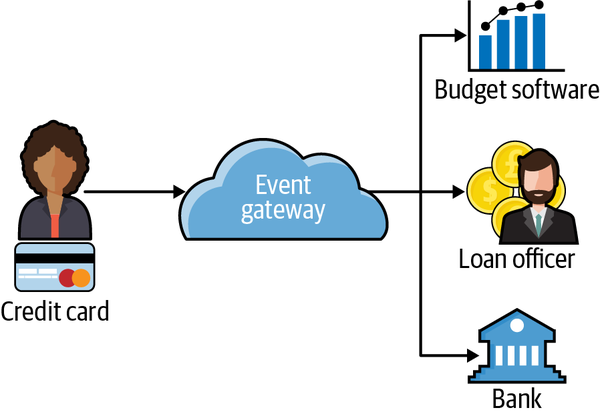
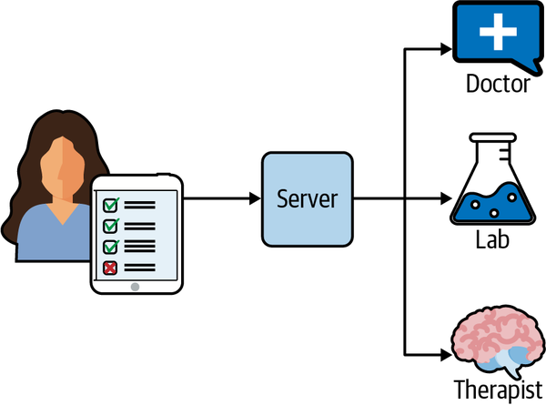
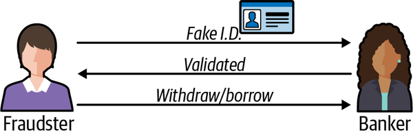
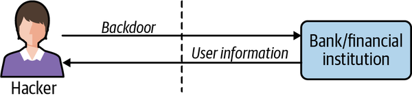
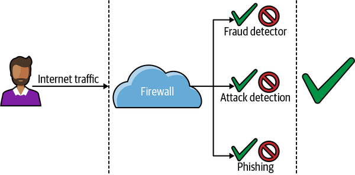
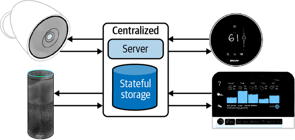

# Chapter 1. The Value of Real-Time Messaging

Real-time messaging systems power many of the systems we rely on today for banking, food, transportation, internet service, and communication, among others. They provide the infrastructure to make many of the daily interactions we have with these systems seem like magic. Apache Pulsar is one of these real-time messaging systems, and throughout this book, we’ll dig into what makes it unique. But first we’ll discuss the motivation for building systems like Pulsar so that you have some context for why we would take on the complexity of a real-time system with all of its moving parts.

# Data in Motion

When I was 11 years old, I started a small business selling trading cards in my school cafeteria. The business model was simple: I bought packs of Pokémon cards, figured out which ones were the most valuable through cross-checking on internet forums, and then attempted to sell them to other kids during lunch break. What started as an exciting and profitable venture soon turned into a crowded space with many other children entering the market and trying to make some spending money of their own. My daily take-home profit dropped from about $1 to 25 cents, and I thought about quitting the business. I talked to my stepfather about it one evening over dinner, looking for advice from someone who ran a small business too (although one that was much more profitable than mine). After listening to me intently, he absorbed what I said and took a deep breath. He explained that I needed a competitive advantage, something that would make me stick out in a space that was crowded with many other kids. I asked him what kinds of things would give me a competitive advantage, and he chuckled. He told me I needed to figure it out myself, and that when I did, I should come back and talk to him.

For weeks I puzzled over what I could be doing differently. Day after day I watched other children transact in the school cafeteria, and nothing came to me immediately. One day I talked to my friend Edgar, who watched all the Pokémon card transactions more intently than I did. I asked him what he was looking at, and he explained that he was keeping track of all the cards sold that day. He walked from table to table, holding a ledger (see [Figure 1-1](https://learning.oreilly.com/library/view/mastering-apache-pulsar/9781492084891/ch01.html#edgarapostrophes_ledger_included_the_pr)) and recording all the transactions he witnessed. Edgar let me look through his notebook, and I saw weeks’ worth of Pokémon card transactions. That’s when it dawned on me that I could use the data he collected to augment my selling strategy and figure out where there was an unmet demand for cards! I told Edgar to meet me after school to talk about the next steps and a business partnership.

*Figure 1-1. Edgar’s ledger included the price of each card sold.*

When school was out, Edgar and I met and came up with a game plan. I pulled out all of my cards, and we went through them and painstakingly created an inventory sheet. I cross-referenced my inventory with the sales Edgar had collected in his notebook. With this information, I felt confident we could be competitive with the other kids and undercut them where it made sense. Thanks to our new inventory and pricing model, Edgar and I spent the next three weeks selling lots of cards and making some money. But although during that time our daily profit slowly rose from 25 cents to around 50 cents, we still weren’t making my original profit of $1 per day, and now we had to share the revenues, which meant we were working much harder and making less money. We decided something had to give, and there had to be another way to make this process easier.

When Edgar and I talked about the limitations of our business, one aspect stuck out. There were only two of us, but there were five tables where kids sold Pokémon cards. Frequently, we would begin selling at the wrong table. Our cards were not the cards the kids at the table wanted to buy. We would miss out on the market opportunity for the day, and often for a week or more, while waiting for new customers. We needed a way to be at all five tables at once. Furthermore, we needed a way to communicate with each other in real time across the tables. Edgar and I schemed for a few days and came up with the plan depicted in [Figure 1-2](https://learning.oreilly.com/library/view/mastering-apache-pulsar/9781492084891/ch01.html#a_diagram_of_our_card-selling_schemedot).

*Figure 1-2. A diagram of our card-selling scheme. At each table, one member of our company had a walkie-talkie and we communicated the prices of transactions to one other over the walkie-talkie.*

We recruited three other students who were trying to break into the Pokémon card-selling market. We split the cards we wanted to sell evenly among the five of us, and each of us went to one of the five cafeteria tables attempting to sell the cards in our hand. Each of us also had a notebook and a walkie-talkie. When one of us overheard another kid negotiating the sale of one of their cards, that person would communicate the information to the other four in our group. We would all keep the same ledger of prices, and if someone in our group had the card of interest, the person at that table would offer it to the buyer at a lower price. With this strategy, we could always undercut the competition, and all five of us had a picture of the Pokémon card market for that day. Thanks to the new company strategy, our Pokémon card profits rose from 50 cents a day to $2.50 a day. Our teachers eventually shut down the business, and I haven’t sold Pokémon cards since.

This story illustrates the value of data in motion. Before we began collecting and broadcasting the Pokémon card sales, the data had little value. It did not have a material impact on our ability to sell cards. Our walkie-talkies and ledgers were a simple system that enabled us to communicate bids and asks in real time across the entire market. Armed with that information, we could make informed decisions about our inventory and sell more cards than we were able to before. While our real-time system only enriched me by a few quarters a day, the system’s principles enable rich experiences throughout modern life.

# Resource Efficiency

In my trading card business, one of the company’s significant advantages was the ability to collect data once and share it with everyone in the company. That ability enabled us to take advantage of sales at the cafeteria tables. In other words, it gave each person at a table a global outlook. This global outlook decentralized the information about sales and created redundancy in our network. Commonly, if one member of the crew was writing and missed an update, they could ask everyone else in the company what their current state of affairs was and they would be able to update their outlook.

While my trading card business was small and inconsequential in the larger scheme of things, resource efficiency can be a boon for companies of any size. When you consider modern enterprise, many events happen that have downstream consequences. Consider the simple meetings that every company has. Creating a calendar meeting requires scheduling time on multiple people’s calendars, reserving a room, setting up videoconferencing software, and often, ordering refreshments for attendees. With tools like Google Calendar, we can schedule a meeting with multiple people and coordinate it by simply clicking a few buttons and entering some information into a form (see [Figure 1-3](https://learning.oreilly.com/library/view/mastering-apache-pulsar/9781492084891/ch01.html#with_event-driven_architecturescomma_co)). Once that event is created, emails are sent, calendars are tentatively booked, pizza is ordered, and the room is reserved.

*Figure 1-3. With event-driven architectures, complex tasks like scheduling meeting invites across multiple participants become much easier.*

Without the platforms to manage and choreograph the calendar invite, administrative overhead can grow like a tumor. Administrators would have to make phone calls, collect RSVPs, and put a sticky note on the door of a conference room. Real-time systems provide value in other systems we use every day, from customer relationship management (CRM) to payroll systems.

# Interesting Applications

Resource efficiency is one reason to utilize a messaging system, but an enhanced user experience may ultimately be a more compelling reason. While the software we use serves a utilitarian purpose, enhancing the user experience can make it easier to complete our intended task as well as new and unintended tasks. The user experience can be enhanced through several methods. The most notable are 1) improving the design to make interfaces easier to navigate and 2) doing more on behalf of the user. Exploring the second of these methods, programs that perform on the user’s behalf can quickly and accurately take an everyday experience and turn it into something magical. Consider a program that automatically deposits money into your savings account when there is a credit in your checking account. Each time a check clears, the program uses the balance and other contexts regarding the account to deposit a certain amount of money in your savings account. Over time, you save money without ever feeling the pain of saving. Messaging systems are the backbone of systems like this one. In this section we will explore a few examples in more detail and discuss precisely how a messaging platform enables rich user experiences.

## Banking

Banks provide the capital that powers much of our economy. To buy a home or car and, in many cases, start a business, you will likely need to borrow money from a bank. If I were to be kind, I would best describe the process of borrowing money from a financial institution as excruciating. In many cases, borrowing money requires that you print out your bank statements so that the bank’s loan officers can get an understanding of your monthly expenses. They may also use these printouts to verify your income and tax returns. In many cases, you may provide bank statements, pay stubs, tax returns, and other documents to prequalify for a loan, and then provide the same copies two months later to get the actual loan. While this sounds superfluous in an era of technology, the bank has good reason to be as thorough and intrusive as possible.

For a bank, lending you six figures’ worth of money comes at considerable risk. By performing extensive checks on your bank statements and other documents, the bank reduces the risk of approving you for a loan. Banks also face significant regulations, and without a good understanding of your credit, they may face loss of licensing for failing to conduct due diligence. To modernize this credit approval system, we need to look at the problem through a slightly different lens.

When a customer prequalifies for a loan, the bank agrees it will lend up to a certain dollar amount contingent on the applicant having the same creditworthiness when they are ready to act on the loan. Typically, a software system connected to the bank will send notifications to the customer’s credit card companies for predetermined events (such as checking a customer’s credit). The bank is notified in real time if the customer does anything that will jeopardize the closing of the loan. Also, based on the customer’s behavior, the bank can update in real time how much the customer can borrow and have a clear understanding of the probability of a successful close. This end-to-end flow is depicted in [Figure 1-4](https://learning.oreilly.com/library/view/mastering-apache-pulsar/9781492084891/ch01.html#credit_card_usage_and_risk_are_communic). After the initial data collection for prequalification, a real-time pipeline of transactions and credit card usage is sent to the bank so that there are no surprises.

*Figure 1-4. Credit card usage and risk are communicated to many downstream consumers.*

This process is superior in many ways to the traditional process of completing a full application at both loan preapproval and approval. It reduces the friction of closing the loan (where the bank would make money) and puts the borrower in control. For the financial institution providing the real-time data, it’s just a matter of routing data used for another purpose for the lender. The efficiency gained and value provided from this approach is exact.

## Medical

Hospitals, medical staff, and medical software are under heightened scrutiny. This scrutiny often looks like compliance and authorization checks by affiliated government entities. When something goes wrong in the medical field, it can be much more devastating than losing money, as with our banking example. Mistakes in the medical field can cause permanent injury or death for a patient, the suspension or revocation of the practitioner’s medical license, or a sanction for a hospital. Because of this high level of scrutiny, even a routine visit to a doctor’s office can feel slow and inefficient in the best case and extremely frustrating in the worst case. There are many forms to fill out; there is a lot of waiting, and you are often asked the same questions multiple times by different people. Not only does this create inefficiency, it also translates into an expensive doctor’s visit.

How would a real-time system help the hospital? Some hospitals in Utah are trying to tackle this problem. The complaints these hospitals heard most often from patients concerned having to give their medical history more than once per visit. When a patient arrived for a visit, they would fill out a form with their health history. When they saw a medical assistant, they were asked many of the same questions they had already answered on the form. When they finally saw their doctor, they were asked the same questions again. The health history provides a reasonable basis for doctors to work from and can prevent common problems concerning misdiagnoses and prescriptions. However, collecting health history often comes at the cost of clinic time, which translates into a poor patient experience and extra work for the staff.

The software engineering department and health providers at these hospitals worked together to reimagine what a health history system should look like. Ultimately, they reengineered the patient record system to make it an event-driven, real-time system. Now when a patient arrives at one of these hospitals, they enter their information on a tablet (see [Figure 1-5](https://learning.oreilly.com/library/view/mastering-apache-pulsar/9781492084891/ch01.html#some_hospitals_automatically_publish_pa)). The data is saved to the patient record system, and three minutes before the scheduled appointment time the doctor receives a notification to log on and check the patient’s information. The doctor uses those three minutes to end the current appointment and start reading the next patient’s chart. When the doctor arrives in the patient’s room, they know everything they need to start a conversation with the patient about their care.

*Figure 1-5. Some hospitals automatically publish patient information to necessary parties, providing a better user experience.*

After the visit, if the patient needs to have any lab work or other tests performed, the doctor clicks a button and the test order is sent to the lab. Similarly, when the patient checks into the lab, their information is auto-populated. While initially designed to prevent duplication of collecting medical history, the system has had a far-reaching impact. Not only have these hospitals saved money, but the patient experience has improved dramatically.

## Security

For governments and private companies, fraud and hacking on the internet are costly problems without a one-size-fits-all solution. The hardest part of fighting hacking and fraud is the number of places or vectors an organization has to protect. Fraud can occur if the bank is unable to verify the identity or authorization of a member accurately (see [Figure 1-6](https://learning.oreilly.com/library/view/mastering-apache-pulsar/9781492084891/ch01.html#fraudster)). For example, if someone who isn’t the owner of an account convinces the bank they are, they can act as the account owner, withdrawing funds, taking out loans, or other nefarious behavior. Hacks can happen when an employee accidentally clicks on a phishing attempt link or an engineer applies the wrong policy to their code (see [Figure 1-7](https://learning.oreilly.com/library/view/mastering-apache-pulsar/9781492084891/ch01.html#hacker)). Defending against multiple attack vectors is expensive and requires specialized skills.

*Figure 1-6. A fraudster uses fabricated identification to fool the banker into thinking they are a legitimate client. The fraudster’s identity is confirmed and they use this access to legitimately withdraw funds.*

*Figure 1-7. A hacker gains entry to a financial institution through a backdoor (unauthorized channel). The hacker uses this backdoor to gain access to user data.*

Real-time systems can reduce some of the cost and overhead of protecting an organization against fraud and hacks. Many organizations require a specialized approach to each threat vector they face. They may use one vendor for their firewall, another to protect their email, and a third to manage their cloud computing policies. For many of these vendors, it’s not in their business interest to make their security products interoperable with other vendors’ products. Many of these vendors use the same data to detect different threats.

Some new product offerings in the market utilize the real-time nature of the data (internet traffic) and provide an all-in-one solution (see [Figure 1-8](https://learning.oreilly.com/library/view/mastering-apache-pulsar/9781492084891/ch01.html#moderncomma_real-time_fraud_detection_s)). These offerings treat each new connection as a threat. They use an event-driven system with machine learning, business logic, and other approaches to determine whether a particular request is safe. This approach is also modular, in that the vendor can customize the threat protection for each customer based on their needs. This approach is superior to the alternatives because it reuses data passing through the system and choreographs responses from multiple systems.

*Figure 1-8. Modern, real-time fraud detection systems treat each new connection as a threat.*

## Internet of Things

The use of smart speakers and other smart-home appliances has been on the rise around the world. With the broader availability of internet service and the lower cost of producing internet-connected devices, many first-time smart-device buyers have entered the market. In general, users of smart devices find utility in what these devices have to offer. I’ve been a smart-home enthusiast for many years now, and while each camera, sensor, and speaker has utility on its own, the utility they have when working together is hard to rival. Working together takes smart homes from many applications on a smartphone to a holistic system that can meet the user’s needs. Unfortunately, getting the devices from myriad manufacturers to work together can be difficult. For the manufacturers, it may not be in their best business interest to make their products interoperable with those of their competitors. There also may be sound technical reasons why a device doesn’t support a popular protocol. For a user, these decisions can be limiting and frustrating. I found these limitations too prohibitive and decided to build my own proprietary bridge for use with my consumer-grade smart-home products.

The majority of consumer-grade smart-home devices speak one of three protocols: Bluetooth, WiFi, or Zigbee. Most of us are familiar with Bluetooth; it is a commonly used protocol for connecting devices from computer keyboards and mice to hearing aids. Bluetooth doesn’t require any internet connectivity and is widely supported. WiFi is a wireless internet connectivity protocol. Zigbee is a low-energy communication protocol commonly used in smart-home devices.

Suppose you had 20 smart-home devices from different manufacturers, and each spoke either Bluetooth, WiFi, or Zigbee. If you wanted them all to work together to, say, monitor your home, it would not be easy to do. However, if you could build a bridge that would translate WiFi into Zigbee, Zigbee into Bluetooth, and so on, the possibilities would be endless. That’s the idea I worked with when designing the smart-home bridge in [Figure 1-9](https://learning.oreilly.com/library/view/mastering-apache-pulsar/9781492084891/ch01.html#a_diagram_of_my_smart_systemdot_each_de).

*Figure 1-9. A diagram of my smart system. Each device on the edge communicates with a different protocol but publishes its events to a centralized MQTT server which can choreograph the events.*

Each of my smart-home devices was event-driven, meaning that when an event occurred that was important to the device, the device would publish the event to a centralized server. For all the smart-home devices I owned, I could tap into their software and broadcast that same event to my event bridge. I use MQTT (Message Queuing Telemetry Transport), a lightweight messaging system designed for Internet of Things applications. Now, whenever an event occurs in my home (like a door opening), it will publish natively to the manufacturer’s platform as well as to my platform. I built a small event-processing platform that takes events posted to MQTT and performs actions when predefined criteria are met. For example, if a door opens but doesn’t close within two minutes, it will send a push notification to my wife. Or if the alarm system is armed and it detects someone is home, it will delay notification for a few seconds.

My smart-home system provides much more utility to me now that all the events are codified in a reusable way. That is the power of real time, and it’s also the power of event-driven architectures.

# Summary

In this chapter we explored examples of real-time and event-oriented systems in the real world. We used these systems to help motivate the need for a system like Apache Pulsar. In the upcoming chapters we’ll move from a high-level view of why we need Pulsar to a more detailed view based on programming and systems literature as well as real-world examples.