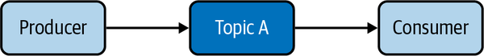
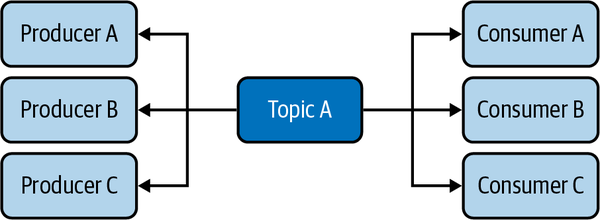
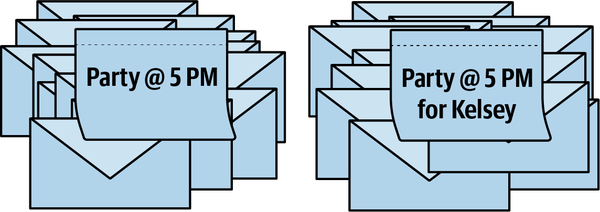
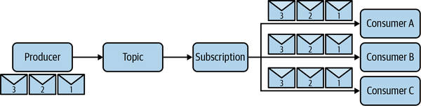
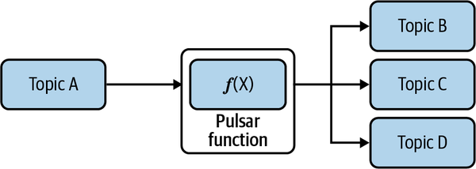

# Chapter 2. Event Streams and Event Brokers

Event streams and event brokers are at the heart of every real-time system. An *event stream* is an endless series of events. Let’s revisit the banking example in [Chapter 1](https://learning.oreilly.com/library/view/mastering-apache-pulsar/9781492084891/ch01.html#the_value_of_real-time_messaging). A borrower’s financial transactions can be considered an event stream. Each time a borrower uses their credit card, applies for a new line of credit, or deposits a check, those actions or events are appended to their event stream. Since the event stream is infinite, the bank can use it to return to any point in the borrower’s past. If the bank wanted to know what a borrower’s bank account looked like on a specific day in history, it could reconstruct that from an event stream. The event stream is a powerful concept, and when equipped with this data, it can empower organizations and developers to make life-changing experiences.

Event brokers are the technology platforms that store event streams and interact with clients that read data from or write data to event streams. Apache Pulsar is an event broker at heart. However, calling Pulsar *only* an event broker would minimize its scope and impact. To fully understand what makes Pulsar unique, it is beneficial to dive into some of the strengths and weaknesses of event brokers and their approaches to implementing event streams. This chapter will walk through some historical context and motivate a discussion around the need for Apache Pulsar.

# Publish/Subscribe

Developers across disciplines in software engineering commonly use the publish/subscribe pattern. At its core, this pattern decouples software systems and smooths the user experience of asynchronous programming. Popular messaging technologies like Apache Pulsar, Apache Kafka, RabbitMQ, NATS, and ActiveMQ all utilize the publish/subscribe pattern in their protocols. It’s worth jumping into this pattern’s history to understand its significance and build on why Pulsar is unique.

In 1987, Kenneth Birman and Thomas Joseph published a paper titled “Exploiting virtual synchrony in distributed systems” in the *ACM SIGOPS Operating Systems Review*.[^i] Their paper describes an early implementation of a large-scale messaging platform built on the publish/subscribe pattern. In their paper, the authors make a convincing case around the publish/subscribe pattern’s value. Specifically, they claim that systems implemented this way *feel* synchronous, even though they are inherently asynchronous. To illustrate this point more clearly, let’s dive into the publish/subscribe pattern with some examples.

[^i]: Kenneth Birman and Thomas Joseph, “Exploiting virtual synchrony in distributed systems,” *ACM SIGOPS Operating Systems Review 21*, no. 5 (November 1987): 123–138.


The idea of a subscription is commonplace in the 21st century. I have subscriptions to news services, entertainment, food delivery, loyalty programs, and many others. [Figure 2-1](https://learning.oreilly.com/library/view/mastering-apache-pulsar/9781492084891/ch02.html#the_publishsolidussubscribe_pattern_dec) is a simple illustration of a pub/sub pattern. I *subscribe* to goods for services from a retailer or entertainer, and they deliver me goods or services based on an agreement. The news services I subscribe to are the best way to illustrate a publish/subscribe pattern. I subscribe to a news service, and when a news source publishes a new article, I expect to receive it on my phone. In this example, you can consider my news service provider to be an event broker, the news publication to be a producer, and me to be a consumer. There are a few features in this relationship that are worth pointing out.



*Figure 2-1. The publish/subscribe pattern decouples software systems and smooths the user experience of asynchronous programming.*


First, there is no coupling between the news publication (publisher) and the subscriber (consumer). The news publication does not need to know that I’m a subscriber; they focus on writing articles and sending them to the news service. Similarly, I don’t need to know anything about the mechanisms of the news publication; the news service provides a reliable mechanism for publication and consumption. From a consumer perspective, promptly getting news on my phone feels magical. I can control how many messages I receive per day and what times I prefer to receive them. For the news publication, they can focus on producing quality news. Delivering the news to the right customers at the right time is managed by the news service.

The aha moment in the virtual synchrony paper was that the publish/subscribe pattern makes asynchronous workflows feel synchronous. [Figure 2-2](https://learning.oreilly.com/library/view/mastering-apache-pulsar/9781492084891/ch02.html#in_this_publishsolidussubscribe_topolog) depicts this model. Examining the interactions with my news service from all angles, it does feel synchronous. I don’t feel like I have to ask and wait for a relationship with my news publication; it just shows up when I need it. The publisher publishes their stories to the news service, and their stories are in users’ hands.



*Figure 2-2. In this publish/subscribe topology, there are multiple producers and consumers.*


The event stream implements a publish/subscribe pattern, but it has one critical distinction: the event broker must retain the same order for every subscriber. This distinction may not seem like much at first blush, but it enables a whole new way of using the publish/subscribe pattern. Consider our example of the news service. When a new customer signs up for the service, they will receive news articles in the future but likely will not receive all past messages onto their device on sign-up. Most messaging systems guarantee the delivery of a published message to a current subscriber and purposefully release messages that are already delivered. For an event stream, the event broker retains the entire history of data. When a new consumer subscribes to the event stream, they choose where they want to start consuming from (including the beginning of time).

# Queues

A queue is a different approach to a publish/subscribe pattern. In the publish/subscribe pattern discussed in the previous section, every subscriber to a topic receives a published message. In the queue model, only one subscriber will receive a message published to a topic. The queue model tackles a specific kind of publish/subscribe problem where each message in the queue is waiting on work to be completed, and the subscribers perform that work. Consider the process of being invited to a party (see [Figure 2-3](https://learning.oreilly.com/library/view/mastering-apache-pulsar/9781492084891/ch02.html#a_generic_invitation_is_shown_on_the_le)). An invitation to anyone who has access to them is analogous to a queue (left) and an invitation to a specific person is analogous to an event stream (right).

The queue model is more straightforward than the event stream model and works for a larger class of applications in which a client receives a work unit, then publishes the work unit to the messaging system, and a downstream consumer completes the work. Email, unsubscribing, deleting records, orchestration of events, and indexing are examples of this class of applications.



*Figure 2-3. A generic invitation is shown on the left and an invitation for a specific invitee (Kelsey) is shown on the right.*


Some messaging systems are purpose-built for the queue model. This class of messaging system is called a *work queue.* Work queues are designed for managing the workloads of programmatic processes. They have three purposes: 1) keep track of all the work to be done (a queue); 2) allow the appropriate worker to perform work; and 3) report back their completion (or lack thereof) of work. Beanstalkd is a widely used messaging system that is a work queue. Beanstalkd’s design is purposefully simple and doesn’t require the user to configure it. Let’s walk through an example in some more depth to get a better handle on Beanstalkd and the queue model.

Beanstalkd organizes work into logical lists called tubes. You can think of a tube as a queue; it is an ordered list of work to be completed, and it has a name. Inside a tube is a job; since Beanstalkd is a work queue, most of the language and concepts are aligned with *work.* Beanstalkd has *publishers*, or programmatic clients that are asking for work to be complete, and it has *subscribers*, or programmatic clients that are picking up work and then marking it as complete. Here is a simple Beanstalkd client publishing a new job to the “worka” tube:

```
// A python program that connects to a local instance of Beanstalkd and creates a
// job
import beanstalkc
beanstalk = beanstalkc.Connection(host='localhost', port=14711)
beanstalk.use('worka') 
beanstalk.put('my job 123')
```

Now that we’ve published work, we can connect to the same “worka” tube and complete the work:

```
import beanstalkc

beanstalk = beanstalkc.Connection(host='localhost', port=14711)
beanstalk.use('worka')
job = beanstalk.reserve() // reserves the job in the tube
job.body // prints "my job 123"
job.delete() // Deletes the job from beanstalkd, marking it was complete
```

In this model, the Beanstalkd server is responsible for keeping track of which jobs go to which tubes, but the consumer manages most of the complexity in the system. The consumer is responsible for the following:

- Reserving the work
- Marking the work as complete
- Resubmitting the work if it fails
- Maintaining a connection with Beanstalkd

In Beanstalkd, typically one job goes to one worker (subscriber).[^ii] When we zoom in on the purpose of the work queue, the decision to have a one-to-one relationship with a job and a consumer (worker) is reasonable. However, there are some implicit side effects of this queue model that we should explore in some more detail to understand the differences.

[^ii]: The Beanstalkd protocol explicitly states that one subscriber should consume a job. However, there are some hacks you can implement to ensure that multiple subscribers consume a job. For example, by simply never deleting a job, you can allow every subscriber to see that job once it’s released.


First, in the queue model (and specifically in the Beanstalkd API), we assume that when a job is complete there is no need for it anymore. In fact, in Beanstalkd, the worker should explicitly delete the job when it’s no longer being worked on. Second, there is no order preservation for the jobs. This means there is no guarantee that a job arriving at Beanstalkd would be processed in any specific or consistent order. For some applications it may be necessary to allow multiple subscribers to pick up the same job, and it may also be advantageous to have a way to follow how jobs arrived in the queue from a historical perspective.

# Failure Modes

Messaging systems can fail. They can fail to deliver messages to subscribers, they can fail to accept publishers’ messages, and they can lose messages in transit. Contingent on the system’s design and use, each failure can have varying degrees of severity. If we think back on the email examples earlier in this chapter, failure to deliver email can have a varying degree of severity. If you fail to receive your favorite email newsletter in your inbox on a given day, that is not the end of the world. You may spend your time on other, more fulfilling pursuits in the absence of the newsletter. But if a failure occurs in an ecommerce platform’s payment pipeline, and the ecommerce platform uses email messages to create *virtual synchrony*, it can prevent a user from receiving their products in the best case and bankrupt the business in the worst case. It’s essential to build a messaging platform that is resistant to failures.

Managing the three failures of message acceptance, message delivery, and message storage requires thoughtful design and wise implementations. We’ll discuss how Pulsar tackles these issues in the next chapter.

# Push Versus Poll

When a producer publishes a new message to a queue or event stream, the way that message propagates to consumers can vary. The two mechanisms for pushing that message to consumers are pushing and polling.

In the *push* model, the event broker pushes messages to a consumer with some predefined configuration. For example, the broker may have a fixed number of messages per period that it sends to a consumer, or it may have a maximum number of messages queued before it pushes them to the consumer. A majority of messaging systems today use a push mechanism because brokers are eager to move messages off their hands.

In an event system, queued messages have some value, but processing the messages is the system’s end goal. By eagerly pushing messages to available consumers, the event broker can rid itself of the responsibility for the message. However, as discussed in [“Failure Modes”](https://learning.oreilly.com/library/view/mastering-apache-pulsar/9781492084891/ch02.html#failure_modes), an event broker may try to push a consumer message and the consumer may be unavailable. This failure mode necessitates the event broker to retry or, in the queue case, move the message onto another consumer.

An alternative to the push model is the *poll* model. The poll model requires the consumer to ask the event broker for new messages. The consumer may ask for new messages after a configured time interval or may ask based on a downstream event. The advantage of this model is that the consumer is always ready to receive messages when it asks. The disadvantage is that the consumer may not receive messages on time or receive them at all.

# The Need for Pulsar

So far in this chapter we’ve talked about early systems developed to tackle messaging, and we’ve touched on systems like RabbitMQ, ActiveMQ, and Apache Kafka. These systems require a nontrivial number of resources to develop and a large community to remain viable in a developer market. Why do we need another one? Apache Pulsar addresses three problems that are not addressed by other event broker technologies:

- Unification of streaming and queues
- Modularity
- Performance

## Unification

The event stream requires an ordered sequence for messages. That ordered sequence enables the rich applications described in [Chapter 1](https://learning.oreilly.com/library/view/mastering-apache-pulsar/9781492084891/ch01.html#the_value_of_real-time_messaging) and is used in many of the applications you use every day. However, an event stream has specific semantics requiring consumers to manage how they process the stream’s events. What if an application doesn’t require the use of an ordered sequence? What if each client needed to get the next available event and was not concerned about its place in the stream?

Pulsar allows topics to be either a queue or an event stream, as depicted in [Figure 2-4](https://learning.oreilly.com/library/view/mastering-apache-pulsar/9781492084891/ch02.html#in_a_shared_subscriptioncomma_every_sub). This flexibility means a Pulsar cluster can provide the platform for all the interactions discussed in this chapter.



*Figure 2-4. In a shared subscription, every subscriber gets every message generated by the producer.*


## Modularity

We talked about the differences between the queue and event stream models of the publish/subscribe model. While these models differ enough to warrant different architectures, application developers are likely to need both models for building robust software. It’s not uncommon for software development teams to use one system intentionally designed for event streams and another for queueing. While this “best tool for the job” approach can be wise, it does have some downsides. One downside is the operational burden of managing two systems. Each system is unique in its maintenance schedule and procedure, best practices, and operations paradigm. An additional downside is that programmers have to familiarize themselves with multiple paradigms and APIs to write applications.

Pulsar is equipped for the queue and event stream models because of its modular design. In [Chapter 3](https://learning.oreilly.com/library/view/mastering-apache-pulsar/9781492084891/ch03.html#pulsar), we will walk through all the components of Pulsar in depth, but to motivate this discussion it’s worth talking about some of them now. Pulsar’s design keeps a clear separation between the various responsibilities of the system.

The following are some of Pulsar’s responsibilities:

- Storing data for finite periods for consumers
- Storing data for long periods for consumers
- Ensuring order in the topics

Pulsar’s short-term storage is managed by the Pulsar brokers. Pulsar’s long-term storage is handled by Apache BookKeeper. These choices enable a rich experience and make Pulsar suitable for a wide range of problems in the messaging space.

For a mature company, migrating from an existing messaging system like RabbitMQ, MQTT, or Kafka to Pulsar may be infeasible. Each of these platforms has a unique protocol, requires custom client libraries, and has a unique paradigm and vernacular. The process of migrating may take years for a sufficiently large organization. Fortunately, Pulsar can be used concurrently with these existing messaging systems, allowing organizations to use, say, Pulsar and RabbitMQ at the same time and slowly migrate their RabbitMQ topics to Pulsar, or keep both running side by side through the Pulsar bridge framework.[^iii] The Pulsar bridge framework provides a mechanism to translate messages from AMQP 0.9.1 (the protocol RabbitMQ uses) to Pulsar. In this model, the RabbitMQ applications can continue to use RabbitMQ and their AMQP 0.9.1 messages will convert to Pulsar protocol messages in the background. When the team is ready, they can start to consume their RabbitMQ messages from Pulsar where they left off.

[^iii]: We will cover Pulsar bridges in [Chapter 12](https://learning.oreilly.com/library/view/mastering-apache-pulsar/9781492084891/ch12.html#operating_pulsar).


The power of Pulsar’s modular design is also evident in its ecosystem. Pulsar supports Functions as a Service (see [Figure 2-5](https://learning.oreilly.com/library/view/mastering-apache-pulsar/9781492084891/ch02.html#pulsar_functions_are_a_built-in_runtime)), as well as the ability to use SQL with Pulsar topic data and change data capture (CDC) with minimal configuration. Each of these features provides additional building blocks and tools for creating rich, event-driven applications.



*Figure 2-5. Pulsar Functions are a built-in runtime for stream processing in Pulsar.*


## Performance

Thus far, we have discussed three critical components of a quality event broker. The broker needs to 1) reliably store data, 2) reliably deliver messages to consumers, and 3) quickly consume messages from publishers. Performing these three tasks well requires thoughtful design and optimized resource utilization. All event brokers have to work through the same disk speed, CPU, memory, and network limitations. In further chapters, we’ll get into more detail around the design considerations in Apache Pulsar, but for now let’s take a look at how some of them enable exceptional performance and scalability.

In [“Modularity”](https://learning.oreilly.com/library/view/mastering-apache-pulsar/9781492084891/ch02.html#modularity-id000009), we discussed Pulsar’s modular approach to storage by using Apache BookKeeper. We focused on how this choice enables features to archive and retrieve Pulsar data. Pulsar administrators can grow the size of the BookKeeper cluster separately from the Pulsar event broker nodes. The storage needs may change during a day, month, or year within a messaging platform. Pulsar enables the flexibility to scale up storage more comfortably with this design decision. When it comes to reliability concerns about storing data, the storage systems’ scalability is a significant factor.

Reliability in the consumption of messages is contingent on the event broker being able to consume the volume of messages sent its way. If an event broker can’t keep up with the volume of messages, many failure scenarios may follow. Clients connect to Pulsar via the Pulsar protocol and connect to a Pulsar node. Since Pulsar nodes can scale separately from the BookKeeper cluster, scaling up consumption is also more flexible.

Finally, what about raw performance? How many messages can a Pulsar cluster consume per second? How many can it securely store in the BookKeeper cluster per second? There are many published benchmarks[^iiii] on Apache Pulsar and its performance, but you should take every benchmark with a grain of salt. As mentioned earlier in this chapter, every messaging system has constraints. The engineers who design these systems take advantage of their unique knowledge and circumstances. Therefore, designing benchmarks that fairly assess the performance of each platform is often an exercise in futility. That said, Apache Pulsar has a reputation for being a performant platform, and hundreds of companies have chosen Pulsar to manage their event streaming platforms.

[^iiii]: For example, see [*Benchmarking Apache Kafka, Apache Pulsar, and RabbitMQ: Which Is the Fastest?*](https://oreil.ly/b67QJ); [*Benchmarking Pulsar and Kafka—A More Accurate Perspective on Pulsar’s Performance*](https://oreil.ly/uewER); and [*Performance Comparison Between Apache Pulsar and Kafka: Latency*](https://oreil.ly/u4DpP).

# Summary

In this chapter you acquired the foundational knowledge needed to understand Pulsar’s value proposition and uniqueness. From here, we’ll pull apart all of Pulsar’s components to gain a deep understanding of the basic building blocks. With that knowledge, you’ll be ready to dive deep into the APIs and start building applications.

