# Chapter 4. Pulsar Internals

So far, we’ve discussed the motivation for using a system like Apache Pulsar, the historical context in which Pulsar was created, and some companies that use Pulsar to power their systems. Now we have sufficient context to pull the covers from Pulsar and explore the components and, more important, why they work together. We’ll start by looking at each of Pulsar’s components (see [Figure 4-1](https://learning.oreilly.com/library/view/mastering-apache-pulsar/9781492084891/ch04.html#pulsarapostrophes_components_include_no)): namely Pulsar brokers, Apache BookKeeper, and Apache ZooKeeper. Then we’ll take a look at a standard technology used across all three of these projects: the Java programming language and the Java virtual machine.


*Figure 4-1. Pulsar’s components include nodes, Apache BookKeeper, and Apache ZooKeeper.*

# Brokers

As noted earlier, Pulsar’s modularity allows the system to separate its responsibilities and select the best technology to handle each one. One of Pulsar’s responsibilities is to provide an interface so that publishers and subscribers can connect to it.

Pulsar brokers handle this as well as the following tasks (see [Figure 4-2](https://learning.oreilly.com/library/view/mastering-apache-pulsar/9781492084891/ch04.html#pulsar_nodes_have_an_underlying_impleme)):

- Temporary management of topic data storage
- Communication with Apache BookKeeper and ZooKeeper
- Schema validation
- Inter-broker communication
- Runtime environments for Pulsar Functions and Pulsar IO


*Figure 4-2. Pulsar nodes have an underlying implementation in Java on the Java virtual machine. Pulsar Functions and Pulsar IO are also implemented in Java. Pulsar supports several HTTP and TCP points for communication within the cluster.*


Let’s take a closer look at Pulsar brokers.

## Message Cache

Pulsar brokers are stateless, in that they do not store any data on the Pulsar broker disks that are used in the message lifecycle. Pulsar is unique among message brokers in this approach, as most similar systems couple the storage and retrieval of messages in some way. Being stateless has advantages as well as disadvantages. The disadvantages are that another system is required to take on state management and some abstractions are required to translate from Pulsar’s storage needs to the storage system. The advantages are that storage requirements are separate from compute requirements and that a more fault-tolerant storage layer results.

If Pulsar brokers were responsible for storing the state of topics on the broker, a number of questions would arise regarding how to store data on the brokers and how to handle failure scenarios.

Since we’re just beginning our journey with Pulsar, let’s keep it simple and explore just the following three considerations:

- Storing data
- Adding new nodes to the cluster
- Removing nodes from the cluster

In [Chapter 3](https://learning.oreilly.com/library/view/mastering-apache-pulsar/9781492084891/ch03.html#pulsar), we discussed what storing data in a distributed system looks like in terms of storage and retrieval for a low-volume system. A high-volume system has even more things to consider when it comes to how data is distributed across nodes and how events like losing a node impact the entire system. Instead of taking on the complexity of understanding the storage problem, Pulsar chose to rely on Apache BookKeeper for storage and to use the brokers as stateless orchestrators of the storage.

Pulsar uses an abstraction on top of BookKeeper, called a managed ledger. The managed ledger works as a bridge between the messages that Pulsar brokers need to store and the ledgers in BookKeeper (covered later in this chapter). You can think of ledgers as the highest storage abstraction in BookKeeper. The managed ledger is an API that keeps track of the ledger sizes and states and when it’s time to start a new ledger.

[Figure 4-3](https://learning.oreilly.com/library/view/mastering-apache-pulsar/9781492084891/ch04.html#in_this_apache_pulsar_clustercomma_book) shows a typical topology of a Pulsar topic. Broker 1 is responsible for topic reads and writes. For reads, it writes to all the BookKeeper instances (main servers, or bookies) that are part of the ensemble for the topic; for reads, it requests data from the leader for that ledger. The managed ledger manages that interface. Does this mean that for every write Pulsar broker has to retrieve data from the bookies? Not exactly. Pulsar brokers have a managed ledger cache that allows some messages to be cached on the broker for a consumer.


*Figure 4-3. In this Apache Pulsar cluster, bookies store data from the topic.*

In a streaming context, each message needs to be written to BookKeeper. Instead of writing to BookKeeper and reading from it for an active consumer, Pulsar brokers can simply tail the latest events directly to an active consumer. This avoids making round trips to BookKeeper, as depicted in [Figure 4-4](https://learning.oreilly.com/library/view/mastering-apache-pulsar/9781492084891/ch04.html#a_pulsar_broker_can_tail_the_latest_eve).


*Figure 4-4. A Pulsar broker can tail the latest events directly to an active consumer.*

It’s important to remember that even though the managed ledger can cache values for consumers that are subscribed to the topic, the cache is only a cache (see [Figure 4-5](https://learning.oreilly.com/library/view/mastering-apache-pulsar/9781492084891/ch04.html#the_managed_ledger_cache_is_a_configura)). Caches are ephemeral and are created and destroyed easily. They are not supposed to be permanent data stores, as data that is stored in a cache is a convenience but also a potential headache. Fortunately, Pulsar brokers have a limited scope in which they cache data. In Chapters [5](https://learning.oreilly.com/library/view/mastering-apache-pulsar/9781492084891/ch05.html#consumers) and [6](https://learning.oreilly.com/library/view/mastering-apache-pulsar/9781492084891/ch06.html#producers) you’ll learn more about Pulsar’s messaging lifecycle.


*Figure 4-5. The managed ledger cache is a configurable cache kept by the Pulsar broker. It stores a ledger of data stored in BookKeeper and keeps an interface to write to BookKeeper.*

## BookKeeper and ZooKeeper Communication

As discussed in this chapter’s introduction, Pulsar nodes work in conjunction with BookKeeper and ZooKeeper as the messaging platform’s backbone. Not surprisingly, Pulsar brokers need to communicate with ZooKeeper and BookKeeper for topic management and other configuration values. How and when this communication takes place is fully managed by the Pulsar brokers. It’s worth taking some time to better understand when brokers communicate with BookKeeper and ZooKeeper.

ZooKeeper stores all metadata related to the Pulsar cluster. This includes metadata about which broker is the leader for a topic, configuration values for service discovery, and other administrative data. Much of the data stored in ZooKeeper is cached on the Pulsar nodes, and there is a configuration-driven lifecycle about when to pull new data from ZooKeeper. Communicating with ZooKeeper is a constant part of Pulsar’s lifecycle.

As discussed in previous sections, BookKeeper is the storage engine in Pulsar. All message data is stored in Pulsar. Every message stored and retrieved from Pulsar requires communication with BookKeeper. BookKeeper’s communication interfaces are covered in more detail in [Chapter 12](https://learning.oreilly.com/library/view/mastering-apache-pulsar/9781492084891/ch12.html#operating_pulsar).

## Schema Validation

Schema validation is the process of ensuring that new messages published to a Pulsar topic adhere to a predefined shape. To ensure that a message adheres to a schema, Pulsar brokers work with the Pulsar schema registry to perform that validation. The lifecycle of schema validation is covered in [Chapter 6](https://learning.oreilly.com/library/view/mastering-apache-pulsar/9781492084891/ch06.html#producers); however, the responsibility of ensuring schema is significant and falls squarely on the brokers, so we’ll discuss it briefly here.

Brokers handle schema validation in two key ways. First, they are the point of ownership for schemas as they relate to topics. Brokers answer the following questions:

- Does this topic have a schema associated with it?
- What is the schema associated with the topic?
- Does this schema require that new messages adhere to the schema?

Also, brokers can ensure validation of in-flight messages. Schema validation is an important part of end-to-end messaging systems, and Pulsar brokers serve this purpose, among others.

## Inter-Broker Communication

As mentioned previously, brokers are responsible for the reads and writes of specific topics. It is possible for a client to request data from a broker that is not responsible for that topic. What happens in this case? [Figure 4-6](https://learning.oreilly.com/library/view/mastering-apache-pulsar/9781492084891/ch04.html#broker_one_is_not_the_leader_for_topic) depicts this. Each broker uses metadata stored in ZooKeeper to determine whether it is the leader (the one responsible for the topic) and, if it is not the leader, who the leader is. The broker may route the client to the correct broker to start publishing (or retrieving) messages.


*Figure 4-6. Broker 1 is not the leader for Topic A and therefore redirects the producers to the correct topic.*

## Pulsar Functions and Pulsar IO

At the beginning of this section, I stressed the importance of modularity in Pulsar’s design. In the sections that followed, you learned how much responsibility falls on the brokers. It may have occurred to you that perhaps Pulsar’s design could be more modular. It’s important to remember two things when considering modularity. First, does it make sense to remove the responsibilities from the brokers and put them elsewhere? And second, would moving those responsibilities elsewhere necessarily improve Pulsar as far as reliability and scalability are concerned? As a general rule, the answer to both questions is no. The exceptions to this rule are Pulsar IO and Pulsar Functions.

Pulsar as a project provides some easy methods for getting started with the base Pulsar brokers as well as extensions such as Pulsar Functions and Pulsar IO. You can use Pulsar Functions or Pulsar IO for a new Pulsar user without additional overhead or difficulty. The limiting factor to this convenience is that brokers are the primary source for throughput in Pulsar. How many messages a cluster can ingest per second is highly influenced by a broker’s availability. If the broker is busy processing Pulsar Functions or Pulsar IO tasks, it will impact the entire system’s performance.

In many cases this performance degradation won’t be problematic, but for sufficient scale, moving your Pulsar IO or Pulsar function to another cluster would be an improvement. Fortunately, Pulsar provides a mechanism for precisely this.

# Apache BookKeeper

[Apache BookKeeper](https://oreil.ly/dOm7v) is a general-purpose data storage system. BookKeeper, like Pulsar and ZooKeeper, was developed at Yahoo! in the 2010s to meet the following requirements:

- Write and read latencies of < 5 ms
- Durable, consistent, and fault-tolerant data storage
- Read data as it is written
- Provide an interface for real-time and long-term storage

BookKeeper is an ambitious project, aimed at building primitives for storage that could work for a wide number of projects and long into the future. BookKeeper is written in Java and heavily utilizes Apache ZooKeeper (which we’ll cover later in this chapter). [Figure 4-7](https://learning.oreilly.com/library/view/mastering-apache-pulsar/9781492084891/ch04.html#bookies_are_servers_where_data_is_store) shows BookKeeper’s architecture. The main servers are called bookies, and they can be arranged as a cluster (ZooKeeper can be arranged in the same way). The bookies contain an underlying storage system called a ledger.


*Figure 4-7. Bookies are servers where data is stored (on a ledger). Apache ZooKeeper (ZK) manages service discovery and coordination among the bookies.*

How do you go about building a system with the performance requirements and durability promised by Apache BookKeeper? The breakdown of requirements from a high level is as follows:

- A simple semantic for storing data
- A fault-tolerant way to distribute the storage of data across nodes
- An easy way to recover from any individual node failure

Starting with the first requirement, Apache BookKeeper implements an append-only log called a *ledger.* A ledger consists of arbitrary data called *entries.* A sequence of ledgers is called a *stream* (see [Figure 4-8](https://learning.oreilly.com/library/view/mastering-apache-pulsar/9781492084891/ch04.html#a_high-level_view_of_bookkeeper_storage))*.*

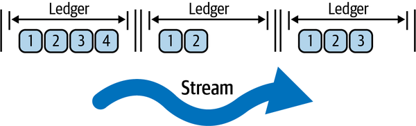

*Figure 4-8. A high-level view of BookKeeper storage. The stream is a collection of ledgers, and ledgers are composed of smaller entries.*

Creating entries and ledgers with the Apache BookKeeper Java client is simple as well. BookKeeper has two Java APIs: the BookKeeper Ledger API and the Advanced Ledger API. The BookKeeper Ledger API is lower level, focused on allowing the user to interact directly with ledgers. The Advanced Ledger API provides some additional features that give the user more fine-grained control around quorum configuration (covered shortly) and other aspects of transaction safety for BookKeeper. For our purposes, we’ll do a few things with the Ledger API to illustrate what it might look like to interact with BookKeeper directly.

We’ll perform these operations:

- Create a new BookKeeper client
- Create a ledger
- Write entries to the ledger
- Close the ledger
- Reopen the ledger
- Read all entries

To begin, take a look at the following code:

```
// Create a client object for the local ensemble.
BookKeeper bkc = new BookKeeper("localhost:2181");

// A password for the new ledger
byte[] ledgerPassword = /* a sequence of bytes */;

// Create a new ledger and get identifier
LedgerHandle lh = bkc.createLedger(BookKeeper.DigestType.MAC, ledgerPassword);
long ledgerId = lh.getId();

// Create a buffer for ten-byte entries
ByteBuffer entry = ByteBuffer.allocate(10);

int numberOfEntries = 100;

// Add entries to the ledger, then close the ledger
for (int i = 0; i < numberOfEntries; i++){
      entry.putInt(i);
      entry.position(0);
      lh.addEntry(entry.array());
}
lh.close();

// Reopen the ledger
lh = bkc.openLedger(ledgerId, BookKeeper.DigestType.MAC, ledgerPassword);

// Read all entries
Enumeration<LedgerEntry> entries = lh.readEntries(0, numberOfEntries - 1);

while(entries.hasMoreElements()) {
      ByteBuffer result = ByteBuffer.wrap(ls.nextElement().getEntry());
      Integer retrEntry = result.getInt();

    // Get all entries printed
    System.out.println(String.format("Result: %s", retrEntry));
}

// Close the ledger and stop the client
lh.close();
bkc.close();
```

The preceding code gives us significant context to move on to the second question we laid out, which is how do we store segments across multiple nodes?

Apache BookKeeper uses quorum-based replication to manage the problem of distributing data across nodes. The protocol has some complexities, but we can focus on the main aspect of it to better understand how it relates to Pulsar topics.

The BookKeeper protocol requires the following for every ledger:

- The ensemble size (`E`)

  Represents the number of bookies the ledger will be stored on.

- The quorum write size (`Q_w`)

  Represents the number of nodes each entry will be written to.

- The quorum acknowledgment (ack) size (`Q_a`)

  Represents the number of nodes an entry must be acknowledged by.

In general, the ensemble has to be greater than or equal to the quorum write size. This is a sensible requirement because you can’t have more bookies that accept a new ledger than there are in the entire cluster. Also, the quorum ack size must be less than or equal to the quorum write size. This also makes sense because, at a minimum, you want every write node to acknowledge the write of a new entry, but reducing the number of nodes required to acknowledge new entries might increase overall performance without having any impact on the redundancy or safety of the data.[^i]

[^i]:  If you have a significantly large write size, then even if one node fails to receive a write the data is replicated by enough nodes for a recovery in the event of a node failure.


It may be helpful to walk through a few examples. [Figure 4-9](https://learning.oreilly.com/library/view/mastering-apache-pulsar/9781492084891/ch04.html#this_bookkeeper_quorum_has_four_ledgers) depicts a BookKeeper configuration in which the ensemble size is 3, the quorum write size is 3, and the quorum ack size is 3. Each new ledger is written to every bookie and every bookie must acknowledge their writing.


*Figure 4-9. This BookKeeper quorum has four ledgers (represented as squares) and an ensemble size of 3, a quorum write size of 3, and a quorum ack size of 3.*


[Figure 4-10](https://learning.oreilly.com/library/view/mastering-apache-pulsar/9781492084891/ch04.html#this_bookkeeper_example_has_an_ensemble) depicts an ensemble of 5, with a quorum write size of 3 and a quorum ack size of 3. In this scenario, each ledger is written to only three bookies.

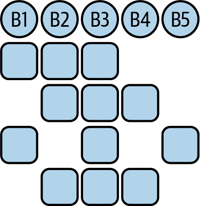

*Figure 4-10. This BookKeeper example has an ensemble of 5, with a quorum write size of 3 and a quorum ack size of 3.*


Now that you know a bit about BookKeeper’s storage internals, let’s take a step back and examine some of the new terminology and ideas I just introduced.

Quorums are used a lot in organizational contexts, but in distributed system contexts, a quorum is simply a group of processes. For BookKeeper, quorums are used for ledger management, but they are also used as a mechanism for keeping track of which bookies are the leaders for a given segment. We won’t get into the topic of leader election here, but [Figure 4-11](https://learning.oreilly.com/library/view/mastering-apache-pulsar/9781492084891/ch04.html#leader_election_in_bookkeeperdot_bookie) provides a decent high-level overview of the concept.

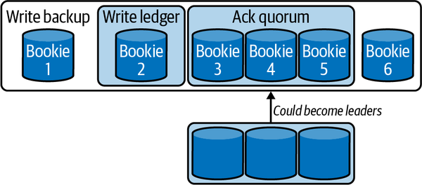

*Figure 4-11. Leader election in BookKeeper. Bookies are leaders for segments and can be removed or changed by a new leader election event.*


Now that you understand the basics of storage, you’ll notice that BookKeeper provides the basic building blocks for storing data and keeping it safe. A single bookie may contain a fragment of a ledger, and that fragment is replicated across several bookies. [Figure 4-12](https://learning.oreilly.com/library/view/mastering-apache-pulsar/9781492084891/ch04.html#fragments_left_parenthesisparts_of_ledg) shows what this might look like for three ledgers across three bookies.

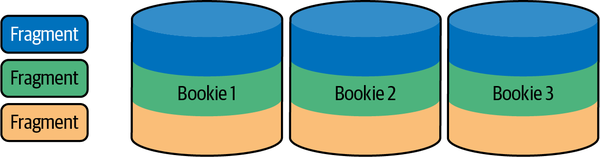

*Figure 4-12. Fragments (parts of ledgers) are stored across different bookies in a BookKeeper ensemble.*


The design and storage primitives in BookKeeper make it suitable for complex ledgers that can span an ever-increasing number of bookies, as depicted in [Figure 4-13](https://learning.oreilly.com/library/view/mastering-apache-pulsar/9781492084891/ch04.html#this_bookkeeper_ensemble_has_several_fr).


*Figure 4-13. This BookKeeper ensemble has several fragments spanning bookies.*


You may be wondering how this system benefits Apache Pulsar. Topics (the fundamental message storage paradigm in Pulsar) are implemented on BookKeeper. In a system where every message is critical, BookKeeper makes it virtually impossible[^ii] to lose any messages. Additionally, BookKeeper ledgers are an append-only log. As such, it’s the perfect primitive for storing data for an event streaming system, as discussed in [Chapter 2](https://learning.oreilly.com/library/view/mastering-apache-pulsar/9781492084891/ch02.html#event_streams_and_event_brokers).

[^ii]: A poorly configured cluster can lose data.


[There is a lot more to BookKeeper](https://oreil.ly/JgpTL), but hopefully this section provided some insight into its elegance. Storage of Pulsar messages is one use case for BookKeeper; let’s explore a few others to solidify our understanding.

## Write-Ahead Logging

A write-ahead log (WAL) is used to provide atomicity and durability in a database system. This book isn’t about databases, but the WAL is a critical concept to understand in order to grasp the value of BookKeeper. If you think about a database table, you can perform actions such as inserts, updates, selects, and deletes. When you perform an insert, update, or delete, the database writes your desire to perform that action to a log (see [Figure 4-14](https://learning.oreilly.com/library/view/mastering-apache-pulsar/9781492084891/ch04.html#in_this_write-ahead_log_implementationc)). The database can then check against the log to validate it performed the action intended by the user. WALs are not only useful for ensuring guarantees in databases; they are also used for change data capture (CDC). Pulsar IO utilizes WALs in databases to perform CDC (we’ll cover this in [Chapter 7](https://learning.oreilly.com/library/view/mastering-apache-pulsar/9781492084891/ch07.html#pulsar_io-id000027)).


*Figure 4-14. In this write-ahead log implementation, each new event is written to a log before it is executed on the underlying database storage engine.*


BookKeeper’s durability properties, fault tolerance, and scalability make it the right choice for a WAL implementation. Additionally, BookKeeper can scale separately from the database if needed, providing modularity and loose coupling.

## Message Storing

Every messaging system has some implementation for storing messages temporarily. A message broker’s value is in the reliable transport of messages, after all. How we implement that storage will have some downstream consequences on how the data can be used later. For systems like Pulsar, Kafka, and Pravega, message durability is paramount. BookKeeper’s model of ledger storage is the perfect abstraction for storing an event stream (see [Figure 4-15](https://learning.oreilly.com/library/view/mastering-apache-pulsar/9781492084891/ch04.html#this_topic_has_sequential_data_written)).


*Figure 4-15. This topic has sequential data written to BookKeeper ledgers.*


Following are some of the properties that make BookKeeper a good solution for event stream data:

- Append-only logging
- Highly durable
- Easily distributed

## Object/Blob Storage

Object stores allow the storage of arbitrarily large objects for future retrieval. Systems like Amazon S3, Google Cloud Storage, and Azure Blob Storage are popular because they offer a simple API to store and retrieve items from the cloud. In cloud systems, object storage is used for storing images, arbitrary files on behalf of users, and large data lakes. Implementing an object store requires elasticity, or the ability to add new nodes to the cluster without disrupting ongoing operations. It also requires fault tolerance; if nodes in the cluster fail, there should be a reliable backup in the cluster somewhere. In addition, it requires the ability to store and retrieve objects of all kinds. Apache BookKeeper can perform all these tasks and can perform them well. BlobIt is an object store built on top of BookKeeper. It allows for the storage of arbitrarily large objects, and all of the storage is managed with BookKeeper. A user can send a CSV file to BlobIt and the file will be stored on BookKeeper as depicted in [Figure 4-16](https://learning.oreilly.com/library/view/mastering-apache-pulsar/9781492084891/ch04.html#you_can_store_a_csv_file_on_bookkeeper).


*Figure 4-16. You can store a CSV file on BookKeeper for use as a general-purpose object store.*


While BookKeeper can store arbitrarily large data, the complexity in using it as an object store is in managing the movement of the data to and from bytes. BlobIt relies on the distributed and fault-tolerant nature of BookKeeper, and adds value by making an Amazon S3–compliant API.

## Pravega

Pravega is a distributed messaging system that has a lot of similarities to Pulsar. Developed at Dell, Pravega builds on the concept of a stream as the fundamental building block for storage. Pravega uses BookKeeper in a similar way to Pulsar (see [Figure 4-17](https://learning.oreilly.com/library/view/mastering-apache-pulsar/9781492084891/ch04.html#pravega_architecturedot_similar_to_apac)): storing all topic and cursor data. Like Pulsar, BookKeeper enables Pravega to scale storage and message throughput independently, and it provides durability for and fault tolerance within a Pravega cluster.


*Figure 4-17. Pravega architecture. Similar to Apache Pulsar, Pravega uses BookKeeper for long-term storage, uses ZooKeeper for distributed coordination, and has some responsibilities that are owned by the Pravega servers.*


An additional interesting tidbit about Pravega is that its use cases extend beyond just event streaming data (an area that Pulsar is focused on). Pravega is also suitable for streaming video data and large files. As mentioned previously*,* you can store any data on BookKeeper; the challenges lie in how that data is presented and how end users interact with it.

## Majordodo

Majordodo is a resource manager that handles the scheduling of bespoke workloads on ephemeral clusters. Majordodo tracks the resources used in a cluster, the available resources in a cluster, and other metadata about jobs running in a cluster (see [Figure 4-18](https://learning.oreilly.com/library/view/mastering-apache-pulsar/9781492084891/ch04.html#a_majordodo_clusterdot_bookkeeper_manag)). [Majordodo](https://oreil.ly/kh1T4) utilizes BookKeeper ledgers to track the starting, running, and completion of jobs on the cluster. Since BookKeeper provides low read and write latencies, scheduling workloads is a novel but worthy use. Majordodo is developed and maintained by Diennea, a technology company that helps build scalable digital brand solutions.


*Figure 4-18. A Majordodo cluster. BookKeeper manages data storage for each node so that any node in the cluster can pick up work or distribute existing work.*


In the preceding sections, we spent a lot of time talking about the importance and use cases for BookKeeper. ZooKeeper works in conjunction with BookKeeper and plays a different but equally important role in Pulsar and in the wider software ecosystem. ZooKeeper is discussed in the next section.

# Apache ZooKeeper

Apache ZooKeeper was developed at Yahoo! in the late 2000s, and the Apache Software Foundation made it an open source platform in 2011. ZooKeeper implements the system described in the 2006 paper “The Chubby Lock Service for Loosely-Coupled Distributed Systems” by Mike Burrows,[^iii] a distinguished engineer at Google. The paper explains why Google needed Chubby to manage its sprawling internal systems and provides some high-level descriptions of its implementation.

[^iii]: Mike Burrows, “Chubby lock service for loosely-coupled distributed systems,” *OSDI ’06: Proceedings of the 7th Symposium on Operating Systems Design and Implementation* (November 2006): 24.


Chubby provides tools for distributed configuration management, service discovery, and a two-phase commit implementation. Chubby is a proprietary service used within Google, and the paper provides a peek at how Google handled a standard set of distributed system problems. With some light shed on how to approach these problems, Yahoo! implemented Apache ZooKeeper.

ZooKeeper provides an open source implementation suitable for coordinating distributed systems. ZooKeeper’s primary requirements are:

- Performance
- Fault tolerance
- Reliability

By meeting these requirements, ZooKeeper is suitable for implementing several distributed system algorithms, including Paxos and Raft. Another standard implementation on top of ZooKeeper is the two-phase commit protocol. The two-phase commit ensures atomicity, or that all nodes have a shared understanding of the system’s current state in a distributed system. The two-phase commit is illustrated in [Figure 4-19](https://learning.oreilly.com/library/view/mastering-apache-pulsar/9781492084891/ch04.html#in_this_two-phase_commitcomma_a_new_cha).


*Figure 4-19. In this two-phase commit, a new change is accepted by the leader and immediately sent to followers as part of a single transaction.*


In Pulsar, ZooKeeper manages the BookKeeper configuration and distributed consensus, and stores metadata about Pulsar topics and configuration. It plays an integral role in all Pulsar operations, and replacing it would be difficult. It’s worth diving into a few examples of use cases for ZooKeeper to understand its importance to Pulsar.

## Naming Service

One common way systems integrate with Apache ZooKeeper is as a naming service. A naming service maps network resources to their respective addresses. In a system with many nodes, keeping track of their identity and their place in the network can be tricky. Apache Mesos uses ZooKeeper for this purpose (among others). In a Mesos cluster, ZooKeeper stores every node, their status, and a leader or follower. If nodes need to coordinate, ZooKeeper can be used as a lookup. ZooKeeper serves this purpose in Apache Pulsar as well, as depicted in [Figure 4-6](https://learning.oreilly.com/library/view/mastering-apache-pulsar/9781492084891/ch04.html#broker_one_is_not_the_leader_for_topic) earlier in this chapter.

## Configuration Management

Apache Pulsar has about 150 configuration values that are tunable by Pulsar operators. Each value changes the underlying behavior of Pulsar, ZooKeeper, or BookKeeper. Some of those configurations impact the publishing and consumption of messages in the Pulsar cluster. Pulsar brokers store their configuration in ZooKeeper because a reliable and highly available place to retrieve and store those configurations is paramount.

In some ways, ZooKeeper is a safe, distributed storage engine. As [Figure 4-20](https://learning.oreilly.com/library/view/mastering-apache-pulsar/9781492084891/ch04.html#a_zookeeper_cluster_can_store_multiple) shows, ZooKeeper can keep track of named keys and values.


*Figure 4-20. A ZooKeeper cluster can store multiple configuration values.*

## Leader Election

Leader election is the process of choosing a leader for a specific set of responsibilities in a distributed system. In Apache Pulsar, a broker is the leader of a topic (or one or more partitions in a partitioned topic). If that broker goes offline, a new broker is elected the leader of that same topic or partition(s). Building on both the naming service use case and the configuration use case, ZooKeeper can provide a reliable building block for implementing leader election. It keeps track of leaders, knows where they are in the cluster, and can be called on to implement new leaders in the future, as depicted in [Figure 4-21](https://learning.oreilly.com/library/view/mastering-apache-pulsar/9781492084891/ch04.html#in_this_leader-follower_modelcomma_the).

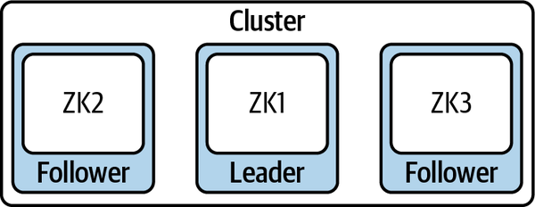

*Figure 4-21. In this leader-follower model, the values are tracked across ZooKeeper nodes.*

## Notification System

The final ZooKeeper use case that we’ll cover is that of a notification system. In [Chapter 1](https://learning.oreilly.com/library/view/mastering-apache-pulsar/9781492084891/ch01.html#the_value_of_real-time_messaging), you learned how notifications can help patients in a hospital receive better care. The most important aspects of a notification system are the timely delivery of notifications and the guaranteed delivery of notifications. If you miss a notification about engagement on a tweet you sent late last night, that isn’t a world-stopping event. However, if you miss a notification to renew your driver’s license, you may be arrested the next time you are pulled over. We’ve discussed how ZooKeeper serves as a high-quality naming service. The same qualities that make ZooKeeper a good naming service make it an excellent notification system. Namely, we can ensure that the system state is shared by all parties, and that if a party doesn’t have that notification, we can quickly determine it using ZooKeeper. [Figure 4-22](https://learning.oreilly.com/library/view/mastering-apache-pulsar/9781492084891/ch04.html#the_commit_protocol_used_in_zookeeper_i) provides a high-level view of this concept.


*Figure 4-22. The commit protocol used in ZooKeeper is useful as a notification protocol.*

## Apache Kafka

Apache Kafka is a distributed messaging system suitable for event streaming. It has broad adoption because of its thoughtful API design and scalability characteristics. Developed at LinkedIn and made freely available in 2014, Kafka provides the building blocks for event management and real-time systems at companies around the world. As of version 2.5, Kafka utilizes Apache ZooKeeper for configuration management and leader election. ZooKeeper plays a critical role in fault tolerance and message delivery in a Kafka cluster. [Figure 4-23](https://learning.oreilly.com/library/view/mastering-apache-pulsar/9781492084891/ch04.html#this_apache_kafka_cluster_has_three_bro) depicts a Kafka cluster with Apache ZooKeeper.


*Figure 4-23. This Apache Kafka cluster has three brokers, as well as ZooKeeper for coordination and leader election.*

Interestingly, the Kafka project removed the requirement of ZooKeeper in a Kafka cluster as of version 2.8 and replaced the ZooKeeper responsibilities with a Raft consensus implementation within the cluster itself. [Figure 4-24](https://learning.oreilly.com/library/view/mastering-apache-pulsar/9781492084891/ch04.html#this_kafka_cluster_has_three_nodes_with) depicts this change.


*Figure 4-24. This Kafka cluster has three nodes with their own consensus algorithm, known as KRaft (Kafka Raft).*

## Apache Druid

Apache Druid is a real-time analytics database originally developed by Metamarkets in 2011 and made freely available through the Apache Software Foundation in 2015. Druid powers the analytics suite of companies like Alibaba, Airbnb, and [Booking.com](http://booking.com/). Unlike SQL-on-Anything engines[^iiii] such as Presto and Apache Spark, Druid stores and indexes data and queries it. As a distributed system, Druid uses ZooKeeper for configuration management and consensus management (see [Figure 4-25](https://learning.oreilly.com/library/view/mastering-apache-pulsar/9781492084891/ch04.html#this_apache_druid_cluster_consists_of_q)). ZooKeeper plays a critical role in allowing Druid clusters to scale out without management overhead or performance degradation.

[^iiii]: SQL-on-Anything is a query engine that enables users to write SQL queries against files, representational state transfer (REST). APIs, databases, and other sources of data. We will cover this topic in more detail in [Chapter 10](https://learning.oreilly.com/library/view/mastering-apache-pulsar/9781492084891/ch10.html#pulsar_sql-id000029).

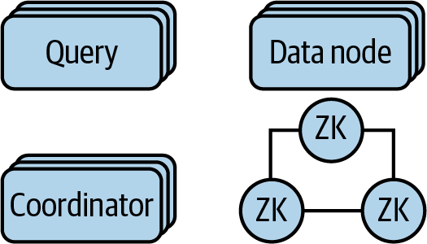

*Figure 4-25. This Apache Druid cluster consists of query nodes, coordinator nodes, data storage nodes, and ZooKeeper for configuration management and service discovery.*

# Pulsar Proxy

While Pulsar brokers are the communication mechanism for Pulsar clients, in cases when the brokers are deployed in a private network scenario, we may need a way to expose communication with the outside world. [Figure 4-26](https://learning.oreilly.com/library/view/mastering-apache-pulsar/9781492084891/ch04.html#a_pulsar_deployment_on_kubernetesdot_th) shows an example of such a scenario.

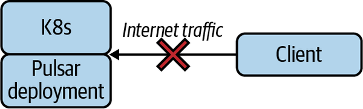

*Figure 4-26. A Pulsar deployment on Kubernetes. The client tries to reach Pulsar over the internet, but the brokers cannot be exposed and Pulsar cannot be reached.*

A Pulsar proxy is an optional gateway that simplifies the process of exposing brokers to outside traffic. A proxy can be deployed as an additional service and serve the role of taking on internet traffic and routing the messages to the right broker (see [Figure 4-27](https://learning.oreilly.com/library/view/mastering-apache-pulsar/9781492084891/ch04.html#this_pulsar_proxy_is_exposing_brokers_o)).

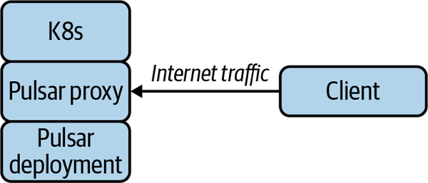

*Figure 4-27. This Pulsar proxy is exposing brokers on the Kubernetes deployment to the internet so that a client can reach it.*

In many cases, we should have an additional load-balancing layer, called a proxy frontend, to handle the concerns of edge internet traffic (see [Figure 4-28](https://learning.oreilly.com/library/view/mastering-apache-pulsar/9781492084891/ch04.html#in_this_configurationcomma_the_proxy_ha)).

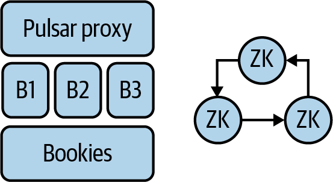

*Figure 4-28. In this configuration, the proxy handles all internet traffic. However, it is better suited for routing traffic across brokers.*

Proxy frontends such as HAProxy and NGINX are purpose built for handling internet scale traffic. Using these with a Pulsar proxy as a destination can help ease the load on the proxy (see [Figure 4-29](https://learning.oreilly.com/library/view/mastering-apache-pulsar/9781492084891/ch04.html#a_load_balancer_in_front_of_a_pulsar_pr)).

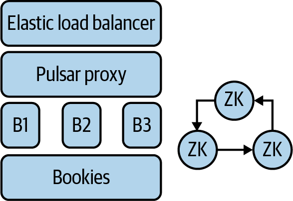

*Figure 4-29. A load balancer in front of a Pulsar proxy. In this scenario, the load balancer manages communication with clients and the proxy works more as a forwarder.*

The common thread between ZooKeeper, BookKeeper, and Pulsar is the Java programming language and the Java virtual machine (JVM). Let’s turn our attention to the JVM and the role it plays in Pulsar projects.

# Java Virtual Machine (JVM)

Pulsar brokers, Apache BookKeeper, and Apache ZooKeeper are written in the Java programming language and run on the Java virtual machine (JVM). Earlier in this chapter, we explored a Pulsar broker’s components and noted that a broker is primarily an HTTP server that implements a special TCP protocol (depicted in [Figure 4-30](https://learning.oreilly.com/library/view/mastering-apache-pulsar/9781492084891/ch04.html#the_pulsar_hierarchy_is_built_on_the_jv)). Nothing within Pulsar screams that it should have been written in Java, so why was Java chosen for Pulsar years ago, and is it still a good choice today?

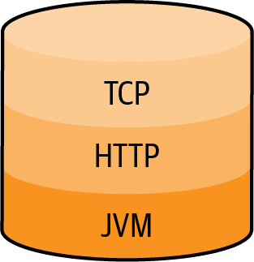

*Figure 4-30. The Pulsar hierarchy is built on the JVM with HTTP and a special TCP protocol.*

To understand why Yahoo! chose Java, it’s essential to consider the environment in which Pulsar was born. Pulsar’s creation [dates back to 2013](https://oreil.ly/pXKjo), when Yahoo! experienced unparalleled user growth. As Yahoo! grew, it ran into unprecedented challenges in the storage, transmission, and retrieval of data. At the time, the Hadoop ecosystem powered the storage and retrieval systems for most web-scale companies. With Hadoop, many of the tools used to build distributed consensus and configuration management were born and written in Java. Apache Mesos (see [Figure 4-31](https://learning.oreilly.com/library/view/mastering-apache-pulsar/9781492084891/ch04.html#apache_mesos_is_a_container_orchestrati)) was one of these systems.

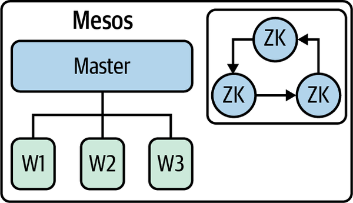

*Figure 4-31. Apache Mesos is a container orchestration engine that is written in Java and utilizes Apache ZooKeeper.[^iiiii]*

[^iiiii]: Apache Mesos was retired from the Apache Software Foundation in 2020. 


The first and most pragmatic reason to choose Java and the JVM is that many developers know the Java programming language. According to Slashdot, the number of Java developers as of 2018 was 7.3 million. That is a significant percentage of the overall total of 23 million developers. As an open source project, Pulsar can have a lot more success by tapping into a more extensive developer market.

In addition, the Java ecosystem is vast. There are Java libraries for just about everything, and when implementing a platform for all messaging needs, existing libraries can go a long way toward simplifying development.

Finally, Java has an excellent track record of powering essential and scalable solutions in technology. Let’s explore three of them in more depth.

## Netty

Netty is a web server written in Java. It powers the web server infrastructure of companies like Facebook, Apple, Google, and Yahoo! Netty’s two goals are to be portable (run in as many places as possible) and to perform (handle as many concurrent connections as possible). Building a web server requires quality implementations for web protocols, concurrency, and network management. Java has battle-tested implementations for these systems, among others. Netty’s success and use can be attributed to a great developer community, ease of use, and development as a JVM project.

## Apache Spark

Apache Spark is a distributed computing system for in-memory computing. Spark originated at the University of California, Berkeley, and was made freely available through the Apache Software Foundation in 2014. Companies such as Apple, Coinbase, and Capital One use Spark to power their analytics and machine learning. As with Pulsar, Spark developers utilize the JVM for its concurrency primitives and network libraries (the first versions of Spark used Netty for networking), development speed, and reliability. Spark is written in Scala, a programming language that shares the JVM with Java. The interoperability between Scala and Java allows Spark developers to build on the JVM’s rich libraries.

## Apache Lucene

Apache Lucene is an indexing engine that was written in Java and runs on the JVM. Lucene provides the building blocks for search systems such as Elasticsearch, Apache Solr, and CrateDB. Lucene implements the necessary algorithms to index text and perform fuzzy searching over a corpus, and it uses other critical algorithms in search. Search is something we come to expect in the 21st century. Not only can we search the entire web with tools like Google, DuckDuckGo, and Bing, but we can search our email, files on our computers, and even files across our entire presence on the web. Lucene powers the majority of search experiences we encounter on the web.

We covered the positives of the JVM and Java, but there are some negatives as well: notably, the size of JVM applications, the impact of garbage collection on application performance, and the compile times associated with large Java applications. In subsequent chapters, we’ll explore how each of these downsides impacts Pulsar.

# Summary

In this chapter we covered the three primary components that make up a Pulsar cluster: Pulsar brokers, Apache BookKeeper, and Apache ZooKeeper. You learned about the reasoning behind their inclusion in the project and the common thread among them: the Java virtual machine. Now that you know what Pulsar can do, you should be ready to take a closer look at how to use it. In the next few chapters, we’ll discuss the interfaces and tools available in Pulsar, and how to build applications.

