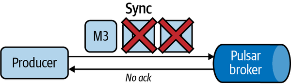
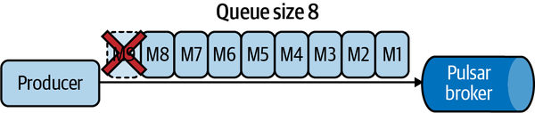

# Chapter 6. Producers

In [Chapter 5](https://learning.oreilly.com/library/view/mastering-apache-pulsar/9781492084891/ch05.html#consumers), we discussed the philosophy of consuming in Apache Pulsar. Producing messages is the other half of the equation, and it’s worth spending some time talking about what responsibilities producers have in a Pulsar system. In general, Pulsar producers control the messages’ schema, routing strategy, encryption, and compression. The producer is the authority figure for messages and is mainly removed from the consumption of messages.

As you learned so far, Pulsar client libraries contain many knobs for tuning performance and allowing the end user to manage the flow of messages. Still, much of the complexity behind ensuring reliability in Pulsar happens with the brokers and in ZooKeeper and BookKeeper. In this chapter, we’ll cover some of the semantics of Pulsar producers and standard settings.

# Synchronous Producers

Synchronous producers await acknowledgment from the Pulsar broker before considering a message or packet as having been “sent.” Synchronous producers provide the strongest guarantee around message delivery but have some implications for performance and may not be perfect for every application topology.

[Figure 6-1](https://learning.oreilly.com/library/view/mastering-apache-pulsar/9781492084891/ch06.html#a_synchronous_producer_in_apache_pulsar) depicts an illustration of a sync send operation in Pulsar. When Message 1 (M1) is acknowledged by the Pulsar broker, M2 is sent, and so on.


*Figure 6-1. A synchronous producer in Apache Pulsar. The producer sends messages M1, M2, and M3, and the broker acknowledges each message.*


From the producer’s perspective, you can be confident that every message is safely stored (and replicated) in Pulsar. Sync might be necessary for overall guarantee of message delivery for mission-critical or transactional systems. However, sending messages individually and awaiting broker confirmation comes at a cost: communicating over the network takes time, and a Pulsar broker may be unable to acknowledge the message at a predictable latency, thereby causing problems downstream (see [Figure 6-2](https://learning.oreilly.com/library/view/mastering-apache-pulsar/9781492084891/ch06.html#in_the_sync_send_settingcomma_if_messag)).



*Figure 6-2. In the sync send setting, if messages are not acknowledged by the broker, it is as though they were never sent.*


Should you use sync send in your Pulsar topology? The answer is that it depends on your system’s throughput and whether you can wait for each message to be acknowledged.

Consider a producer that is using sync send. This producer manages a set number of requests per second, and only one message can be sent to the Pulsar brokers at a time. As new concurrent upstream requests come along, the producer has to manage those connections while still awaiting full sync downstream. This process can result in a situation where all upstream processes are waiting for the producer and there is latency across the system.

Fortunately, we can treat this process as equal parts art and science. [Chapter 12](https://learning.oreilly.com/library/view/mastering-apache-pulsar/9781492084891/ch12.html#operating_pulsar) covers some metrics you can use to determine latencies across your topic topology and determine whether send sync is appropriate for your use case.

# Asynchronous Producers

Async producers send their messages to the Pulsar broker as a background task. The producer keeps an internal blocking queue of messages, and each message is sent to the Pulsar broker “out of band.” By offloading messages to a background task, the producer isn’t blocked and can process new messages and other tasks (see [Figure 6-3](https://learning.oreilly.com/library/view/mastering-apache-pulsar/9781492084891/ch06.html#send_queue_sizedot_this_queue_size_is_c)).



*Figure 6-3. Send queue size. This queue size is configurable and keeps track of messages that the producer has sent to the Pulsar broker.*


The majority of messaging use cases can benefit from async production. The async paradigm is popular in networked programming, where network call latency is only predictable within a distribution. This means that tail latency can exceed the average, and blocking network calls can make an entire application feel slow. Pulsar brokers are not immune to network communication problems, and a producer may block on a slow network call, causing a cascading effect in the application pipeline. The async send separates the networking needed to send the message from the producer’s other responsibilities and only blocks when needed (see [Figure 6-4](https://learning.oreilly.com/library/view/mastering-apache-pulsar/9781492084891/ch06.html#an_async_producerdot_messages_are_queue)).


*Figure 6-4. An async producer. Messages are queued and sent to the Pulsar broker out of band rather than directly, one message at a time.*

# Producer Routing

Before we jump into why a producer would route messages, we should talk about partitioned topics. A partitioned topic is a topic that splits or partitions its ownership across multiple brokers. Partitioning a topic affects one crucial function: performance. By partitioning a topic, you increase the number of brokers that can receive messages for that topic and increase the overall number of messages per period ingested by Pulsar. In contrast to Kafka, where every topic is partitioned, in Pulsar, topics are not partitioned by default.

How a topic is partitioned is another essential consideration. Typically, topics are partitioned by a *key*, or a value in the message payloads with some identifying characteristic. Once the partitioning process has been established, the producer needs to route each message to the proper partition for a topic. In Apache Pulsar, this is where producer routing comes into play.

Pulsar supports three routing schemes for partitioned topics:

- Round-robin routing 
- Single partition routing
- Custom partition routing 

## Round-Robin Routing

Round-robin routing acts as a load balancer. It sends messages to partitions in order and has the advantage of simplicity (see [Figure 6-5](https://learning.oreilly.com/library/view/mastering-apache-pulsar/9781492084891/ch06.html#the_producer_routes_messages_to_brokers)). Round robin is a common routing strategy because it doesn’t require much configuration or forethought, yet allows for outstanding performance.


*Figure 6-5. The producer routes messages to brokers in a round-robin fashion.*


You can configure round robin with or without a key. [Table 6-1](https://learning.oreilly.com/library/view/mastering-apache-pulsar/9781492084891/ch06.html#configuring_a_round-robin_router_with_a) summarizes the differences between the two approaches.

| Approach         | Consequences                                                 |
| :--------------- | :----------------------------------------------------------- |
| Key specified    | When a key is specified, the broker will hash the keys and route them to the same partition (discussed in [“Key_Shared”](https://learning.oreilly.com/library/view/mastering-apache-pulsar/9781492084891/ch05.html#key_shared)). |
| No key specified | When no key is specified, the broker uses the batch settings to determine which partition gets which messages. |

You can define the partitioning with the Pulsar Java client like this:

```
String pulsarBrokerRootUrl = "pulsar://localhost:6650";
String topic = "persistent://my-tenant/my-namespace/ggc";

PulsarClient pulsarClient = PulsarClient.builder()
		.serviceUrl(pulsarBrokerRootUrl)
		.build();
Producer<byte[]> producer = pulsarClient.newProducer()
        .topic(topic)
        .messageRoutingMode(MessageRoutingMode.RoundRobin)
        .create();

producer.newMessage().key("my-key")
		.value("A letter to my unborn".getBytes())
		.send();
```

## Single Partition Routing

Single partition routing provides an even simpler mechanism: it routes all messages to a single partition (see [Figure 6-6](https://learning.oreilly.com/library/view/mastering-apache-pulsar/9781492084891/ch06.html#in_this_configurationcomma_the_producer)). This mode is similar to an unpartitioned topic. Essentially, one broker is in charge of all messages. This partitioning mode occurs when *SinglePartition* is selected and no key is provided. When a key is provided, the behavior reverts to a consistent hashing scheme similar to round-robin routing. [Table 6-2](https://learning.oreilly.com/library/view/mastering-apache-pulsar/9781492084891/ch06.html#single_partition_routing_with_and_witho) summarizes these differences.


*Figure 6-6. In this configuration, the producer sends all messages to a single partition owned by a single broker. If a key is supplied, it is hashed and messages are routed to specific partitions.*


| Key              | Behavior                                               |
| :--------------- | :----------------------------------------------------- |
| Key specified    | Keys are hashed and assigned to particular producers.  |
| No key specified | A single broker (partition) receives all the messages. |

You can define a single partition using the Java Pulsar client library:

```
String pulsarBrokerRootUrl = "pulsar://localhost:6650";
String topic = "persistent://my-tenant/my-namespace/ggc";

PulsarClient pulsarClient = PulsarClient.builder()
		.serviceUrl(pulsarBrokerRootUrl)
		.build();
Producer<byte[]> producer = pulsarClient.newProducer()
        .topic(topic)
        .messageRoutingMode(MessageRoutingMode.SinglePartition)
        .create();

producer.newMessage().key("my-key")
		.value("A letter to my unborn"
		.getBytes()).send();
```

## Custom Partition Routing 

Custom partition routing provides a mechanism for the producer to describe how messages should be routed to partitions. You can use a custom partition for routing based on specific keys or other metadata within a message. For a simple example, you may want to route every message with a specific key to a specific partition (see [Figure 6-7](https://learning.oreilly.com/library/view/mastering-apache-pulsar/9781492084891/ch06.html#in_this_custom_partitioncomma_the_produ)), or route messages with a specific version of a schema to a specific partition.


*Figure 6-7. In this custom partition, the producer implements logic to ensure that data is sent to a specific partition.*


Defining your own partition in Pulsar is simple if you are using the Java client library. You need to implement the `MessageRouter` interface, which has one method called `choosePartition`. It looks like this:

```
public interface MessageRouter extends Serializable {
    int choosePartition(Message msg);
}
```

With this interface, we can implement a router that randomly assigns partitions 6–10:

```
public class RandomRouter implements MessageRouter {
    public int choosePartition(Message msg) {
        Random ran = new Random(); 
int x = ran.nextInt(6) + 5;

        return x;
    }
}
```

Now we can use our router to route messages on a partitioned topic:

```
String pulsarBrokerRootUrl = "pulsar://localhost:6650";
String topic = "persistent://my-tenant/my-cluster-my-namespace/ggc";

PulsarClient pulsarClient = PulsarClient.builder()
		.serviceUrl(pulsarBrokerRootUrl)
		.build();
Producer<byte[]> producer = pulsarClient.newProducer()
        .topic(topic)
        .messageRouter(new RandomRouter())
        .create();
producer.send("Hello, Moto".getBytes());
```

Finally, we can use message keys to route:

```
// If the message has a key, it supersedes the round robin routing policy
    if (msg.hasKey()) {
        return signSafeMod(hash.makeHash(msg.getKey()),
        topicMetadata.numPartitions());
    }

    if (isBatchingEnabled) { // if batching is enabled, 
                             // choose partition on `partitionSwitchMs` boundary.
        long currentMs = clock.millis();
        return signSafeMod(currentMs / partitionSwitchMs + startPtnIdx,
            topicMetadata.numPartitions());
    } else {
        return signSafeMod(PARTITION_INDEX_UPDATER.getAndIncrement(this),
            topicMetadata.numPartitions());
    }
```

# Producer Configuration

Pulsar producers are highly configurable. Throughout this chapter, we’ve interacted with several code examples that utilize configurations for Pulsar producers. Now we’ll go through each configuration and expound a bit on their meaning as well as provide a reference section for ourselves in the future.

## topicName

Pulsar topic names can have any character except the forward slash (/). By default, this configuration is null and will not submit any messages to the consumer. Generally, topic names are hyphenated, as in “my-topic.” However, this naming convention is just a suggestion, and organizations can choose whatever naming convention they want.

## producerName

The producer name is a string that identifies the producer. This name needs to be unique within a Pulsar distribution. One convention I’ve seen for `producerName` is `*<team>.<application>*`*.* As with `topicName`, there are no enforced naming schemes.

## sendTimeoutMs

This configuration sets the maximum amount of time (in milliseconds) the producer should wait for a Pulsar broker to acknowledge a packet. By default, this setting is 30,000 ms (30 seconds). We talked about sync send earlier in this chapter, and 30 seconds is far too high for any application in that scenario. For the async case, 30 seconds is a reasonable choice.

## blockIfQueueFull

This configuration sets the behavior for the outgoing queue in the async send scenario. If set to true, when an additional message attempts to add to the queue it is blocked, rather than failing. If set to false, when additional messages attempt to add to the queue a `ProducerQueueIsFullError` is returned. In these cases, the producer needs to deal with the error immediately. By default, this parameter is set to false. On some further examination, it is a reasonable decision to set this parameter to false. It is much more transparent and forces producers to consider faults in their programs.

## maxPendingMessages

This configuration sets the maximum number of messages queued for processing in the async send mode. The default for this setting is 1,000, and this value can be set to any integer.

## maxPendingMessagesAcrossPartitions

For partitioned topics, this value is the sum of max pending messages across all partitions. This configuration is necessary because it clarifies communication health between the brokers and the producer. For partitioned topics, variance in the acknowledgment speed is typical, and keeping track of the overall health of message sync between all partitions can help when designing a producer. By default, the `maxPendingMessagesAcrossPartitions` value is set to 5,000, but there are several reasons to tune that value.

## messageRoutingMode

For partitioned topics, Pulsar supports three routing modes:

- Round robin
- Single partition
- Custom partition

We described each of these routing modes in detail in [“Producer Routing”](https://learning.oreilly.com/library/view/mastering-apache-pulsar/9781492084891/ch06.html#producer_routing).

## hashingScheme

`hashingScheme` is a function used to determine how to route messages in a partitioned topic. By default, this configuration is set to `JavaStringHash`, which provides a basic string hashing algorithm on the message for routing. The two alternatives are `pulsar.Murmur3_32Hash` and `pulsar.BoostHash`. Both have some performance implications (they can be much faster) and have some other implications regarding uniqueness. [Hashing](https://oreil.ly/0Z5kQ) is a complex topic that is beyond the scope of this book, so I have included a footnote for further reading.[^i]

[^i]: Kelly Brown, “The Dangers of Weak Hashes,” SANS Whitepaper (November 2013). [*https://oreil.ly/d7rcc*


## cryptoFailureAction

This configuration dictates the behavior of the producer of encryption failure. By default, if the producer fails to encrypt the message, the message won’t be sent to the Pulsar broker. The alternative is that the unencrypted message is still sent to the broker. Also by default, Pulsar wants to encrypt each message. The setting illustrates this behavior to fail to send when encryption is not successful. While this book is not about security, security is an essential consideration in a messaging system. Ensuring that only sanctioned parties can read the data is a sensible default.

## batchingMaxPublishDelayMicros

This configuration sets the maximum number of microseconds of delay a producer should wait to send a batch to a Pulsar broker. By default, this is set to 100 microseconds.

## batchingMaxMessages

This configuration sets a maximum batch size for a producer. When the limit is reached, the producer sends a batch of messages to a Pulsar broker.

## batchingEnabled

By default, batching with 1,000 messages or 1 ms is enabled. Since the Pulsar broker manages to decompose a batch for subscribers, you can set this configuration much higher if your use case requires it.

## compressionType

By default, compression is off on Pulsar topics. Pulsar supports four compression algorithms, and it’s worth going through each one to understand their trade-offs. This section is not a primer on compression algorithm design; instead, it provides a glimpse of what each compression algorithm has to offer and why you might consider one over the other or none of them at all.

Before we dive into each algorithm, let’s consider why we would compress messages in the first place. The only reason is because of disk space. Thinking about Pulsar as a record system or a system that stores all messages indefinitely, disk space is at a premium. Compression of 20% to 40% (what these algorithms offer) can save millions of dollars in storage costs over time.

There are three essential things to consider with a compression algorithm: how quickly it can compress data given the hardware that’s available, how long it takes to transfer the data, and how long it takes to decompress it on the other end when needed.

Pulsar supports the following compression algorithms. Each algorithm has some trade-offs based on specific use cases, as summarized in the following list:

- LZ4

  LZ4’s focus is to provide the best performance on the smallest amount of computing resources. It’s suitable for a wide array of applications.

- ZLIB

  ZLIB has similar advantages to LZ4. However, it is focused on ecosystem compatibility. Many programming languages have ZLIB implementations, making it a good choice for compression in a polyglot ecosystem.

- ZSTD

  ZSTD is a compression algorithm focused on delivering the smallest final file size at the cost of requiring more compute power to get there.

- Snappy

  Snappy is a compression algorithm that sacrifices optimization in final file size for the overall speed of compression. Snappy is typically used for data analytics workloads such as those found with Parquet files.

# Schema on Write

In [Chapter 5](https://learning.oreilly.com/library/view/mastering-apache-pulsar/9781492084891/ch05.html#consumers), we discussed how Pulsar topics are schema optional. Philosophically, a producer is best positioned to declare a schema and may even provide that on delivering data to the topic. The idea of creating a schema for data before storing it is called *schema on write.* Schema on write is a defensive technique and is inflexible. Once the schema is declared and enforced on the broker level, changing it requires producers and consumers to move to a new schema. In this section, we’ll cover the following:

- Creating schemas
- Schema enforcement
- Supported schemas

## Using the Schema Registry

By default, Pulsar uses Apache BookKeeper for schema storage. Pulsar does support third-party schema registries as well, but for this book we’ll stick to the built-in registry.[^ii]

[^ii]: To use an external schema registry, we need to implement the integration. Third-party registries like the AWS Schema Registry and APIcurio have been used in the past. 


A schema is automatically created when a typed producer (see [Figure 6-8](https://learning.oreilly.com/library/view/mastering-apache-pulsar/9781492084891/ch06.html#a_typed_producerdot_a_producer_can_choo)) publishes messages to a topic in Pulsar. However, for any topic, you can update schemas via Pulsar’s representational state transfer (REST) API. A schema has the following properties:

- Name

  Each schema shares a name with the topic assigned to it.

- Payload

  The payload is a binary representation of the schema. It is used for retrieving the schema and for schema validation.

- Type

  Schemas can be primitive types, similar to the following:`Producer<String> producer = client.newProducer(Schema.STRING).create(); producer.newMessage().value("Surprise!").send();`

  where the schema is defined like this:`Schema.TYPE`Or they can be complex types defined with key–value pairs or struct. Key–value schemas can be defined like this:`Schema<KeyValue<Integer, String>> kvSchema = Schema.KeyValue( Schema.INT32, Schema.STRING, KeyValueEncodingType.SEPARATED ); Producer<KeyValue<Integer, String>> producer =    client.newProducer(kvSchema)   .topic(TOPIC)   .create(); final int key = 1; final String value = "Jowanza"; // send the key–value message producer.newMessage() .value(new KeyValue<>(key, value)) .send();`Structs are common for Avro and Protobuf generation:`@Builder @AllArgsConstructor @NoArgsConstructor public static class User {   String name;   int age; }  Producer<User> producer = client 	.newProducer(Schema.AVRO(User.class)) 	.create(); producer .newMessage() .value(User.builder().name("jowanza") .age(26).build()).send();`Pulsar primitive types are listed in [Table 6-3](https://learning.oreilly.com/library/view/mastering-apache-pulsar/9781492084891/ch06.html#summary_of_the_primitive_schema_types). An example of a typed producer is shown in [Figure 6-8](https://learning.oreilly.com/library/view/mastering-apache-pulsar/9781492084891/ch06.html#a_typed_producerdot_a_producer_can_choo).

- User-defined properties

  You can set any user-defined property on a Pulsar schema. You can include some notes about the schema or include another link to where the schema is stored in a Git repository.

| Primitive Type          | Description                                                  |
| :---------------------- | :----------------------------------------------------------- |
| `BOOLEAN`               | True or false (binary value)                                 |
| `INT8`                  | An 8-bit signed integer                                      |
| `INT16`                 | A 16-bit signed integer                                      |
| `INT32`                 | A 32-bit signed integer                                      |
| `INT64`                 | A 64-bit signed integer                                      |
| `FLOAT`                 | A single-precision (32-bit) IEEE 754 floating-point number   |
| `DOUBLE`                | A double-precision (64-bit) IEEE 754 floating-point number   |
| `BYTES`                 | A sequence of 8-bit unsigned bytes                           |
| `STRING`                | A Unicode character sequence                                 |
| `TIMESTAMP(DATE, TIME)` | A logic type representing a specific instant in time with millisecond precision |
| `INSTANT`               | A single instantaneous point on the timeline with nanosecond precision |
| `LOCAL_DATE`            | An immutable date-time object that represents a date, often viewed as year-month-day |
| `LOCAL_TIME`            | An immutable date-time object that represents a time, often viewed as hour-minute-second, with time represented with nanosecond precision |
| `LOCAL_DATE_TIME`       | An immutable date-time object that represents a date-time, often viewed as year-month-day-hour-minute-second |


*Figure 6-8. A typed producer. A producer can choose to have a schema attached to a topic and register it with the schema registry.*


In addition to client library implementations of schema validation, we can also set schemas from the Pulsar Admin CLI or Pulsar Admin API.

Uploading a schema with the CLI looks like this:

```
$ pulsar-admin schemas upload --filename <schema-definition-file> <topic-name>
```

From the Admin REST API, it looks like this:

```
POST /admin/v2/schemas/:tenant/:namespace/:topic/schema
Body {
   "type": "<schema-type>",
   "schema": "<an-utf8-encoded-string-of-schema-definition-data>",
   "properties": {} // the properties associated with the schema
}
```

We can get the latest version of a schema via the CLI with the following command:

```
$ pulsar-admin schemas get <topic-name>

{
   "version": 0,
   "type": "String",
   "timestamp": 0,
   "data": "string",
   "properties": {
       "property1": "string",
       "property2": "string"
   }
}
```

# Nonpersistent Topics

Throughout this chapter, we’ve focused on persistent topics or topics that will persist to Apache ZooKeeper based on lifecycle management. Pulsar also supports nonpersistent topics, which are topics that do not have any persistence in BookKeeper and are simply collected and tailed from the broker.

My focus in this book is on the event streaming offered by Pulsar, so all examples assume a persistent topic. That said, it’s worth talking about how it to set up a nonpersistent topic and why we might want to use one.

## Use Cases

The only use case for a nonpersistent topic is high throughput and real-time scenarios. In these scenarios, data that arrives to a consumer late has no value to the application; thus, persisting it doesn’t have any purpose. You can think of a nonpersistent topic as being like an infinitely running hose: water keeps coming out and consumers need to keep up; and if they are unable to, they need to restart their consumption. In this model, a producer publishes and the consumers (which are subscribed at the time) consume (see [Figure 6-9](https://learning.oreilly.com/library/view/mastering-apache-pulsar/9781492084891/ch06.html#in_a_nonpersistent_topic_topologycomma)).


*Figure 6-9. In a nonpersistent topic topology, the producer (publisher) sends messages and receives an acknowledgment, and the subscribers (consumers) consume the messages, but only if it is actively consuming.*


Nonpersistent topics don’t have a “replay” ability, because that would require tracking a cursor and storing data.

## Using Nonpersistent Topics

You can use the client libraries, Admin CLI, or Admin API to create nonpersistent topics. For this example, we’ll create a nonpersistent topic with the Admin CLI, publish a message with the Pulsar client, and consume the message on the other end. It’s important to attach the consumer first because the consumer might not receive the message since it is not persistent.

You can create a nonpersistent topic with the following command:

```
$ pulsar-admin topics create non-persistent://public/default/example-np-topic
```

You can use the Pulsar client CLI to publish a message to the nonpersistent topic:

```
$ bin/pulsar-client produce non-persistent://public/default/example-np-topic \
  --num-produce 1 \
  --messages "Surprise!"
```

Then you can use the Pulsar client CLI to consume the message:

```
$ bin/pulsar-client consume non-persistent://public/default/example-np-topic \
  --num-messages 0 \
  --subscription-name my-ole-sub
  --subscription-type exclusive
```

# Transactions

Transactions are a new feature in Pulsar as of Pulsar 2.7.0. Transactions provide a mechanism for ensuring that all messages are either consumed and committed or rolled back. Transactions are one way to provide the “exactly once” semantics that are coveted by real-time applications. In Pulsar, transactions are implemented as a consumer-process-produce flow (see [Figure 6-10](https://learning.oreilly.com/library/view/mastering-apache-pulsar/9781492084891/ch06.html#in_a_stream_processing_flowcomma_messag)) for stream processing. A streaming app consumes messages, processes them, and produces a new flow, all in a single transaction. Either all messages are consumed and processed or none of them are.


*Figure 6-10. In a stream processing flow, messages are consumed from a source, processed, and produced to a new source in a single transaction.*


Transactions have two points at which they can fail: either they do not commit in a timely fashion or they are aborted. In either case, messages are rolled back (see [Figure 6-11](https://learning.oreilly.com/library/view/mastering-apache-pulsar/9781492084891/ch06.html#if_a_transaction_doesnapostrophet_commi)).


*Figure 6-11. If a transaction doesn’t commit, all messages are rolled back.*


Transactions are enabled through some new consumer and producer APIs. Let’s walk through what it looks like for a consumer, for a producer, and then from a consumer to a producer.

A transaction is a new API in Pulsar. You can create a transaction in the Java API:

```
Transaction txn = pulsarClient
        .newTransaction()
        .withTransactionTimeout(1, TimeUnit.MINUTES)
        .build()
        .get();
```

Transactions have a timeout which you can set with any `TimeUnit` API limit. For this example, we’re using one minute, which is a long time for a transaction, but it’s reasonable for educational purposes.

Now we can use a producer to begin the transaction cycle:

```
producer.newMessage(txn).value("Surprise".getBytes()).send();
```

As part of a `newMessage` we can send a transaction as part of the payload.

From the consumer side, we can confirm or abort the transaction:

```
Message<byte[]> message = consumer.receive();
consumer.acknowledge(message.getMessageId(), txn);
txn.commit().get();
```

In this example, we abort the transaction and it’s rolled back:

```
Message<byte[]> message = consumer.receive();
consumer.acknowledge(message.getMessageId(), txn);
txn.abort();
```

While the benefits for client-side applications are there, the stream processing side has an even stronger case for its use.

Pulsar transactions are a new feature in Apache Pulsar as of Pulsar 2.8. They represent a simpler, but more powerful and consistent way forward with *exactly-once semantics*, which means that for a given topology with topics, subscriptions, producers, and consumers, every message is processed once with no chance of duplicate processing. In a stream processing use case, the need for exactly-once processing serves two purposes: it provides guarantees that the system reflects the true state of the world (no duplications) and it reduces any overhead created by processing or storing duplicates of messages.

# Summary

In this chapter you learned about the important job that Pulsar producers have in enabling end-to-end stream processing. Among other things, producers are responsible for:

- Determining the schema of a topic
- Compressing data within the topic
- The hashing scheme of a topic
- Chunking messages

Now that you know how producers and consumers work, you’re ready to learn about Pulsar IO, a framework for producing and consuming messages from Pulsar.

