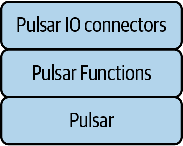
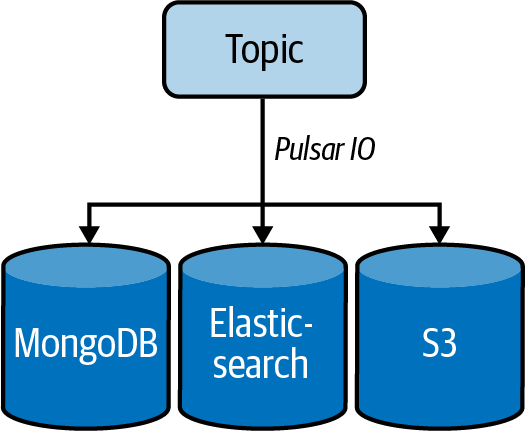
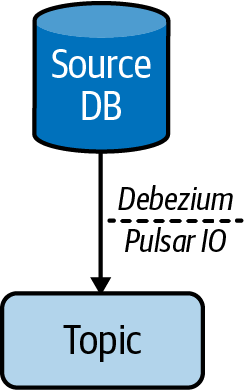

# Chapter 7. Pulsar IO

You’ve learned about Pulsar’s philosophy and architecture, use cases for Pulsar, and the producer and consumer model. Now it’s time to work through some examples of using Pulsar. The most accessible place to start on this journey is with Pulsar IO, a framework that lets you easily create, deploy, and manage Pulsar connectors that interact with third-party systems. I’ll start by covering the Pulsar IO architecture and then move on to practical examples. At the end of the chapter, we’ll write our own Pulsar IO connector.

# Pulsar IO Architecture

Before jumping in, I want to justify my reasons for starting with Pulsar IO as the best way to learn about producers and consumers in Pulsar:

- Pulsar IO provides a framework for producing and consuming messages with Apache Pulsar.
- Pulsar IO connectors can work after configuration without additional code by the end user.
- Pulsar IO is simple to understand.

In Chapters [5](https://learning.oreilly.com/library/view/mastering-apache-pulsar/9781492084891/ch05.html#consumers) and [6](https://learning.oreilly.com/library/view/mastering-apache-pulsar/9781492084891/ch06.html#producers), we discussed producers and consumers in Pulsar and how configuration decisions on one side impact the other side. The best way to understand what it takes to write an application that utilizes Pulsar and the implications of configuration decisions is to write an end-to-end application and break down the pieces. Using Pulsar IO, we can use a Pulsar IO connector (or multiple connectors) to achieve our end goal of understanding the message lifecycle and message topologies in Pulsar.

Pulsar has first-party client library support in Java, Python, and Go, and support for languages like Scala and JavaScript through community-supported projects. In [Chapter 8, “Pulsar Functions”](https://learning.oreilly.com/library/view/mastering-apache-pulsar/9781492084891/ch08.html#pulsar_functions-id000023) and [Chapter 10, “Pulsar SQL”](https://learning.oreilly.com/library/view/mastering-apache-pulsar/9781492084891/ch10.html#pulsar_sql-id000029), we’ll explore language-specific implementations from the client library side. For now, Pulsar IO gives us everything we need to generate topologies without having to get caught in the specifics of a client library implementation (see [Figure 7-1](https://learning.oreilly.com/library/view/mastering-apache-pulsar/9781492084891/ch07.html#the_pulsar_io_hierarchydot_pulsar_io_is)).

Pulsar IO is also simple to understand. That simplicity affords us the time to explore the nuances of Pulsar. With the goals of the chapter laid out, it’s time for us to dive in.



*Figure 7-1. The Pulsar IO hierarchy. Pulsar IO is an extension of the Pulsar Functions framework, providing a reusable set of components to build producer and consumer applications on top of Pulsar.*


## Runtime

Pulsar IO’s runtime`foobar` consists of Pulsar brokers, Pulsar Functions (covered in depth in [Chapter 8](https://learning.oreilly.com/library/view/mastering-apache-pulsar/9781492084891/ch08.html#pulsar_functions-id000023)), Apache BookKeeper, and the Pulsar IO connector framework. Let’s take a look at each component in detail.

Pulsar brokers are a core component of Pulsar. The brokers are the main entry point for all client communication. Brokers also handle message routing and caching in the Pulsar ecosystem. For Pulsar IO, connectors run on brokers by default.

Pulsar Functions are a stream processing runtime that works in conjunction with Pulsar. Pulsar IO runs on top of Pulsar Functions.

Apache BookKeeper is the storage engine for Pulsar and an essential part of Pulsar IO. All configuration is stored and managed in BookKeeper.

The Pulsar IO connector framework is an abstraction on top of Pulsar Functions. It provides the building blocks for writing a Pulsar IO connector, and it makes developers consider aspects of connectors like fault tolerance, serialization, and error handling out of the box (see [Figure 7-2](https://learning.oreilly.com/library/view/mastering-apache-pulsar/9781492084891/ch07.html#an_example_of_the_pulsar_io_sourceen_da)).


*Figure 7-2. An example of the Pulsar IO source–sink model. Sources are applications that are a target for a Pulsar topic. Sinks are destinations for messages stored in Pulsar topics.*


## Performance Considerations

By default, Pulsar IO topologies utilize compute power, memory, network, and storage from Pulsar brokers. Because Pulsar IO runs on the brokers, the broker resources are the upper bound of Pulsar IO. In practice, Pulsar IO is a purpose-built Pulsar function. In general, functions are lightweight JVM processes; however, resource utilization depends on the volume of messages from a source and the latency characteristics of a sink.

At low message volumes, Pulsar IO with default configurations is unlikely to impact your Pulsar cluster. However, as the number of messages increases, tuning your Pulsar IO configuration becomes a necessity.

# Use Cases

Pulsar IO is a general-purpose framework for providing a repeatable, configuration-driven mechanism for moving data to and from Pulsar topics. There is a spectrum of use cases in stream processing, and Pulsar IO is not designed to meet all of them. Pulsar IO’s focus is on simplicity and repeatability. It is most appropriate for stream processing tasks with a clear answer for every message that enters the pipeline (see [Figure 7-3](https://learning.oreilly.com/library/view/mastering-apache-pulsar/9781492084891/ch07.html#in_this_example_of_pulsar_iocomma_appli)). Two types of processing jobs with these requirements are simple event processing pipelines and change data capture processes.


*Figure 7-3. In this example of Pulsar IO, applications publish data to a source, such as a database. Pulsar IO consumes data from the source and publishes it to the Pulsar topic. From the topic, a Pulsar IO process moves the data to another system (perhaps another database). Applications then consume the data.*


## Simple Event Processing Pipelines

Many stream processing jobs have simple requirements. For example, a streaming job might read in all messages from a topic containing user data, remove personally identifiable information, and publish the cleansed data to a new topic. Another example is a topic that contains user phone numbers in different formats; the topic normalizes the data and saves it to a new topic. Both of these stream processing jobs have qualities that make them suitable tasks for Pulsar IO:

- A single source of data (a topic)
- A repeatable process for each message in the topic
- A single destination for each message

Given these qualities, we can write code that handles these events in a repeatable way (see [Figure 7-4](https://learning.oreilly.com/library/view/mastering-apache-pulsar/9781492084891/ch07.html#in_stream_processingcomma_a_topic_sends)).



*Figure 7-4. In stream processing, a topic sends messages to MongoDB, Elasticsearch, and Amazon S3.*


## Change Data Capture

Change data capture (CDC) is a pattern used to track changes in a system of record. CDC is commonly utilized in data warehouse technologies for storing transactions from a transactional database. In this architecture, the process that monitors the transaction databases and captures the appropriate changes for the data warehouse is a CDC process. A typical pattern for implementing CDC is the write-ahead log (WAL). Exploring how a WAL works in conjunction with an event system like Apache Pulsar might solidify how Pulsar IO can provide utility.

MySQL is a popular open source database used in hundreds of thousands of applications. MySQL uses a WAL to provide fault tolerance and guarantees around transactions. The WAL has two similarities to an event stream. First, the WAL is a log. We’ve talked at length about how Pulsar is a distributed log underneath the covers. Second, WALs are an append-only data structure, and the event stream is as well. We can build a repeatable way to move data from a database to a Pulsar topic with these characteristics.

While it is possible to read a WAL and write it directly into a Pulsar topic, this isn’t how the built-in CDC implementations work in Pulsar IO. Pulsar IO supports CDC from MySQL, PostgreSQL, MongoDB, Cassandra, Oracle, and Vitess. Pulsar supports CDC for these databases through another open source project called Debezium (see [Figure 7-5](https://learning.oreilly.com/library/view/mastering-apache-pulsar/9781492084891/ch07.html#some_pulsar_io_connectors_utilize_debez)), an open source CDC server supporting connections to message systems like Apache Kafka, Amazon Kinesis, and Pulsar. Through a connection with Debezium, Pulsar IO can be a CDC mechanism.



*Figure 7-5. Some Pulsar IO connectors utilize Debezium to manage retrieval of data from external systems. In most Pulsar IO implementations, there is a clear separation of responsibilities between Debezium and Pulsar IO.*


# Considerations

Thus far, we’ve discussed some of the benefits and concepts of Pulsar IO and focused on its simplicity and use cases. Now let’s consider some of the potential pitfalls of using Pulsar IO and what we can do to manage them.

## Message Serialization

For source and sink connectors, message serialization is an important consideration when thinking about using Pulsar IO. Message serialization is the process of translating an object from its source type to a format that is acceptable by Pulsar. In [Chapter 6](https://learning.oreilly.com/library/view/mastering-apache-pulsar/9781492084891/ch06.html#producers), we talked about Pulsar’s formats, including strings, Avro, Protobuf, and JSON. Message serialization can show up as an issue in both source and sink connectors; let’s explore each.

For a source connector, some message serialization will likely need to occur as data comes from the source and into Pulsar. That serialization can take time and resources to complete, and it can also be prone to error. Database schemas can change, and those changes may not be in lockstep with the Pulsar topic, and thus can lead to failures within the Pulsar IO connector.

Uniform serialization of the source topic in a sink connector is also essential. Maintaining simplicity in a Pulsar IO connector requires that the source data has some uniform shape that can be represented in the configuration for Pulsar IO. Any variability in data shape and type may lead to errors and make Pulsar IO connectors less reliable.

## Pipeline Stability

Pulsar IO connectors can incur instability for a few reasons. The source may be unresponsive for source connectors, experience network failures, or be entirely unavailable. Any interruption of this sort may lead to failures in the Pulsar IO connector that require a restart. The same failures can occur for the sink connectors, leading to topics that are full of unacknowledged messages. Most of these failure modes have been considered for the built-in Pulsar IO connectors and have been worked into the connector.

When building your connector, pipeline instability should be top of mind. Following are some questions to consider in the implementation:

- What will happen when my source database isn’t able to connect?
- How many times should I try to reconnect after a failed connection?
- How should I handle errors from a source or sink?

This list is not exhaustive, but it provides some context regarding what you should consider when developing a connector and problems you might encounter using a built-in connector.

## Failure Handling

Pulsar IO sinks and sources can fail for a variety of reasons, including these:

- Incorrect configuration
- Source or sink becomes unavailable
- Network partitions

If these or any other errors occur in Pulsar IO, the creator of the connector should be able to catch them. In addition, the Pulsar IO framework provides a mechanism for catching connection errors as well as writing errors.

For connection errors, you implement the following interface and throw an exception on failure:

```
   /**
     * Open connector with configuration
     *
     * @param config initialization config
     * @param sinkContext
     * @throws Exception IO type exceptions when opening a connector
     */
    void open(final Map<String, Object> config,
		SinkContext sinkContext) throws Exception;
```

For writing, there is a similar interface:

```
   /**
     * Write a message to Sink
     * @param record record to write to sink
     * @throws Exception
     */
    void write(Record<T> record) throws Exception;
```

# Examples

In this section, we’ll work our way through some end-to-end Pulsar IO examples to understand its configuration, the requirements for using it, and what it looks like to write your own Pulsar IO connector (see [Figure 7-6](https://learning.oreilly.com/library/view/mastering-apache-pulsar/9781492084891/ch07.html#in_the_sourceen_dashsink_architectureco)). My intent is to illustrate the elegance of Pulsar IO and provide some pointers on how best to utilize it. Note, though, that Pulsar IO is among the least documented aspects of Pulsar as of this writing. The absence of documentation is a reflection of Pulsar IO’s simplicity.


*Figure 7-6. In the source–sink architecture, Pulsar IO is the glue that enables the workflow.*


## Elasticsearch

Elasticsearch is an open source search engine developed by Elastic. Elasticsearch provides developers with an elegant interface for indexing and retrieving data. Search is a critical component of many applications, and indexing stores data suitable for retrieving it with natural language queries. For Pulsar IO, Elasticsearch is a sink connector. This means we configure Pulsar IO to read from a Pulsar topic and write that data to an Elasticsearch index.

Pulsar IO Elasticsearch connectors are built in, meaning the packages needed to use them are already included in the base installation of Apache Pulsar. To use the Elasticsearch connector, we need a Pulsar topic and a handful of configuration values, as shown in [Table 7-1](https://learning.oreilly.com/library/view/mastering-apache-pulsar/9781492084891/ch07.html#configuration_values_for_use_with_an_el).

| Config Value            | Definition                                                   |
| :---------------------- | :----------------------------------------------------------- |
| `elasticSearchUrl`      | This is a required field and is the database URL for your Elasticsearch instance. |
| `indexName`             | The index is a collection in Elasticsearch; this field is required. |
| `typeName`              | This is the type of data stored in the index.                |
| `indexNumberOfShards`   | Elasticsearch indexes can be sharded; if you can supply this number to Pulsar IO to optimize writes, it is optional. |
| `indexNumberOfReplicas` | This is the number of replicas for an index in a clustered deployment of Elasticsearch. |
| `username`              | This is the username for Elasticsearch.                      |
| `password`              | This is the user password for Elasticsearch.                 |

An example configuration for a Pulsar IO Elasticsearch sink connector looks like this:

```
{ "elasticSearchUrl": "http://localhost:9200", "indexName": "my_index",
	"username": "jowanza", "password": "neversharepasswords" }
```

You can run this Elasticsearch connector by saving this configuration file locally, such as in a file called *my_elastic_search.json*, and running it with the Pulsar CLI with the following command:

```
$ bin/pulsar-admin sinks localrun \
    --archive connectors/pulsar-io-elastic-search-2.8.1.nar \
    --tenant public \
    --namespace default \
    --name elasticsearch-test-sink \
    --sink-config my_elastic_search.json \
    --processing-guarantees EFFECTIVELY_ONCE \
    --inputs good_topic
```

Now if we publish the topic `good_topic`, we will automatically save that result to our Elasticsearch cluster.

## Netty

Netty is a server framework for building fast, safe, and reliable network applications. Netty provides some abstractions over network protocols such as HTTP and TCP to enable easier integration with programming languages. For Pulsar IO, the Netty source connector reads data from a specific protocol on a specific port. For HTTP, you can think of it as the Netty server opening a web service specifically for Pulsar. The Netty source connector has a few configuration values:

- `type`

  The network protocol used by Netty (TCP, UDP, or HTTP).

- `host`

  The Netty server hostname.

- `port`

  The port where Pulsar should listen for new messages.

- `numberOfThreads`

  The number of threads the Netty server utilizes for the connection. By default, this value is set to 1, but it may be higher depending on your Netty server.

An example connector looks like this:

```
{ "type": "tcp", "host": "127.0.0.1", "port": "10911", "numberOfThreads": "1" }
```

We can save our config to a file again and call it *netty_config*. From here we can create a Pulsar IO source connector:

```
$ ./bin/pulsar-admin sources localrun \
--archive pulsar-io-2.8.1.nar \
--tenant public \
--namespace default \
--name netty \
--destination-topic-name netty-topic \
--source-config-file netty-source-config.yaml \
--parallelism 1
```

With a running Netty server, we will push traffic from the server to Pulsar IO.

# Writing Your Connector

Apache Pulsar supports many connectors out of the box, and those connectors are excellent for the majority of use cases. For bespoke applications, it may be necessary to write your own connector. Fortunately, the Pulsar IO connector framework makes this process simple. In this section, we’ll write a Pulsar IO connector for TimescaleDB. This exercise will expose us to the internals of the connector framework and solidify concepts we’ve discussed so far in this chapter. There is a lot of code that goes into writing a connector, including several files and boilerplate code. For this exercise, I will only talk through the necessary code and will share the code samples in [GitHub](http://www.github.com/josep2).

## TimescaleDB

TimescaleDB is an open source time-series database. TimescaleDB shares some philosophical and performance characteristics with InfluxDB, a database supported out of the box by Pulsar IO. I chose TimescaleDB because there is an adequate amount of documentation on the project, and it provides a relatively easy path forward for a Pulsar IO sink connector. Implementing a sink connector requires only three methods:

- `open():`

  Describes what should happen when the connector starts. In our case, we want to make sure we can reach our TimescaleDB, and if we can’t, we want to notify the user immediately.

- `write():`

  Describes how to write the message to the database. In this method, we should handle serialization and work with the interface of TimescaleDB to write the data to it.

- `close():`

  Tells Pulsar what to do when the connector is disconnected or shut down. Ideally, the connector’s shutdown should not have harmful effects on Pulsar or the corresponding sink database.

While these are the main methods that we need to implement to create a connector, we have to do a little more to make sure our serialization is correct (from Avro to a format TimescaleDB will accept). We also need to add some logic around how to manage failures.

Here is the `open` method:

```
public void open(Map<String, Object> config,
   SinkContext sinkContext) throws Exception {

   connectionValues = (Map<String, String>)
   	 config.getOrDefault("connection", null);

   try {
     timeScaleConnector(connectionValues).connect();
    
   } catch (Exception e){
     throw new RuntimeException(e);
   }

 }
```

In this method, I try to connect to a `TimeScaleDB` instance given some connection values in the config. If I am able to connect, then we’re good; otherwise, I throw an exception.

Here is the `write` method:

```
public void write(Record<String> record) throws Exception {
   try {
     timescaleWriter.write(record);
     record.ack();
   } catch (Exception e){
     record.fail();
     throw new RuntimeException(e);
   }
 }
```

In this method, I try to write a record to the timescale writer, and if I am unable to, I throw an exception.

Here is the `close` method:

```
public void close() throws Exception {
   try {
     timescaleConnectionPool.close();
   } catch (IOException except){
       except.printStackTrace();
   }
 }
```

In this method, I try to close the connection pool, and if I am unsuccessful, I print an error.

# Summary

In this chapter you learned about Pulsar IO and the Pulsar IO connector framework. [Chapter 8](https://learning.oreilly.com/library/view/mastering-apache-pulsar/9781492084891/ch08.html#pulsar_functions-id000023) covers the Pulsar Functions SDK and provides some examples of Pulsar Java and Go functions.