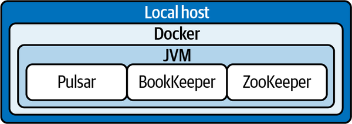
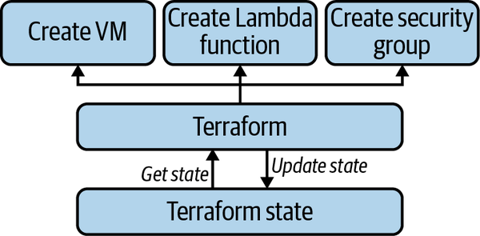
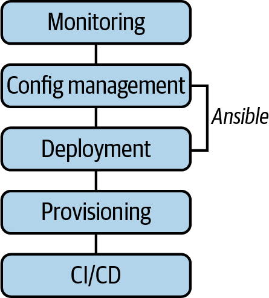

# Chapter 11. Deploying Pulsar

A discussion of Pulsar would be incomplete without talking about Pulsar deployment. Deploying Pulsar exposes the operator to many of the lower-level constructs in Pulsar and helps them find some of the patterns in the process. This chapter will cover several ways to deploy Pulsar, including Docker, Kubernetes, and bare metal.

# Docker

The simplest way to get up and running with Pulsar is by utilizing the official Pulsar Docker image(s). The Docker deployment is still necessary to deploy all the Pulsar components, including Apache ZooKeeper and Apache BookKeeper, but the official Pulsar images from Docker Hub ease the burden (see [Figure 11-1](https://learning.oreilly.com/library/view/mastering-apache-pulsar/9781492084891/ch11.html#pulsar_running_on_dockerdot_the_host_sy)).



*Figure 11-1. Pulsar running on Docker. The host system runs the Docker daemon, which runs a virtualized environment with the Java virtual machine. The Pulsar nodes, Apache BookKeeper, and Apache ZooKeeper run within the virtualized environment.*


Docker is an excellent way to get started because it doesn’t require you to install anything in your local environment (other than Docker, of course). It also works across multiple systems, including macOS, Windows, and various flavors of Linux. When getting started with any system, I generally recommend starting with Docker before moving to anything else.

To get started with the Docker deployment, we first need to pull all images related to Pulsar from Docker Hub:

```
docker pull apachepulsar/pulsar-all:latest
```

This command pulls images for Pulsar, ZooKeeper, and BookKeeper. From here, we should run each image.

```
docker run -it --name bookkeeper apachepulsar/pulsar-all:latest /bin/bash docker
run -it --name zookeeper apachepulsar/pulsar-all:latest /bin/bash docker run -it --
name broker apachepulsar/pulsar-all:latest /bin/bash
```

Next, we need to create network connectivity between the Docker images. We’ll create a Pulsar network and then connect each container to the network.

First, create the network:

```
docker network create Pulsar
```

Then connect each image to the network:

```
docker network connect pulsar zookeeper 
docker network connect pulsar bookkeeper 
docker network connect pulsar broker
```

With that command, we’ve built a Pulsar cluster from Docker containers. We can add another container to the Pulsar network or port forward traffic from the containers to the localhost to connect to the cluster.

One alternative to this path is to use Docker Compose. Docker Compose provides a mechanism to deploy multiple components in Docker and orchestrate their deployment. The Pulsar open source project has a helpful Docker Compose implementation.

Docker Compose deploys the following (you can remove elements that are not necessary for your use case). The numbers in parentheses indicate the number of containers that are deployed for each service:

- ZooKeeper (3)
- BookKeeper (3)
- Pulsar (3)
- Proxy (1)
- WebSocket (1)
- Function (1)
- Pulsar Manager (1)
- SQL (1)

To get started we need to clone the Pulsar repository:

```
git clone https://github.com/apache/pulsar.git
```

Next, we need to get to the directory with the Docker Compose configuration:

```
cd docker-compose/kitchen-sink
```

Now we just run the compose file:

```
docker-compose up
```

Once all the resources are deployed, we can begin sending messages to Pulsar as well as interacting with the admin console.

# Bare Metal

In this section, when I use the term *bare metal* I mean deploying in an environment that is outside the public cloud. There is some debate about whether bare metal means a nonvirtualized environment, but we’ll stick to the nonpublic cloud definition for this section.

To deploy Pulsar on bare metal, we need to deploy each of the following in the order presented:

- Apache ZooKeeper cluster
- Initialized cluster metadata
- Apache BookKeeper cluster
- A minimum of one Pulsar broker

In earlier chapters, we talked about how both Pulsar brokers and BookKeeper bookies use Apache ZooKeeper. In some deployments, you may want to deploy two ZooKeeper clusters for dedicated responsibility, but we’ll share ZooKeeper across Pulsar nodes and bookies for our use case.

## Minimum Requirements

For the bare-bones Pulsar deployment, only six virtual machines are needed. Ideally, these virtual machines are Linux based and have the 64-bit JRE/JDK 8 or later installed.

Hardware requirements may vary, but it’s recommended to have at least 1 TB of disk space per virtual machine, 16 virtual CPUs, and about 100 GB of RAM for production workloads.

## Getting Started

Once your virtual machines are provisioned, you should install the most recent Pulsar binaries (Pulsar 2.8.0 at the time of this writing). You can install the binaries using `wget`:

```
wget https://archive.apache.org/dist/pulsar/pulsar-2.8.0/apache-pulsar-2.8.0-bin.tar.gz
```

Once you’ve downloaded wget, untar the binary in preparation for the installation:

```
$ tar xvzf apache-pulsar-2.8.0-bin.tar.gz $ cd apache-pulsar-2.8.0
```

[Table 11-1](https://learning.oreilly.com/library/view/mastering-apache-pulsar/9781492084891/ch11.html#common_directories_in_the_pulsar_distri) summarizes the directories in the Pulsar distribution.

| Directory | Purpose                                                      |
| :-------- | :----------------------------------------------------------- |
| *bin*     | This directory contains all the command-line tools, such as Pulsar and pulsar-admin. You’ll use these tools as we install Pulsar and its various components. |
| *conf*    | This directory contains all the configuration files for Pulsar, ZooKeeper, and BookKeeper. |
| *data*    | This directory is the data storage directory for Apache ZooKeeper and BookKeeper. |
| *lib*     | This directory contains all the JAR files used in Pulsar.    |
| *logs*    | This directory contains all the logs created when interacting with installation files. |

## Deploying ZooKeeper

On three of our virtual machines, we’ll perform the following steps. Since ZooKeeper is responsible for most of the coordination tasks in Pulsar and BookKeeper, we need to make sure ZooKeeper is installed and running before moving forward.

To begin, we need to ensure that each node has the same ZooKeeper configuration:

```
cd conf
vi zookeeper.conf

server.1=zk1.us-west.example.com:2888:3888 
server.2=zk2.us-west.example.com:2888:3888 
server.3=zk3.us-west.example.com:2888:3888
```

Additionally, each ZooKeeper node must have an ID parameter set. We create this ID in the *data/zookeeper* directory on each node as follows:

```
mkdir -p data/zookeeper 
echo <id> > data/zookeeper/myid
```

Now we’re ready to start ZooKeeper. Since we’re going to install bookies on these same nodes, we need to change the ZooKeeper stats port in our command to start ZooKeeper:

```
PULSAR_EXTRA_OPTS="-Dstats_server_port=8001" bin/pulsar-daemon start zookeeper
```

We also need to initialize our Pulsar cluster:

```
$ bin/pulsar initialize-cluster-metadata \ 
--cluster pulsar-cluster-1 \ 
--zookeeper zk1.us-west.example.com:2181 \ 
--configuration-store zk1.us-west.example.com:2181 \ 
--web-service-url http://pulsar.us-west.example.com:8080 \ 
--web-service-url-tls https://pulsar.us-west.example.com:8443 \ 
--broker-service-url pulsar://pulsar.us-west.example.com:6650 \ 
--broker-service-url-tls pulsar+ssl://pulsar.us-west.example.com:6651
```

This command tells ZooKeeper where to find specific pieces of metadata about the Pulsar cluster. For it to work, the operator needs to have a DNS server and configure traffic to route to these URLs, TLS termination, and other considerations.

## Starting BookKeeper

Now that ZooKeeper is operating and the cluster metadata is initialized, we need to get our bookies up and running. On the same nodes that we installed ZooKeeper, let’s install bookies.

The first step is to configure the bookies, similar to what we did with ZooKeeper. *conf/bookkeeper* confuses the host/port configurations we used in the ZooKeeper configuration section. It should look like this:

```
zkServers=zk1.us-west.example.com:2181,
zk2.us-west.example.com:2181,
zk3.us-west.example.com:2181
```

BookKeeper has many configurable values, but for this installation, all of the defaults are satisfactory. Next, we use the pulsar-daemon command-line tool to start the bookies one at a time:

```
$ bin/pulsar-daemon start bookie
```

We can validate the installation by using the *bookiesanity* tool:

```
$ bin/bookkeeper shell bookiesanity
```

If successful, we validated our install of BookKeeper.

## Starting Pulsar

Similar to BookKeeper and ZooKeeper, all of Pulsar’s configurations are in the */conf* directory; specifically, the */conf/broker.conf* files. First, we need to make sure our ZooKeeper servers and configuration servers match what we included in the previous sections:

```
zookeeperServers=zk1.us-west.example.com:2181,
zk2.us-west.example.com:2181,
zk3.us-west.example.com:2181
  configurationStoreServers=zk1.us-west.example.com:2181,
zk2.us-west.example.com:2181,
zk3.us-west.example.com:2181
```

Our cluster name should also match what we set when we initialized the cluster metadata:

```
clusterName=pulsar-cluster-1
```

Additionally, we need to verify that our values for ports match what was set in the cluster initialization:

```
brokerServicePort=6650 
brokerServicePortTls=6651 
webServicePort=8080 
webServicePortTls=8443
```

Now we’re ready to start our Pulsar cluster; we can do this by using the pulsar-daemon command-line tool:

```
bin/pulsar-daemon start broker
```

Now that we have a running Pulsar cluster, we should confirm that it works according to our specifications. You can use a Pulsar client and connect to the broker service URL, or you can use the command-line tool that ships with Pulsar. You first need to change the Pulsar client configuration located in *conf/client* from whichever Pulsar node you decide to run in *conf/client.conf*:

```
webServiceUrl=http://us-west.example.com:8080
  brokerServiceurl=pulsar://us-west.example.com:6650
```

Now we can send some data to Pulsar:

```
$ bin/pulsar-client produce \ 
  persistent://public/default/test \
  -n 1 \
  -m "Hello, moto"
```

We can open a new client to consume the message:

```
$ bin/pulsar-client consume \ 
  persistent://public/default/test \
  -n 100 \ 
  -s "consumer-test" \
```

Installing Pulsar on bare metal is a considerable amount of work, and without proper configuration tools, it is also prone to mistakes and frustration. It’s recommended that you use a tool like Ansible to automate much of the work described in this section. I’ll go into what that looks like in the next section on public cloud installations.

# Public Cloud Providers

Nowadays, a likely mechanism for deploying Pulsar is the public cloud. There are many good reasons to deploy Pulsar on the public cloud; one of the biggest is using the cloud platform. An additional reason that is especially relevant for us is the elasticity of the cloud. Getting started with a small implementation and deployment and then expanding later is entirely possible.

This section will cover some of the high-level differences between the three major cloud providers when deploying Apache Pulsar. Before we dive into the specifics of each cloud provider, I need to introduce some tools that have not been discussed in the book so far.

We’ll use two tools to deploy Pulsar into the public cloud providers: Terraform and Ansible.

Terraform is an “infrastructure as code” tool. It provides some building blocks to connect to public resources (like cloud providers and software as a service vendors) and provision them. At its core, Terraform is relatively simple. It provides a handful of valuable abstractions over your infrastructure. First, it keeps track of the current state of your infrastructure (see [Figure 11-2](https://learning.oreilly.com/library/view/mastering-apache-pulsar/9781492084891/ch11.html#terraform_provides_quotation_markinfras)). Second, it provides a schema over infrastructure objects, and finally, it provides an authentication mechanism to apply those changes.



*Figure 11-2. Terraform provides “infrastructure as code” tools to deploy and control cloud software. Users can track the state of their applications in the cloud, inventory them, and delete them.*


Ansible is a tool for managing configurations, deploying applications, and checking the current state of the process (see [Figure 11-3](https://learning.oreilly.com/library/view/mastering-apache-pulsar/9781492084891/ch11.html#ansible_sits_in_the_configuration_manag)). Whereas Terraform is about working with third-party systems like AWS to request resources, Ansible configures those resources after they are provisioned.



*Figure 11-3. Ansible sits in the configuration management and deployment plane of DevOps. You can use Ansible to automate tasks like setting up servers and deploying binaries.*


We’ll use Terraform to provide the resources needed for each cloud provider and then Ansible to install and configure Pulsar.

## AWS

Pulsar ships with Terraform and Ansible modules; to use them, you need to have the following installed on your system:

- AWS command-line tool (you must be authenticated)
- Python 3.7
- PIP (Python package manager)
- Terraform
- Ansible

To get started, clone the Pulsar GitHub repository with the Terraform and Ansible code:

```
git clone https://github.com/apache/pulsar 
cd pulsar/deployment/terraform-ansible/aws
```

Next, initialize Terraform from this repository:

```
terraform init
```

Apply the default configurations included in the repository:

```
terraform apply
```

If you inspect your Terraform response, you should see the following resources deployed in the us-west-2 region of AWS:

- 9 EC2 instances
  - Three t2.small instances
  - Three i3.xlarge instances
  - Two c5.2xlarge instances
  - One c5.2xlarge instance
- A security group
- A virtual private cloud
- An API gateway
- A route table
- A subnet for the virtual private cloud (VPC)

Now we can use Ansible to install Pulsar, BookKeeper, and ZooKeeper.

First we’ll use the Ansible Playbook to configure the disks for BookKeeper:

```
ansible-playbook \
  --user='ec2-user' \
  --inventory=`which terraform-inventory` \
  setup-disk.yaml
```

Next we’ll use the Ansible Playbook to set up Pulsar. This will perform all the steps in the bare metal installation. It may take a few minutes for everything to become operational:

```
ansible-playbook \ --user='ec2-user' \ --inventory=`which terraform-inventory` \
../deploy-pulsar.yaml
```

We can validate our Pulsar installation by trying to connect to the Pulsar cluster and sending some messages:

```
$ pip install pulsar-client

$ python
import pulsar
client = pulsar.Client('pulsar://pulsar-client-url')
producer = client.create_producer('persistent://public/default/test-topic')
producer.send('Hello, moto')
>>> client.close()
```

## Azure

Installing Pulsar on Azure is very similar to installing it on AWS. This section will point out only places where the process is meaningfully different from the AWS process.

The requirements to install from your local system are as follows:

- Azure CLI (you must be authenticated)
- Python 3.7
- PIP (Python package manager)
- Terraform
- Ansible

You will need to perform the same Terraform commands you performed for AWS; the only difference is you need to clone it from a different place. By default, Azure Terraform is not included in the Pulsar repository:

```
git clone https://github.com/josep2/pulsar-ias 
cd pulsar/deployment/terraform-ansible/azure
```

From here, you can follow the steps in the AWS installation.

## Google Cloud Platform

Installing Pulsar on Google Cloud is very similar to installing it on AWS. This section will point out only places where the process is meaningfully different from the AWS process.

The requirements to install from your local system are as follows:

- Google Cloud CLI (you must be authenticated)
- Python 3.7
- PIP (Python package manager)
- Terraform
- Ansible

You will need to perform the same Terraform commands as you did in the AWS section; the only difference is you need to clone it from a different place. By default, GCP Terraform is not included in the Pulsar repository:

```
git clone https://github.com/josep2/pulsar-ias 
cd pulsar/deployment/terraform-ansible/gcp
```

From here, you can follow the steps in the AWS installation.

# Kubernetes

Since its public release in 2014, Kubernetes has become an increasingly popular mechanism for operating software in production environments. Kubernetes provides a set of abstractions that hide much of the complexity of deploying containerized applications. The popularity and rise of Kubernetes are also partially because of its ease of running in a local environment. For many Kubernetes applications, you can use minikube. A local virtualized clustered environment, minikube is an excellent way to get a feel for how a workload would run on Kubernetes before releasing it into your production environment.

Deploying an application in a Kubernetes cluster requires the operator to tell the Kubernetes API what they wish to deploy. “What” can include anything from which container Kubernetes should deploy to managing events like rollbacks and data backups. Kubernetes is flexible, but it requires users to describe their deployments with YAML or JSON. Kubernetes provides default APIs to use and lets the end user customize and provide their objects and operator patterns. With all of this choice and sprawling API definitions, Kubernetes deployments can quickly become unwieldy. Helm is a project designed to deal with some of the problems created by Kubernetes deployment. Helm is described as a “package manager for Kubernetes.” It provides some abstractions (on top of the dense existing Kubernetes abstractions) to simplify Kubernetes deployments.

For Apache Pulsar deployments on Kubernetes, Helm is the recommended way to accomplish this. Kubernetes is a popular way to deploy Pulsar because Pulsar has a project that has actively looked to Kubernetes to serve as the infrastructure layer for many components. In [Chapter 8](https://learning.oreilly.com/library/view/mastering-apache-pulsar/9781492084891/ch08.html#pulsar_functions-id000023) we talked about Pulsar Functions on Kubernetes, and there are many efforts to make BookKeeper and ZooKeeper run better on Kubernetes.

This section will walk through all the requirements to deploy an Apache Pulsar Helm chart. Helm uses templates to capture all the configurations across a deployment. The Helm chart has many default values, so we typically don’t have to set anything to get started. However, you can look to this version of the entire helm chart with notes from the maintainers on each of the values for reference.

Before using Helm, you should have kubectl and helm installed in your local environment. For local Kubernetes, some projects that are helpful are:

- [minikube](https://oreil.ly/kfIoo)
- [Kind](https://oreil.ly/wSGXs)
- [Docker for Desktop](https://oreil.ly/kYH0c)

To prepare for a Helm release, you can run the following command:

```
git clone https://github.com/apache/pulsar-helm-chart cd pulsar-helm-chart
./scripts/pulsar/prepare_helm_release.sh -n <k8s-namespace> -k <helm-release-name>
```

This will create all of the following resources:

- A Kubernetes namespace for installing the Pulsar release.
- JSON Web Tokens (JWT) secret keys and tokens for three super users: broker-admin, proxy-admin, and admin. By default, it generates an asymmetric public/private key pair. You can choose to generate a symmetric secret key by specifying `--symmetric`.
  - The proxy-admin role is used for proxies to communicate to brokers.
  - The broker-admin role is used for inter-broker communications.
  - The admin tools use the admin role.

Now we can install the chart:

```
helm repo add apache https://pulsar.apache.org/charts helm repo update helm install
pulsar apache/pulsar \ --timeout 10m \ --set initialize=true \ --set [any other
configuration values]
```

After deployment, it may take up to 10 minutes for all the components to be available. You can always check the status of your deployment with:

```
helm status pulsar
```

Some common errors you’ll see are pods that are in a `ContainerCreating` state or a `CrashloopBackoff` state. This typically means that not all of the components are executed in order and they will restart until things are working properly. Other times there may be issues in your Kubernetes cluster setup, and it may help to delete your Helm installation and try again.

While the Kubernetes mechanism for deployment required learning a few abstractions, all of the work required on our end involved changing configuration values. I believe this is a fair trade-off, and for an organization that is already using Kubernetes, deploying Pulsar on Kubernetes is an effective way to get started.

# Summary

In this chapter we covered several mechanisms for deploying Apache Pulsar. How you choose to deploy Pulsar will depend on your organizational expertise as well as your patience. Now we have sufficient context to take the next (and final) step in our journey, that of operating our cluster. In [Chapter 12](https://learning.oreilly.com/library/view/mastering-apache-pulsar/9781492084891/ch12.html#operating_pulsar) you’ll learn about:

- Metrics collection in Pulsar
- Performance tuning
- Interceptors
- Metrics forwarding