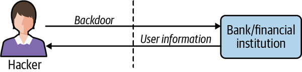

# 第一章：实时消息系统的价值

Real-time messaging systems power many of the systems we rely on today for banking, food, transportation, internet service, and communication, among others. They provide the infrastructure to make many of the daily interactions we have with these systems seem like magic. Apache Pulsar is one of these real-time messaging systems, and throughout this book, we’ll dig into what makes it unique. But first we’ll discuss the motivation for building systems like Pulsar so that you have some context for why we would take on the complexity of a real-time system with all of its moving parts.

实时消息系统为我们日常依赖的诸多系统提供动力，比如银行、食品、交通、互联网服务和通信等。它提供了基础设施，使我们与这些系统的许多日常互动看起来像魔术一样。Apache Pulsar 就是一样一个实时消息系统，在本书中，我们将深入探讨它的独特之处。但首先我们将讨论构建像 Pulsar 这样的系统的动机，这样你就会了解背景，了解为什么我们要承担一个具有所有移动部件的实时系统的复杂性。

# 动态数据 Data in Motion 

When I was 11 years old, I started a small business selling trading cards in my school cafeteria. The business model was simple: I bought packs of Pokémon cards, figured out which ones were the most valuable through cross-checking on internet forums, and then attempted to sell them to other kids during lunch break. What started as an exciting and profitable venture soon turned into a crowded space with many other children entering the market and trying to make some spending money of their own. My daily take-home profit dropped from about $1 to 25 cents, and I thought about quitting the business. I talked to my stepfather about it one evening over dinner, looking for advice from someone who ran a small business too (although one that was much more profitable than mine). After listening to me intently, he absorbed what I said and took a deep breath. He explained that I needed a competitive advantage, something that would make me stick out in a space that was crowded with many other kids. I asked him what kinds of things would give me a competitive advantage, and he chuckled. He told me I needed to figure it out myself, and that when I did, I should come back and talk to him.

在我 11 岁的时候，我在学校的食堂开始了一项卖交易卡的小生意。商业模式很简单：我买了几包神奇宝贝卡片，通过互联网论坛的交叉检查找出最有价值的卡片，然后在午休时间尝试将它们卖给其他孩子。最初是一项令人兴奋且有利可图的冒险，但很快就变成了一个拥挤的空间，许多其他孩子进入市场并试图自己赚钱。我每天的实得利润从大约 1 美元下降到 25 美分，我想退出这项生意。一天晚餐时，我和继父谈论了这件事，想从同样做小生意的人哪里寻求建议（尽管他的生意比我的利润高得多）。他认真地听了我的话，然后深吸了一口气。他解释说，我需要一个竞争优势，这会让我在一个挤满了许多其他孩子的空间中脱颖而出。我问他什么样的东西会给我带来竞争优势，他笑了笑。他告诉我我需要自己弄清楚，当我想清楚时，我应该回来和他谈谈。

For weeks I puzzled over what I could be doing differently. Day after day I watched other children transact in the school cafeteria, and nothing came to me immediately. One day I talked to my friend Edgar, who watched all the Pokémon card transactions more intently than I did. I asked him what he was looking at, and he explained that he was keeping track of all the cards sold that day. He walked from table to table, holding a ledger (see [Figure 1-1](https://learning.oreilly.com/library/view/mastering-apache-pulsar/9781492084891/ch01.html#edgarapostrophes_ledger_included_the_pr)) and recording all the transactions he witnessed. Edgar let me look through his notebook, and I saw weeks’ worth of Pokémon card transactions. That’s when it dawned on me that I could use the data he collected to augment my selling strategy and figure out where there was an unmet demand for cards! I told Edgar to meet me after school to talk about the next steps and a business partnership.

几个星期以来，我一直在想我可以做些什么不同的事情。 日复一日，我看着其他孩子在学校食堂做交易，但我没有立即想到该做什么。 有一天我和我的朋友 Edgar 交谈，他比我更仔细地观察所有神奇宝贝卡交易。 我问他在看什么，他解释说他正在记录当天售出的所有卡片。 他从一张桌子走到另一张桌子，拿着一个账本（见[图1-1]）记录着他见证的所有交易。 Edgar 让我翻看他的笔记本，我看到了数周的神奇宝贝卡交易。 就在那时，我突然意识到我可以使用他收集的数据来增强我的销售策略，并找出对卡片的需求未得到满足的地方！ 我告诉 Edgar 放学后等着我，讨论下一步商业合作问题。

*图 1-1. Edgar 的账本包括每张售出卡片的价格*

When school was out, Edgar and I met and came up with a game plan. I pulled out all of my cards, and we went through them and painstakingly created an inventory sheet. I cross-referenced my inventory with the sales Edgar had collected in his notebook. With this information, I felt confident we could be competitive with the other kids and undercut them where it made sense. Thanks to our new inventory and pricing model, Edgar and I spent the next three weeks selling lots of cards and making some money. But although during that time our daily profit slowly rose from 25 cents to around 50 cents, we still weren’t making my original profit of $1 per day, and now we had to share the revenues, which meant we were working much harder and making less money. We decided something had to give, and there had to be another way to make this process easier.

放学后，我和埃德加见面并提出了一个游戏计划。我拿出我所有的卡片，我们仔细检查它们，煞费苦心地制作了一张库存清单。我将我的库存与埃德加在他的笔记本中收集的销售额进行了交叉引用。有了这些信息，我有信心可以与其他孩子竞争，并在合理的地方压低他们的价格。多亏了我们新的库存和定价模型，Edgar 和我在接下来的三周里卖了很多卡并赚了一些钱。虽然那段时间我们的每日利润从 25 美分慢慢上升到 50 美分左右，但我们仍然没有赚到原来每天 1 美元的利润，现在我们不得不分享收入，这意味着我们工作得更辛苦，赚的钱更少。我们决定必须有所作为，并且必须有另一种方法来简化这个过程。

When Edgar and I talked about the limitations of our business, one aspect stuck out. There were only two of us, but there were five tables where kids sold Pokémon cards. Frequently, we would begin selling at the wrong table. Our cards were not the cards the kids at the table wanted to buy. We would miss out on the market opportunity for the day, and often for a week or more, while waiting for new customers. We needed a way to be at all five tables at once. Furthermore, we needed a way to communicate with each other in real time across the tables. Edgar and I schemed for a few days and came up with the plan depicted in [Figure 1-2](https://learning.oreilly.com/library/view/mastering-apache-pulsar/9781492084891/ch01.html#a_diagram_of_our_card-selling_schemedot).

当和 Edgar 谈到我们业务的局限性时，有一个方面很突出。我们只有两个人，但有五张桌子是孩子们卖神奇宝贝卡的地方。通常，我们会在错误的桌子上开始销售。我们的卡片不是餐桌上的孩子们想要购买的卡片。在等待新客户时，我们会错过当天的市场机会，通常会错过一周或更长时间。我们需要一种方法，可以同时出现在所有五张桌子上。此外，我们需要一种跨桌实时通信的方法。 Edgar 和我计划了几天，并提出了 [图 1-2] 中描述的计划。

*图 1-2. 卡片销售方案示意图。在每张桌子上，我们公司的一名成员都有对讲机，我们通过对讲机相互交流交易价格。*

We recruited three other students who were trying to break into the Pokémon card-selling market. We split the cards we wanted to sell evenly among the five of us, and each of us went to one of the five cafeteria tables attempting to sell the cards in our hand. Each of us also had a notebook and a walkie-talkie. When one of us overheard another kid negotiating the sale of one of their cards, that person would communicate the information to the other four in our group. We would all keep the same ledger of prices, and if someone in our group had the card of interest, the person at that table would offer it to the buyer at a lower price. With this strategy, we could always undercut the competition, and all five of us had a picture of the Pokémon card market for that day. Thanks to the new company strategy, our Pokémon card profits rose from 50 cents a day to $2.50 a day. Our teachers eventually shut down the business, and I haven’t sold Pokémon cards since.

我们招募了另外三名试图打入神奇宝贝卡销售市场的学生。我们将要卖的卡片平分给我们五个人，然后我们每个人走到五张自助餐厅的一张桌子，试图卖掉我们手中的卡片。我们每个人还有一个笔记本和一个对讲机。当我们中的一个人偷听到另一个孩子在谈判出售他们的卡片时，那个人会将信息传达给我们小组中的其他四个人。我们都将保持相同的价格账本，如果我们组中的某个人有兴趣卡，那张桌子上的人会以较低的价格将其提供给买方。有了这个策略，我们总能压低竞争价格，我们五个人都对那天的神奇宝贝卡市场有了了解。由于新的公司战略，我们的神奇宝贝卡利润从每天 50 美分上升到每天 2.50 美元。我们的老师最终关闭了这项业务，从那以后我再也没有卖过神奇宝贝卡。

This story illustrates the value of data in motion. Before we began collecting and broadcasting the Pokémon card sales, the data had little value. It did not have a material impact on our ability to sell cards. Our walkie-talkies and ledgers were a simple system that enabled us to communicate bids and asks in real time across the entire market. Armed with that information, we could make informed decisions about our inventory and sell more cards than we were able to before. While our real-time system only enriched me by a few quarters a day, the system’s principles enable rich experiences throughout modern life.

这个故事说明了动态数据的价值。在我们开始收集和传播神奇宝贝卡销售情况之前，这些数据几乎没有价值。它对我们销售卡片的能力没有实质性影响。我们的对讲机和账本是一个简单的系统，使我们能够在整个市场上实时传达出价和询价。有了这些信息，我们就可以对我们的库存做出明智的决定，并销售比以前更多的卡片。虽然我们的实时系统每天只让我获益几十分钟，但该系统的原理使我在现代生活中获益良多。

# 资源效率

In my trading card business, one of the company’s significant advantages was the ability to collect data once and share it with everyone in the company. That ability enabled us to take advantage of sales at the cafeteria tables. In other words, it gave each person at a table a global outlook. This global outlook decentralized the information about sales and created redundancy in our network. Commonly, if one member of the crew was writing and missed an update, they could ask everyone else in the company what their current state of affairs was and they would be able to update their outlook.

在我的交易卡业务中，公司的重要优势之一是能够一次性收集数据并与公司中的每个人共享。这种能力使我们能够利用自助餐厅餐桌上的销售优势。换句话说，它让餐桌上的每个人都有一个全局视野。这种全局视野分散了有关销售的信息，并在我们的网络中造成了冗余。通常，如果一名工作人员正在忙着而错过了更新，他们可以询问公司中的其他人他们目前的状况是什么，并将能够更新自己的信息。

While my trading card business was small and inconsequential in the larger scheme of things, resource efficiency can be a boon for companies of any size. When you consider modern enterprise, many events happen that have downstream consequences. Consider the simple meetings that every company has. Creating a calendar meeting requires scheduling time on multiple people’s calendars, reserving a room, setting up videoconferencing software, and often, ordering refreshments for attendees. With tools like Google Calendar, we can schedule a meeting with multiple people and coordinate it by simply clicking a few buttons and entering some information into a form (see [Figure 1-3](https://learning.oreilly.com/library/view/mastering-apache-pulsar/9781492084891/ch01.html#with_event-driven_architecturescomma_co)). Once that event is created, emails are sent, calendars are tentatively booked, pizza is ordered, and the room is reserved.

虽然我的交易卡业务很小，在更大的计划中无关紧要，但资源效率对于任何规模的公司来说都是一个福音。当你考虑现代企业时，许多事件的发生都会对下游产生影响。考虑一下每家公司都有的简单会议。创建日历会议需要在多人的日历上安排时间、预订房间、设置视频会议软件，并且通常需要为与会者订购茶点。使用 Google 日历等工具，我们可以安排多人会议并通过简单地单击几个按钮并将一些信息输入表单来协调会议（参见 [图 1-3])。一旦该事件被创建，将发送电子邮件、暂定日历、订购比萨饼并预订房间。

*图 1-3. 借助事件驱动架构，安排多个参与者的会议邀请等复杂任务变得更加容易。*

Without the platforms to manage and choreograph the calendar invite, administrative overhead can grow like a tumor. Administrators would have to make phone calls, collect RSVPs, and put a sticky note on the door of a conference room. Real-time systems provide value in other systems we use every day, from customer relationship management (CRM) to payroll systems.

如果没有平台来管理和编排日历邀请，管理开销就会像肿瘤一样增长。 管理员必须打电话，收集回复，并在会议室的门上贴一张便条。 实时系统为我们每天使用的其他系统提供价值，从客户关系管理 (CRM) 到工资系统。

# 有趣的应用 Interesting Applications 

Resource efficiency is one reason to utilize a messaging system, but an enhanced user experience may ultimately be a more compelling reason. While the software we use serves a utilitarian purpose, enhancing the user experience can make it easier to complete our intended task as well as new and unintended tasks. The user experience can be enhanced through several methods. The most notable are 1) improving the design to make interfaces easier to navigate and 2) doing more on behalf of the user. Exploring the second of these methods, programs that perform on the user’s behalf can quickly and accurately take an everyday experience and turn it into something magical. Consider a program that automatically deposits money into your savings account when there is a credit in your checking account. Each time a check clears, the program uses the balance and other contexts regarding the account to deposit a certain amount of money in your savings account. Over time, you save money without ever feeling the pain of saving. Messaging systems are the backbone of systems like this one. In this section we will explore a few examples in more detail and discuss precisely how a messaging platform enables rich user experiences.

资源效率是使用消息系统的一个原因，但提升用户体验最终可能是一个更有说服力的原因。虽然我们使用的软件是为实用性目的服务的，但提升用户体验可以更轻松地完成我们的预期任务以及新的非预期的任务。可以通过多种方法提升用户体验，例如 1) 改进设计以使界面更易于导航， 2) 代表用户做更多事情。对于第二种方法，代表用户执行的程序可以快速准确地获取日常体验并将其变成神奇的东西。例如一个程序当你的支票账户中有信用时，自动将钱存入您的储蓄账户。每次支票清算时，程序都会使用余额和其他账户信息将一定数量的钱存入您的储蓄帐户。随着时间的推移，您在存钱时不会感到存钱的痛苦。消息系统是此类系统的支柱。在本节中，我们将更详细地探讨几个示例，并讨论消息系统如何实现丰富的用户体验。

## 银行应用

Banks provide the capital that powers much of our economy. To buy a home or car and, in many cases, start a business, you will likely need to borrow money from a bank. If I were to be kind, I would best describe the process of borrowing money from a financial institution as excruciating. In many cases, borrowing money requires that you print out your bank statements so that the bank’s loan officers can get an understanding of your monthly expenses. They may also use these printouts to verify your income and tax returns. In many cases, you may provide bank statements, pay stubs, tax returns, and other documents to prequalify for a loan, and then provide the same copies two months later to get the actual loan. While this sounds superfluous in an era of technology, the bank has good reason to be as thorough and intrusive as possible.

银行提供资本，为我们的经济提供动力。为了购买房屋或汽车，或是为了创业，您可能需要从银行借钱。如果要我说得客气一点，我会说向金融机构借钱的过程是折磨人的。通常情况借钱需要您打印银行对账单，以便银行的信贷员了解您的每月支出。他们还可以使用这些打印件来验证您的收入和纳税申报。通常还需要提供银行对账单、工资单、纳税申报表和其他文件来进行贷款资格预审，然后在两个月后提供相同的副本以获得实际贷款。虽然这在技术时代听起来是多余的，但银行有充分的理由让借贷过程尽可能彻底和侵入。

For a bank, lending you six figures’ worth of money comes at considerable risk. By performing extensive checks on your bank statements and other documents, the bank reduces the risk of approving you for a loan. Banks also face significant regulations, and without a good understanding of your credit, they may face loss of licensing for failing to conduct due diligence. To modernize this credit approval system, we need to look at the problem through a slightly different lens.

对于银行来说，借给你六位数的钱是有相当大的风险的。通过对你的银行对账单和其他文件进行大量检查，银行可以降低批准贷款的风险。银行也面临着严峻的法规要求，如果对你的信用没有很好的了解，他们可能会因未能进行尽职调查而面临失去执照的风险。为了让这个信用审批系统现代化，我们需要从一个稍微不同的角度来看待这个问题。

When a customer prequalifies for a loan, the bank agrees it will lend up to a certain dollar amount contingent on the applicant having the same creditworthiness when they are ready to act on the loan. Typically, a software system connected to the bank will send notifications to the customer’s credit card companies for predetermined events (such as checking a customer’s credit). The bank is notified in real time if the customer does anything that will jeopardize the closing of the loan. Also, based on the customer’s behavior, the bank can update in real time how much the customer can borrow and have a clear understanding of the probability of a successful close. This end-to-end flow is depicted in [Figure 1-4](https://learning.oreilly.com/library/view/mastering-apache-pulsar/9781492084891/ch01.html#credit_card_usage_and_risk_are_communic). After the initial data collection for prequalification, a real-time pipeline of transactions and credit card usage is sent to the bank so that there are no surprises.

当客户获得贷款资格预审时，银行同意根据申请人准备对贷款采取行动时具有的信用度为条件，向申请人贷出一定金额的贷款。通常，连接到银行的软件系统会向客户的信用卡公司发送预定事件的通知（例如检查客户的信用）。如果客户做了任何会危及贷款偿还的事情，银行会实时收到通知。此外，银行可以根据客户的行为，实时更新客户可以借多少，清楚了解成功平仓的概率。 [图 1-4] 描述了这种端到端流程。在收集资格预审的初始数据之后，交易和信用卡使用的实时信息被发送到银行，这样就不会有任何意外。

*图 1-4. 信用卡使用情况和风险会传达给多个下游消费者。*

This process is superior in many ways to the traditional process of completing a full application at both loan preapproval and approval. It reduces the friction of closing the loan (where the bank would make money) and puts the borrower in control. For the financial institution providing the real-time data, it’s just a matter of routing data used for another purpose for the lender. The efficiency gained and value provided from this approach is exact.

这个过程在许多方面都优于在贷款预批准和批准时完成完整申请的传统过程。 它减少了关闭贷款（银行赚钱的地方）的摩擦，并使借款人处于控制之中。 对于提供实时数据的金融机构来说，只需将数据路由给贷方用于其他目的。 从这种方法获得的效率和提供的价值是确切的。

## 医疗应用

Hospitals, medical staff, and medical software are under heightened scrutiny. This scrutiny often looks like compliance and authorization checks by affiliated government entities. When something goes wrong in the medical field, it can be much more devastating than losing money, as with our banking example. Mistakes in the medical field can cause permanent injury or death for a patient, the suspension or revocation of the practitioner’s medical license, or a sanction for a hospital. Because of this high level of scrutiny, even a routine visit to a doctor’s office can feel slow and inefficient in the best case and extremely frustrating in the worst case. There are many forms to fill out; there is a lot of waiting, and you are often asked the same questions multiple times by different people. Not only does this create inefficiency, it also translates into an expensive doctor’s visit.

医院、医务人员和医疗软件正受到严格审查。这种审查通常看起来像是政府的合规性和授权检查。当医疗领域出现问题时，它可能比上述银行示例中的亏损更具破坏性。医疗领域的错误可能导致患者永久性伤害或死亡，从业者的医疗执照被暂停或吊销，医院被制裁。由于这种高度的审查，即使是对医生办公室的例行访问，在最好的情况下也会感到缓慢和低效，在最坏的情况下更会非常令人沮丧。有很多表格要填写；有大量等待，而且你经常被不同的人多次询问同样的问题。这不仅会造成效率低下，还会转化为昂贵的就医费用。

How would a real-time system help the hospital? Some hospitals in Utah are trying to tackle this problem. The complaints these hospitals heard most often from patients concerned having to give their medical history more than once per visit. When a patient arrived for a visit, they would fill out a form with their health history. When they saw a medical assistant, they were asked many of the same questions they had already answered on the form. When they finally saw their doctor, they were asked the same questions again. The health history provides a reasonable basis for doctors to work from and can prevent common problems concerning misdiagnoses and prescriptions. However, collecting health history often comes at the cost of clinic time, which translates into a poor patient experience and extra work for the staff.

那么实时系统会如何帮助医院呢？犹他州的一些医院正在努力解决这个问题。这些医院最常听到的投诉是患者每次就诊时必须提供不止一次病史。当患者来访时，他们会填写一份表格，其中包含他们的健康史。当他们看到一名医疗助理时，他们会被问到了许多他们已经在表格上回答过的问题。当最终见到医生时，他们又会被问到同样的问题。健康史为医生提供了合理的工作基础，可以预防常见的误诊和处方问题。然而，收集健康史通常是以牺牲门诊时间为代价的，这意味着患者体验不佳和工作人员的额外工作。

The software engineering department and health providers at these hospitals worked together to reimagine what a health history system should look like. Ultimately, they reengineered the patient record system to make it an event-driven, real-time system. Now when a patient arrives at one of these hospitals, they enter their information on a tablet (see [Figure 1-5](https://learning.oreilly.com/library/view/mastering-apache-pulsar/9781492084891/ch01.html#some_hospitals_automatically_publish_pa)). The data is saved to the patient record system, and three minutes before the scheduled appointment time the doctor receives a notification to log on and check the patient’s information. The doctor uses those three minutes to end the current appointment and start reading the next patient’s chart. When the doctor arrives in the patient’s room, they know everything they need to start a conversation with the patient about their care.

这些医院的软件工程部门和医疗机构共同努力，重新设想健康历史系统应该是什么样子。最终，他们重新设计了患者记录系统，使其成为事件驱动的实时系统。现在，当患者到达其中一家医院时，他们会在平板电脑上输入他们的信息（参见 [图 1-5])。数据被保存到病历系统中，在预约时间前三分钟，医生会收到通知登录并检查患者信息。医生利用这三分钟结束当前预约并开始阅读下一位患者的病历。当医生到达病人的房间时，他们就已经知道病人的一切信息了。

*图 1-5. 医院会自动将患者信息发布给必要的各方，从而提供更好的用户体验。*

After the visit, if the patient needs to have any lab work or other tests performed, the doctor clicks a button and the test order is sent to the lab. Similarly, when the patient checks into the lab, their information is auto-populated. While initially designed to prevent duplication of collecting medical history, the system has had a far-reaching impact. Not only have these hospitals saved money, but the patient experience has improved dramatically.

就诊后，如果患者需要进行任何实验室化验或其他检查，医生点击一个按钮，检查订单就会发送到实验室。 同样，当患者进入实验室时，他们的信息会自动填充。 虽然最初的设计只是为了防止重复收集病史，但该系统已产生了更加深远的影响。 这些医院不仅节省了资金，而且患者体验也得到了显著改善。

## 安全应用

For governments and private companies, fraud and hacking on the internet are costly problems without a one-size-fits-all solution. The hardest part of fighting hacking and fraud is the number of places or vectors an organization has to protect. Fraud can occur if the bank is unable to verify the identity or authorization of a member accurately (see [Figure 1-6](https://learning.oreilly.com/library/view/mastering-apache-pulsar/9781492084891/ch01.html#fraudster)). For example, if someone who isn’t the owner of an account convinces the bank they are, they can act as the account owner, withdrawing funds, taking out loans, or other nefarious behavior. Hacks can happen when an employee accidentally clicks on a phishing attempt link or an engineer applies the wrong policy to their code (see [Figure 1-7](https://learning.oreilly.com/library/view/mastering-apache-pulsar/9781492084891/ch01.html#hacker)). Defending against multiple attack vectors is expensive and requires specialized skills.

对于政府和私营公司而言，互联网上的欺诈和黑客攻击是代价高昂的问题，没有一个一刀切的解决方案。打击黑客和欺诈最困难的部分是组织必须保护的地点或媒介的数量。如果银行不能准确验证会员的身份或授权，就可能发生欺诈（参见[图 1-6])。例如，如果不是账户所有者的人让银行相信他是账户所有者，他可以冒充账户所有者，提取资金、贷款或进行其他恶意行为。当员工不小心点击了网络钓鱼链接，或者工程师对代码应用了错误的策略，就会发生黑客攻击（参见 [图 1-7])。防御多种攻击媒介的成本很高，并且需要专业技能。

*图 1-6. 欺诈者使用伪造的身份来欺骗银行，使其认为他们是合法客户。 欺诈者的身份得到确认，他们使用此访问权限合法地提取资金。*

*图 1-7. 黑客通过后门（未经授权的渠道）进入金融机构。 黑客使用此后门获取用户数据。*

Real-time systems can reduce some of the cost and overhead of protecting an organization against fraud and hacks. Many organizations require a specialized approach to each threat vector they face. They may use one vendor for their firewall, another to protect their email, and a third to manage their cloud computing policies. For many of these vendors, it’s not in their business interest to make their security products interoperable with other vendors’ products. Many of these vendors use the same data to detect different threats.

实时系统可以减少保护组织免受欺诈和黑客攻击的一些成本和开销。许多组织一个专门方法来处理他们面临的每个威胁媒介。他们可能使用一个供应商的防火墙，使用另一个供应商来保护电子邮件，使用第三个供应商来管理他们的云计算策略。对于这些供应商来说，让他们的安全产品与其他供应商的产品互操作不符合他们的商业利益。其中许多供应商使用相同的数据来检测不同的威胁。

Some new product offerings in the market utilize the real-time nature of the data (internet traffic) and provide an all-in-one solution (see [Figure 1-8](https://learning.oreilly.com/library/view/mastering-apache-pulsar/9781492084891/ch01.html#moderncomma_real-time_fraud_detection_s)). These offerings treat each new connection as a threat. They use an event-driven system with machine learning, business logic, and other approaches to determine whether a particular request is safe. This approach is also modular, in that the vendor can customize the threat protection for each customer based on their needs. This approach is superior to the alternatives because it reuses data passing through the system and choreographs responses from multiple systems.

市场上的一些新产品利用数据的实时性（互联网流量）并提供一体化解决方案（参见 [图 1-8]）。这些产品将每个新连接视为威胁。他们使用带有机器学习、业务逻辑和其他方法的事件驱动系统来确定特定请求是否安全。这种方法也是模块化的，供应商可以根据每个客户的需求为他们定制威胁防护。这种方法优于其他方法，因为它重用通过系统的数据，并编排来自多个系统的响应。

*图 1-8. 现代的实时欺诈检测系统将每个新连接视为威胁。*

## 物联网应用

The use of smart speakers and other smart-home appliances has been on the rise around the world. With the broader availability of internet service and the lower cost of producing internet-connected devices, many first-time smart-device buyers have entered the market. In general, users of smart devices find utility in what these devices have to offer. I’ve been a smart-home enthusiast for many years now, and while each camera, sensor, and speaker has utility on its own, the utility they have when working together is hard to rival. Working together takes smart homes from many applications on a smartphone to a holistic system that can meet the user’s needs. Unfortunately, getting the devices from myriad manufacturers to work together can be difficult. For the manufacturers, it may not be in their best business interest to make their products interoperable with those of their competitors. There also may be sound technical reasons why a device doesn’t support a popular protocol. For a user, these decisions can be limiting and frustrating. I found these limitations too prohibitive and decided to build my own proprietary bridge for use with my consumer-grade smart-home products.

智能音箱和其他智能家电的使用在全球范围内呈上升趋势。随着互联网服务的广泛普及，以及互联网连接设备的生产成本降低，许多首次购买智能设备的买家进入了市场。一般来说，智能设备的用户在这些设备所提供的东西中发现了效用。多年来，我一直是智能家居爱好者，虽然每个摄像头、传感器和音箱都有自己的效用，但它们在协同工作时的效用却一言难尽。协同工作将智能家居从智能手机上的许多应用程序转变为可以满足用户需求的整体系统。不幸的是，让无数制造商的设备一起工作可能很困难。对于制造商来说，让他们的产品与竞争对手的产品互操作可能不符合他们的最佳商业利益。设备不支持流行协议也可能有合理的技术原因。对于用户来说，这些决定可能是限制性的和令人沮丧的。我发现这些限制太令人望而却步了，因此决定建立自己的专有桥梁，用于我的消费级智能家居产品。

The majority of consumer-grade smart-home devices speak one of three protocols: Bluetooth, WiFi, or Zigbee. Most of us are familiar with Bluetooth; it is a commonly used protocol for connecting devices from computer keyboards and mice to hearing aids. Bluetooth doesn’t require any internet connectivity and is widely supported. WiFi is a wireless internet connectivity protocol. Zigbee is a low-energy communication protocol commonly used in smart-home devices.

大多数消费级智能家居设备都使用以下三种协议之一：蓝牙、WiFi 或 Zigbee。我们大多数人都熟悉蓝牙。它是一种常用的协议，用于连接计算机键盘和鼠标、连接助听器。蓝牙不需要任何互联网连接并且得到广泛支持。 WiFi 是一种无线互联网连接协议。 Zigbee 是智能家居设备中常用的一种低能耗通信协议。

Suppose you had 20 smart-home devices from different manufacturers, and each spoke either Bluetooth, WiFi, or Zigbee. If you wanted them all to work together to, say, monitor your home, it would not be easy to do. However, if you could build a bridge that would translate WiFi into Zigbee, Zigbee into Bluetooth, and so on, the possibilities would be endless. That’s the idea I worked with when designing the smart-home bridge in [Figure 1-9](https://learning.oreilly.com/library/view/mastering-apache-pulsar/9781492084891/ch01.html#a_diagram_of_my_smart_systemdot_each_de).

假设您有 20 台来自不同制造商的智能家居设备，每台设备都使用蓝牙、WiFi 或 Zigbee。如果你想让他们一起工作，比如说，监控你的家，这并不容易。然而，如果你能建造一座桥，将 WiFi 转换为 Zigbee，Zigbee 转换为蓝牙等等，那么可能性将是无穷无尽的。这就是我在 [图 1-9] 中设计智能家居桥时的想法。

*图 1-9. 我的智能家居系统示意图。边缘上的每个设备使用不同的协议进行通信，但会将其事件发布到一个集中式 MQTT 服务器，该服务器可以编排事件。*

Each of my smart-home devices was event-driven, meaning that when an event occurred that was important to the device, the device would publish the event to a centralized server. For all the smart-home devices I owned, I could tap into their software and broadcast that same event to my event bridge. I use MQTT (Message Queuing Telemetry Transport), a lightweight messaging system designed for Internet of Things applications. Now, whenever an event occurs in my home (like a door opening), it will publish natively to the manufacturer’s platform as well as to my platform. I built a small event-processing platform that takes events posted to MQTT and performs actions when predefined criteria are met. For example, if a door opens but doesn’t close within two minutes, it will send a push notification to my wife. Or if the alarm system is armed and it detects someone is home, it will delay notification for a few seconds.

我的每个智能家居设备都是事件驱动的，这意味着当发生对设备很重要的事件时，设备会将事件发布到集中式服务器。对于我拥有的所有智能家居设备，我可以利用他们的软件并将相同的事件广播到我的事件桥。我使用 MQTT（Message Queuing Telemetry Transport），一种专为物联网应用程序设计的轻量级消息系统。现在，每当我家发生事件（比如开门），它都会本地发布到制造商的平台以及我的平台。我构建了一个小型事件处理平台，它接收发布到 MQTT 的事件并在满足预定义条件时执行操作。例如，如果一扇门打开但在两分钟内没有关闭，它会向我的妻子发送推送通知。或者，如果警报系统已布防并且检测到有人在家，它将延迟通知几秒钟。

My smart-home system provides much more utility to me now that all the events are codified in a reusable way. That is the power of real time, and it’s also the power of event-driven architectures.

现在，我的智能家居系统为我提供了更多效用，因为所有事件都以可重用的方式编码。这就是实时的力量，也是事件驱动架构的力量。

# 总结

In this chapter we explored examples of real-time and event-oriented systems in the real world. We used these systems to help motivate the need for a system like Apache Pulsar. In the upcoming chapters we’ll move from a high-level view of why we need Pulsar to a more detailed view based on programming and systems literature as well as real-world examples.

在本章中，我们探讨了现实世界中的实时和面向事件的系统的例子。我们用这些系统来帮助激发对 Apache Pulsar 这样的系统的需求。在接下来的章节中，我们将从为什么需要 Pulsar 的高层次视图转向基于编程和系统文献以及现实世界实例的更详细的视图。