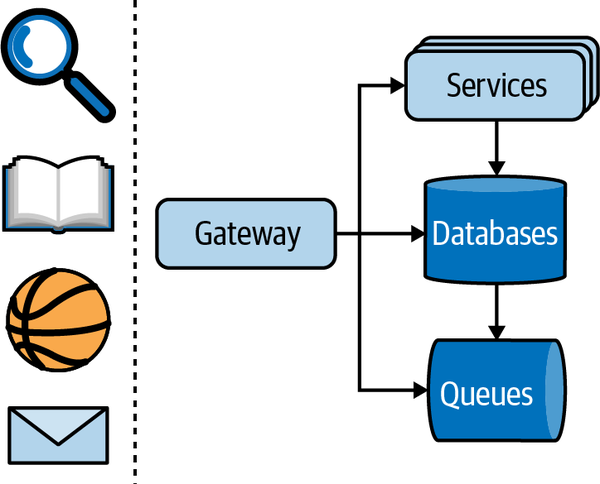
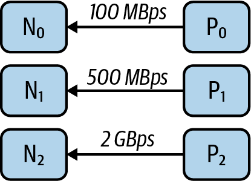
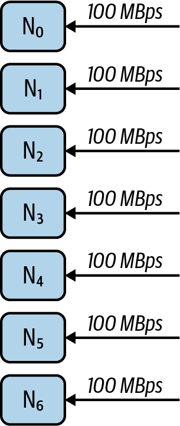
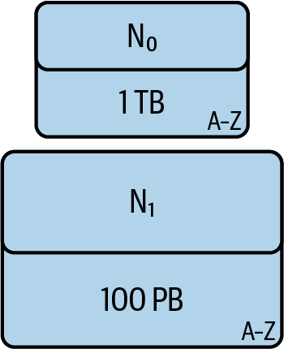
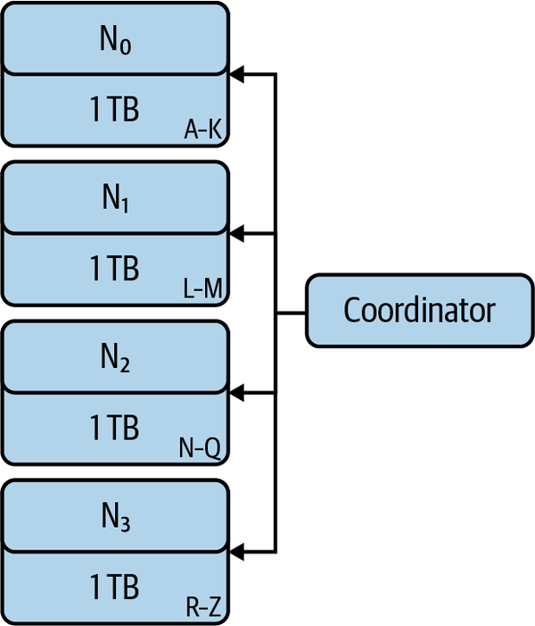
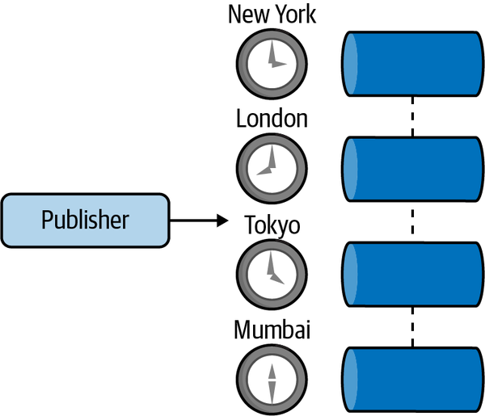
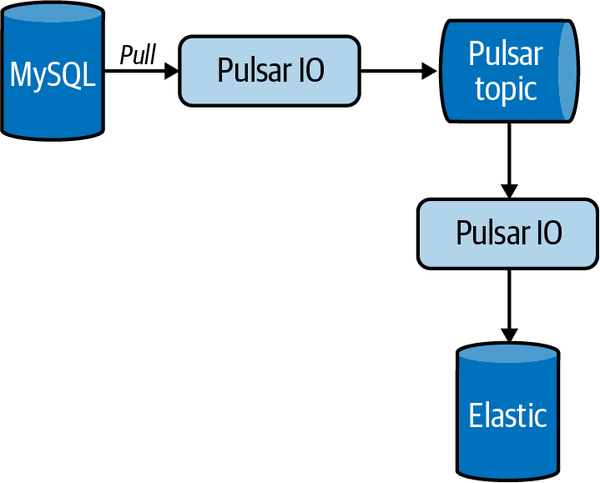
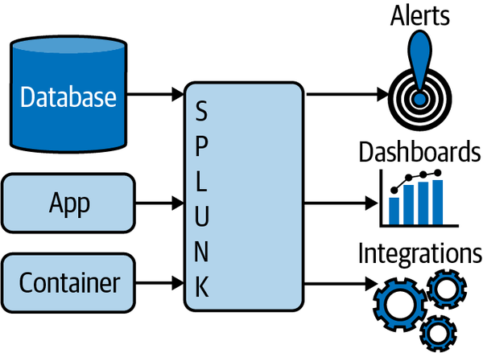

# Chapter 3. Pulsar

In [Chapter 2](https://learning.oreilly.com/library/view/mastering-apache-pulsar/9781492084891/ch02.html#event_streams_and_event_brokers), we discussed the motivation for a system like Apache Pulsar: namely, a system that handles both the event stream and pub/sub patterns seamlessly. I provided sufficient evidence for the utility of a system like Pulsar and provided a historical backdrop for asynchronous messaging. We did not, however, cover how Pulsar came into existence. To begin this chapter on the design principles and use cases for Pulsar, it’s worth understanding how exactly the system came to be.

# Origins of Pulsar

In 2013, Yahoo! reported having 800 million active users across its services. At the time, Yahoo! provided services for email, photo storage, news, social media, chat, and fantasy sports, among others. From an infrastructure perspective, Yahoo! felt it needed to address some of its underlying architecture decisions to meet users’ demands and continue to build its world-class services. The messaging architecture used at Yahoo! was thought to be the most important area for improvement. In the company’s service-oriented architecture, the messaging system helped all components scale and provided the low-latency primitives to simplify scalability across all services (see [Figure 3-1](https://learning.oreilly.com/library/view/mastering-apache-pulsar/9781492084891/ch03.html#in_this_representation_of_yahooexclamat)). Following are the most critical aspects for the new messaging platform to meet:

- Flexibility

  Yahoo! worked with queues, publish/subscribe, and streaming, and wanted its messaging platform to handle these use cases seamlessly.

- Reliability

  Yahoo! was accustomed to 99.999% reliability, and the new system had to have the same level of reliability, if not better.

- Performance

  Yahoo! needed low, end-to-end latencies for services like chat and email as well as its ad platform.

*Figure 3-1. In this representation of Yahoo! services, search, news, sports, and email are supported by backend infrastructure, including services, databases, and queues.*

Yahoo! evaluated existing messaging technologies and determined that none of the open source or off-the-shelf solutions would work for its scale and needs. Yahoo! decided to create a system to meet its needs and designed and built the first version of Pulsar.

In 2015, Yahoo! deployed its first Pulsar cluster. Pulsar’s use quickly exploded to replace the company’s existing messaging infrastructure. In 2017, Yahoo! made Pulsar an open source project by donating it to the Apache Software Foundation.

# Pulsar Design Principles

Pulsar was designed from the ground up to be the default messaging platform at Yahoo! As Yahoo! is a large technology company with hundreds of millions of users and numerous popular services, using one platform to meet everyone’s needs was complicated at best. Scalability and usability challenges were only the tip of the iceberg. At the dawn of Pulsar’s design and implementation, many companies were utilizing the public cloud, but cloud adoption was nowhere near what it is today. Creating a system that meets a company’s needs today but doesn’t lock the company into a single development pattern for years to come is a challenge few engineering teams can meet.

To meet these challenges, the Pulsar designers focused on two essential design principles:

- Modularity
- Performance

Modularity and performance are a rare combination in systems. Like a Thoroughbred made of Legos (see [Figure 3-2](https://learning.oreilly.com/library/view/mastering-apache-pulsar/9781492084891/ch03.html#the_two_design_principles_behind_pulsar)), Pulsar allows for extensions while never compromising on performance. From these two design principles, some of Pulsar’s elegance and foresight come to the surface: namely, its multitenancy, geo-replication, performance, and modularity. We’ll dive into each and show how it relates to Pulsar’s design principles.

*Figure 3-2. The two design principles behind Pulsar are modularity (represented by the Legos) and performance (represented by the Thoroughbred).*

## Multitenancy

When I was growing up, I lived in an apartment complex with 27 units in a five-story building. We all shared the utilities, including heat, water, cable, and gas. Trying to ensure a suitable temperature, good water pressure, a reliable cable signal, and adequate gas for all the units was impossible. In the winter, the top floor was 75°F (too hot) and the first floor was 65°F (barely tolerable). In the morning, tenants raced to get to the shower before all the hot water was used and the water pressure was low. If several tenants were watching Monday Night Football, it would be difficult to get a reliable signal.

Our apartment complex was multitenant (see [Figure 3-3](https://learning.oreilly.com/library/view/mastering-apache-pulsar/9781492084891/ch03.html#in_this_apartment_buildingcomma_multipl)) in that each unit contained its own family but all units shared resources. In software, multitenant systems are designed to run workloads for different customers on the same hardware. Pulsar’s flexible subscription model and decoupled architecture enable a high-quality, multitenant experience.

*Figure 3-3. In this apartment building, multiple tenants share resources. Without smart management of these resources, one tenant can impact the others. Pulsar’s multitenant architecture enables the use of multiple tenants on fixed resources.*

Pulsar handles multitenancy through namespacing and allows tenant scheduling on a specific part of the Pulsar cluster. A *namespace* is simply a logical grouping of topics. Namespaces give structure to Pulsar by providing some organizing fabric to the topics. These two mechanisms put the Pulsar cluster operator in full control of resource allocation and isolation for specific tenants. Returning to the example of my apartment building, Pulsar allows a cluster operator to keep together those tenants who like to keep their unit at the same temperature, and to separate those tenants who take showers around the same time to preserve hot water and water pressure. We’ll explore multitenancy in Pulsar further in [Chapter 4](https://learning.oreilly.com/library/view/mastering-apache-pulsar/9781492084891/ch04.html#pulsar_internals).

## Geo-Replication

Yahoo!, a globally distributed company, had more than 800 million users at its peak. Pulsar’s usage spread throughout Yahoo! and around the globe, and with that expansion came the responsibility of replicating data. Replication is the process of copying data from one node in Pulsar to another. Replication is a core aspect of two important concepts: performance and redundancy. It’s worth taking a moment to consider why these two aspects are important.

We use computers to perform tasks like word processing, browsing the internet, editing photos, and playing games, to name a few. Our computers use software and a few hardware components to make these experiences possible. As we use our computers, we quickly learn their limitations. We may notice that when we have 20 tabs open in our browser, everything on the computer slows down. We may notice we can’t process a 4K video and stream a movie concurrently. Every computer has a finite set of hardware resources and a quantifiable limit that the hardware can achieve.

When you consider a system like Apache Pulsar, it runs on hardware that is not dissimilar from your personal computer. The hardware has the same memory, processing power, disk space, network speed, and other limitations of a personal computer. When you consider how to get more power out of your computer, you have a few options:

- Make the programs perform better, given your hardware constraints.
- Get a computer with more hardware to meet your requirements.
- Find a clever way to get more hardware.

The first option is likely already considered and in place. For most of the software we use, like web browsers, email clients, and games, the developers of the software focused on getting the maximum performance from the hardware. Getting a bigger, better computer may be feasible for some budgets, but your needs might quickly outstrip your budget. The clever way to get more hardware is to distribute the needs of our computing system across many computers. This distributed approach to managing hardware requirements is how Pulsar deals with the performance aspect of its responsibilities.

In [Figure 3-4](https://learning.oreilly.com/library/view/mastering-apache-pulsar/9781492084891/ch03.html#nodes_with_fixed_performance_bandwidths), we have three nodes, labeled N0, N1, and N2. Each is able to handle a specific amount of load from an external process. The smallest load that can be managed is 100 MBps and the largest is 2 GBps. Suppose now that the cost of increasing performance by 100 MBps was exponential. This would mean that as you approach 2 GBps and then 3 GBps, you are paying 10 times more than what you were paying at 100 MBps.

*Figure 3-4. Nodes with fixed performance bandwidths ranging from 100 MBps to 2 GBps. To scale the system to ingest more data per second we must add another node of the same size.*

Now consider [Figure 3-5](https://learning.oreilly.com/library/view/mastering-apache-pulsar/9781492084891/ch03.html#seven_nodescomma_each_with_a_bandwidth). In this figure, we have nodes labeled N0–N6; all have the constraint of 100 MBps, but instead of one node we have seven nodes. If we can effectively split our tasks in a way that can maximize the throughput of each node, we can get the outcomes we want without running into prohibitively expensive costs. So far, all of the drawings of Pulsar have multiple instances of Pulsar, and that is intentional. It is for performance and cost management, but also for redundancy, which we’ll talk about next.

*Figure 3-5. Seven nodes, each with a bandwidth of 100 MBps. In this configuration, all the data in the system is split across the seven nodes.*

For a third option, consider [Figure 3-6](https://learning.oreilly.com/library/view/mastering-apache-pulsar/9781492084891/ch03.html#nodes_with_different_configurations_but). In this figure we have two nodes. N0 contains all the data entries in an encyclopedia, from A to Z. When someone wants to look up a term, the term is retrieved from N0 at a specific speed. Notice that N0 has a fixed disk size of 1 TB. If the encyclopedia requires more than 1 TB of space, we will have to move to another node. The other node, N1, has the same considerations as N0 but more disk space and can take on more capacity. Both N0 and N1 have one critical problem, though: if either of them goes offline, no encyclopedia data can be retrieved. Also, their capacities are fixed, so regardless of what words users are interested in looking up, the nodes contain all the data, useful or not.

*Figure 3-6. Nodes with different configurations but the same encyclopedia requirements. N1 can store a much larger corpus than N0.*

In [Figure 3-7](https://learning.oreilly.com/library/view/mastering-apache-pulsar/9781492084891/ch03.html#a_coordinator_with_distributed_workload), we see a different model for the encyclopedia. Now, not only are there multiple nodes (N0–N3), but none of them contains the entire encyclopedia; rather, only specific letters. This figure also introduces the concept of a coordinator, which will map a request to the right encyclopedia. In this model we get higher throughput, assuming an even distribution of requests across the encyclopedia. One more step would be to have more than one node share their letters. This way, if an individual node is offline, we can still serve requests for those letters in the encyclopedia.

*Figure 3-7. A coordinator with distributed workloads. The coordinator is aware of the responsibility of each node, and as it receives new work, it knows where it should be routed.*

For Apache Pulsar, both the performance and redundancy considerations of being distributed are fully realized. To build on this further, Pulsar enables distribution across datacenters. In fact, it can be deployed across multiple datacenters by default. This means that, as an application scales across geographies, it can use one Pulsar cluster. Topics are replicated across datacenters, and topic redundancy can be configured to the needs of the applications utilizing the topic. For a topic deployed across hundreds of datacenters around the world, Pulsar manages the complexity of routing data to the right place.

Later in the book, we’ll explore how Pulsar’s replication protocol works and how replication enables smooth global operations for companies like Splunk. For the remainder of this chapter, we’ll focus on how Pulsar components are modular, allowing for a cluster across the globe to appear as one connected cluster (see [Figure 3-8](https://learning.oreilly.com/library/view/mastering-apache-pulsar/9781492084891/ch03.html#in_geo-replication_in_pulsarcomma_the_p)). This design and implementation detail separates Pulsar from other systems.

*Figure 3-8. In geo-replication in Pulsar, the publisher (producer) sends a message to the brokers, which replicate the messages across geographies as needed.*

## Performance

As a messaging system, Pulsar’s primary responsibility is to reliably and quickly consume publishers’ messages and deliver subscribers’ messages. Fulfilling these responsibilities on top of being a reliable message storage mechanism is complicated. From the outset, Yahoo! was concerned about building a system with low latency. In its 2016 post [“Open-Sourcing Pulsar, Pub-Sub Messaging at Scale”](https://oreil.ly/Xu0az), Yahoo! cites average publish latencies of 5 ms as being a strict requirement when building Pulsar. Let’s put this into perspective.

One millisecond is one one-thousandth of a second, and the speed of a human eye blink ranges from 100 to 400 milliseconds. Yahoo! required speeds much faster than the blink of an eye just to publish latencies, or the speed at which the message broker receives, saves, and acknowledges the message. Why is this? As I stated earlier, message platforms are often the center of company operations. Publishing to the messaging system is Step 1 among many other steps, but getting safely and quickly to the messaging system is perhaps the most important goal. By ensuring quick publishing times, every other downstream action can begin, and the overall time from when a message was created to when it delivered value is shortened.

While this book covers all of Pulsar’s features, building blocks, and ecosystem, the reality is that Pulsar’s core functionality is unquestionably fast message delivery. All other features in Pulsar build off of this fundamental truth.

## Modularity

At its core, Pulsar’s implementation is a distributed log. The distributed log is an excellent primitive for a system like Pulsar because it provides the building blocks for many systems, including databases and file systems. In 2013, Jay Kreps, then a principal staff engineer at LinkedIn, published a blog post titled [“The Log: What every software engineer should know about real-time data’s unifying abstraction”](https://oreil.ly/QF0K0). In this post, Kreps argues that the log provides some key tenants, allowing it to be a building block for real-time systems. Namely, logs are *append only* (meaning you can add to the log but not remove an item from the log) and are indexed based on the order an item was inserted into the log.

[Chapter 4](https://learning.oreilly.com/library/view/mastering-apache-pulsar/9781492084891/ch04.html#pulsar_internals) describes Pulsar’s implementation of a distributed log in more detail. For now, we’ll focus on how building this core enables other messaging models to work with Pulsar.

In [Chapter 2](https://learning.oreilly.com/library/view/mastering-apache-pulsar/9781492084891/ch02.html#event_streams_and_event_brokers) we talked about event streams. An event stream has a one-to-one relationship with a log. Each event is appended to the stream and ordered by an index (offset). When a consumer publishes an event stream, maintaining the order in which the messages were published is vital. Pulsar’s event-based implementation works well for this use case. For a queue, the order in which the messages are published doesn’t matter. Additionally, the queue consumers don’t care where they are relative to the queue’s beginning or end. In this instance, you can still use the log but relax some of the constraints to model a queue.

Alternative pub/sub implementations can be small moderations on top of a distributed log implementation. For example, MQTT (Message Queuing Telemetry Transport) is implemented in Pulsar via the MQTT-On-Pulsar project. Other implementations and protocols can run on top of Pulsar with modifications to the core log, such as the Kafka protocol or the AMQP 1.0 protocol.

# Pulsar Ecosystem

Creating Pulsar and making it an open source project provided the building blocks for sound and flexible messaging. Since then, developers have built powerful tools to couple with Pulsar’s underlying technology. In addition to the three projects highlighted in this section, the Pulsar community is active with thousands of users in Slack channels and messaging boards.

## Pulsar Functions

At its core, Pulsar is about performant messaging and storage. We’ve talked at length in this chapter about Pulsar’s flexible design for data storage and scalability. Pulsar Functions answer the question of how to process data stored within Pulsar. They are lightweight compute processes that can consume data from a Pulsar topic, perform some computation, and then publish the results to another Pulsar topic.

Pulsar Functions draw inspiration from Functions as a Service implementations such as Google Cloud Functions and Amazon Web Services Lambda Functions. Specifically, Pulsar Functions have a flexible deployment model in which resources can be coupled with Pulsar broker nodes or run as a separate process. Pulsar Functions both receive and output to Pulsar topics (see [Figure 3-9](https://learning.oreilly.com/library/view/mastering-apache-pulsar/9781492084891/ch03.html#this_pulsar_function_is_receiving_a_top)).

*Figure 3-9. This Pulsar function is receiving a topic, performing some processing, and sending it to another topic.*

Pulsar Functions align well with the design principle of modularity. Though Pulsar’s core is written in Java, you can write Pulsar Functions in Java, Python, or Go. The choice to separate Pulsar’s runtime from Pulsar Functions’ runtime reduces the learning curve for programmers who want to learn Pulsar and interact with it. Pulsar Functions are an optional way to process messages in Pulsar. If a user wants to continue using their current stream processing framework, they can do that instead. Pulsar Functions also provide a high-quality stream processing implementation that has a shallow learning curve; if you can write in Java, Python, or Go, you can write semantically correct stream processing without learning a new framework.

## Pulsar IO

Pulsar IO is a connector framework for Pulsar that allows Pulsar topics to become input or output for other processes. To understand Pulsar IO, it’s a bit more instructive to think of an end-to-end example. Suppose you want to create a pipeline that reads in data from your MySQL database row by row and then stores it in an Elasticsearch index. (*Elasticsearch* is an open source search engine technology. An *index* is a named entity in Elasticsearch by which the documents are organized. You can think of them as analogous to a database in relational database parlance.) Pulsar IO can facilitate this entire application with just configuration (see [Figure 3-10](https://learning.oreilly.com/library/view/mastering-apache-pulsar/9781492084891/ch03.html#a_pulsar_process_pulls_data_from_mysqlc)).

*Figure 3-10. A Pulsar process pulls data from MySQL, and a Pulsar IO process moves data from the Pulsar topic to Elasticsearch.*

Like Pulsar Functions, Pulsar IO provides an isolated and scalable compute process to facilitate the event-driven movement of data through Pulsar topics to destinations. In Pulsar Functions, the interface is a Pulsar topic; in Pulsar IO, the interface can be a Pulsar topic or an external system. Pulsar IO has some philosophical and implementation similarities to Kafka Connect. Like Kafka Connect, Pulsar IO is designed to enable ease of use for everyday use cases with Pulsar. I’ll go into considerably more detail and give examples of using Pulsar IO and building our application in [Chapter 7](https://learning.oreilly.com/library/view/mastering-apache-pulsar/9781492084891/ch07.html#pulsar_io-id000027).

## Pulsar SQL

Pulsar’s decoupled compute and storage architecture allows it to store more data for more extended periods. With all of the data stored in Pulsar, querying data on Pulsar is a natural next step. Pulsar SQL provides a scalable compute runtime that enables SQL queries to be executed against Pulsar topics. Pulsar SQL uses Apache Presto, a SQL-on-Anything engine, to provide the compute resources to query Pulsar topics.

Pulsar SQL has some philosophical similarities to Kafka’s KSQL. Both are designed to allow the querying of topics with SQL syntax. Pulsar SQL is a read-only system designed to query topics and not necessarily create permanent data views. KSQL, on the other hand, is interactive and allows users to create new topics based on the results of SQL queries. You’ll learn more about Pulsar SQL implementation and use cases in [Chapter 10](https://learning.oreilly.com/library/view/mastering-apache-pulsar/9781492084891/ch10.html#pulsar_sql-id000029).

# Pulsar Success Stories

So far in this chapter, we’ve talked at length about how and why Apache Pulsar was developed, the Pulsar ecosystem, and the unique challenges that resulted when Pulsar became an open source system. Can Pulsar address the problems of companies today? Does a platform like Pulsar created in the private cloud of Yahoo! work for companies hosted on the public cloud? These are essential questions for teams that are evaluating Pulsar for their messaging needs. In this section, we’ll cover three companies that adopted Pulsar and have been successful with it. These stories highlight a business problem that engineering teams turned to Pulsar to explain, and they describe how Pulsar helped them solve the problem.

## Yahoo! JAPAN

In 2017, Yahoo! JAPAN managed about 70 billion page views per month. At the time, it faced challenges around managing the load on its servers and orchestrating hundreds of services in its service-oriented architecture. Along with the challenges of running its services at scale, Yahoo! JAPAN wished to distribute its entire architecture across countries (geo-replication). Yahoo! JAPAN looked to a messaging system to help with each of these problems. The company investigated Apache Pulsar and Apache Kafka for its workflow needs and reported the results of the investigation in a [blog post published in 2019](https://oreil.ly/8K6Hw).

The authors of the post detail some of the key differences between Pulsar and Kafka and why they ultimately chose Pulsar for their workloads. The three most important features that influenced their choice were the following:

- Geo-replication
- Reliability
- Flexibility

While Pulsar and Kafka scored similarly on reliability, Pulsar took a commanding lead in terms of geo-replication and flexibility. At the time of their investigation, little had been published on cross-datacenter deployments of Kafka. Meanwhile, the Pulsar story around geo-replication was well known in the community (as stated in this chapter’s opening). Ultimately, Yahoo! JAPAN chose Pulsar and has used it for many years to power its services. Pulsar provides the engine for its service-oriented architecture and removes many of the burdens that come with geo-replication.

## Splunk

Splunk is a corporation that makes the collection, aggregation, and searching of logs and other telemetry data easy (see [Figure 3-11](https://learning.oreilly.com/library/view/mastering-apache-pulsar/9781492084891/ch03.html#applications_and_databases_forward_thei)). Hundreds of enterprise technology companies use Splunk to collect logs from their applications, instrument their applications, and troubleshoot their infrastructure and applications. In 2019, Splunk acquired Streamlio, the first managed offering of Apache Pulsar. In the [press release announcing the acquisition](https://oreil.ly/o98lq), Splunk notes that Apache Pulsar is a unique technology and that it will be transformative for the company. It’s not hard for a company like Splunk to imagine how technology like Pulsar is used in its products. In a 2020 talk titled [“How Splunk Mission Control Leverages Various Pulsar Subscription Types”](https://oreil.ly/PPQ77), Pranav Dharma, then a senior software engineer at Splunk, covers how Splunk uses Pulsar’s flexible subscription model to power its center of operations. The flexible subscription allows the company to provide a range of message processing guarantees based on application needs. We’ll talk about subscriptions in more detail in [Chapter 6](https://learning.oreilly.com/library/view/mastering-apache-pulsar/9781492084891/ch06.html#producers).

*Figure 3-11. Applications and databases forward their logs and metrics to Splunk, and Splunk indexes them and makes them searchable.*

In another 2020 talk titled [“Why Splunk Chose Pulsar”](https://oreil.ly/LA1DA), Karthik Ramasamy, distinguished engineer at Splunk and founder of Streamlio, details the wins that Splunk gets from Pulsar geo-replication, low-latency message transmission, and scalable storage via Apache BookKeeper. Pulsar was a significant investment for Splunk, but by all accounts, it was a worthwhile one. Splunk leverages Pulsar’s core performance to make quick decisions and its flexible subscription model to provide a single platform to handle all messaging needs.

## Iterable

Iterable is a customer engagement platform designed to make customer lifecycle marketing, recommendation systems, and cross-channel engagement easy. To scale its operations across thousands of customers, Iterable needed a messaging platform that could be the foundation of its software interactions. Initially, Iterable used RabbitMQ, but the company ran into the system’s limitations and turned to other systems to solve its messaging problems. In an article titled [“How Apache Pulsar Is Helping Iterable Scale Its Customer Engagement Platform”](https://oreil.ly/7bg34), author Greg Methvin lays out the problems Iterable looked to solve with a new messaging platform. The three key features he and his team looked for were:

- Scalability

  Iterable needed a system that would scale up to the demand of its users.

- Reliability

  Iterable needed a system that could reliably store its messaging data.

- Flexibility

  Iterable needed a system that would handle all of its messaging needs.

Iterable evaluated several messaging platforms, including Apache Kafka, Amazon’s Simple Queue Service (SQS), and Kinesis. In the evaluation, Pulsar was the only system that provided the required semantics and scalability. Iterable used its messaging platform for both queuing and streaming. While Kinesis and Kafka provided some facilities for accomplishing this, they fell short of Pulsar’s elegance and general-purpose mechanism. Additionally, Pulsar’s decoupled architecture provided the flexibility Iterable needed to scale topics independently, as well as the proper semantics in terms of topics.

By choosing Pulsar as the event backbone of its architecture, Iterable has been able to scale and meet new and growing customer demands.

# Summary

In this chapter, we focused exclusively on the use cases for Apache Pulsar, and specifically on some large companies that have used (and continue to use) Pulsar as a cornerstone technology. You learned that Pulsar is especially suitable for the following:

- Low-latency messaging requirements
- Geo-replication
- Problems that require queueing and event streams

We covered the need for streaming technology in [Chapter 1](https://learning.oreilly.com/library/view/mastering-apache-pulsar/9781492084891/ch01.html#the_value_of_real-time_messaging), we discussed the publish/subscribe method in [Chapter 2](https://learning.oreilly.com/library/view/mastering-apache-pulsar/9781492084891/ch02.html#event_streams_and_event_brokers), and now we have some sufficient motivation for the uniqueness of Pulsar and are prepared to unpack its pieces in [Chapter 4](https://learning.oreilly.com/library/view/mastering-apache-pulsar/9781492084891/ch04.html#pulsar_internals).