# 第 5 章：消费者

So far, we’ve talked about consuming messages in Pulsar, but we haven’t discussed the specifics of how messages can be consumed in Pulsar. It’s worth taking a moment to specify what a consumer is in Pulsar.

到目前为止，我们已经讨论了 Pulsar 中消息消费，但我们还没有讨论如何在 Pulsar 中消费消息的细节。值得花些时间来说明一下 Pulsar 中的消费者具体是指什么。


A Pulsar consumer is any process that subscribes to a Pulsar topic. Consumers are typically native consumers (Java, Python, or Go processes that subscribe to topics), Pulsar Functions, Pulsar IO, or subscribers via HTTP proxy. How message brokers manage consumers has a material impact on the types of applications built on top of the messaging system. As such, Pulsar’s philosophy about consuming is to be as flexible as the system can warrant. Pulsar achieves this flexibility through a novel subscription model, acknowledgment schemes, configurable consumption modes, and a tunable way to manage message age. These design decisions play a crucial role in enabling the rich applications that run on Pulsar today.

Pulsar 消费者是指订阅 Pulsar 主题的任何进程。消费者通常是原生消费者（订阅主题的 Java、Python 或 Go 进程）、Pulsar Functions、Pulsar IO 或通过 HTTP 代理的订阅者。消息 Broker 如何管理消费者对构建在消息系统之上的应用程序类型有重大影响。因此，Pulsar 的消费理念是系统在允许范围内尽可能灵活。 Pulsar 通过新颖的订阅模型、确认方案、可配置的消费模式、以及可调整的消息年龄管理方式实现了这种灵活性。这些设计决策在实现当今在 Pulsar 上运行的丰富的应用程序中发挥着至关重要的作用。


From the perspective of a messaging system, you may be asking why we aren’t starting with producers before consumers. After all, we do need to get data into the system before being able to consume it. There are some good reasons to introduce consumers first, but the main reason is because there are fewer concepts to cover. Producers introduce concepts such as partitioned topics, and we’ll save that until we have a better idea of some of the more rudimentary client configurations you’ll find for a consumer. In this chapter you can expect a good deal more code samples.

从消息系统的角度来看，你可能会问为什么我们不先从生产者开始介绍。毕竟，我们确实需要先将数据输入系统，然后才能消费它。首先介绍消费者有许多理由，但主要原因是因为要涵盖的概念较少。生产者引入了诸如分区主题之类的概念，我们会把这个问题保留到我们对消费者有些初步了解之后再来讨论。在本章中，你可以期待更多的代码示例。


# 成为消费者意味着什么？

As I just mentioned a consumer is any process that subscribes to a Pulsar topic. A Pulsar topic is an immutable log of data. The data enters the log through a producer (or many producers) and can be consumed by a consumer (or many consumers). [Figure 5-1](https://learning.oreilly.com/library/view/mastering-apache-pulsar/9781492084891/ch05.html#in_this_simple_example_of_a_logcomma_on) provides the simplest illustration of this, with one consumer and one producer consuming from a log of messages.

正如我刚刚提到的，消费者是订阅 Pulsar 主题的任何进程。 Pulsar 主题是不可变的数据日志。数据通过一个生产者（或多个生产者）进入日志，可以被一个消费者（或多个消费者）消费。 图 5-1提供了最简单的说明，一个生产者写入日志，一个消费者消费来自消息日志。


*图 5-1. 在这个简单的日志示例中，一个生产者和一个消费者消费包含七个条目的日志。*


In this scenario, if the log were to grow from seven entries to hundreds of thousands of entries, the consumer would just continue to receive messages. This is a simple model of consumption, but it doesn’t answer questions concerning the relationship between the immutable log, the producer, and the consumer. For example, what happens when the consumer is unavailable but the producer continues to publish messages? Does the consumer keep track of where they were in the log? Does the log itself keep track of it? These are questions that not only determine how programmers interact with a messaging system, but also influence what kinds of applications can be built on top of the streaming system. Pulsar handles this by providing flexibility to the end user to determine which kind of interaction the consumer (and producer) should have with the log. Pulsar refers to the mechanism by which a consumer subscribes to a topic as a *subscription*, and we’ll get into how subscriptions work now.

在这种情况下，如果日志从七个条目增长到数十万个条目，消费者将继续接收消息。这是一个简单的消费模型，但它没有回答有关不可变日志、生产者和消费者之间关系的问题。例如，当消费者不可用但生产者继续发布消息时会发生什么？消费者是否跟踪他们在日志中的位置？日志本身是否会跟踪它？这些问题不仅决定了程序员如何与消息系统交互，而且还影响可以在流式系统之上构建哪些类型的应用程序。 Pulsar 通过为终端用户提供灵活性来决定消费者（和生产者）应该与日志进行哪种交互来处理这个问题。 Pulsar 将消费者订阅主题的机制称为 *subscription*，我们现在将了解订阅是如何工作的。


# 订阅

Apache Pulsar provides an abstraction and configuration for consumers, called a subscription. A subscription describes who the consumers of a topic are and how they would like to consume it. [Figure 5-2](https://learning.oreilly.com/library/view/mastering-apache-pulsar/9781492084891/ch05.html#a_hand_left_parenthesisproducerright_pa) depicts how a subscription might be managed. While the topic may have many different consumers, the producer adds messages and the broker will route the messages to the correct consumers.

Apache Pulsar 为消费者提供了一种抽象和配置，称为订阅。订阅描述了主题的消费者是谁以及他们希望如何消费该主题。 图 5-2 描述了订阅是如何被管理的。主题可能有许多不同的消费者，生产者则添加消息，而 Broker 将消息路由到正确的消费者。


A subscription can be for one or more topics, and it can have one of four types of semantics. Before we jump into the subscription types in Pulsar, it’s worth taking a closer look at this approach and what’s required from the programmer to engage with Pulsar topics via a subscription.

订阅可以针对一个或多个主题，并且可以具有四种语义类型之一。在我们讲解 Pulsar 订阅类型之前，有必要仔细研究一下这种方法以及程序员如何通过订阅参与 Pulsar 主题交互。


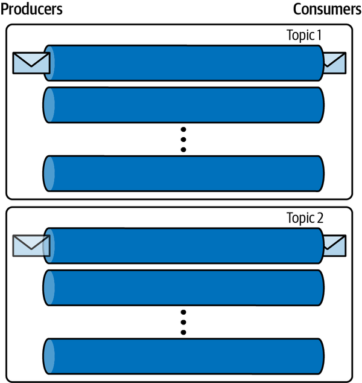

*图 5-2. 生产者将新消息写入主题，消息将被路由到适当的消费者。*


Pulsar brokers manage the subscriptions. Since Pulsar brokers own topics or topic partitions, they are a reasonable choice for managing consumer subscriptions as well. What exactly is in a subscription? Essentially, a subscription contains a handful of metadata about the topic and the consumer that is subscribed to it, including the following:

- The topic name (or topic partition contingent on the topic)
- The name of the subscription
- The expiration details around the subscription
- The cursor for the subscription

Let’s take a closer look at each of these requirements. First, including the topic name is obvious; after all, the broker needs to know what topic the consumer wishes to get data from. Each subscription has a name. When defining a consumer, the subscription name is a required field. It is a string that represents a qualified name for the subscription:

```
Consumer<byte[]> consumer = pulsarClient.newConsumer(Schema.BYTES)
              .topic(topic)
              .subscriptionName("jowanzas-subscription")
```

The expiration details of the subscription are a complex topic we will cover later in this chapter. For now, we can refer to it as the behavior Pulsar should have once it has successfully delivered a message to a subscription, or the behavior it takes if a subscriber is no longer consuming messages.

Finally, the cursor is a tracking mechanism for the Pulsar broker. It tells the broker where the consumer is in the log. You can think of a cursor as similar to the cursor in a word processor (see [Figure 5-3](https://learning.oreilly.com/library/view/mastering-apache-pulsar/9781492084891/ch05.html#an_example_of_a_word_processor_with_a_c)). The cursor blinks and tells you where you are on a line. You can use the cursor to navigate the document and arrive at any point in the document.


*Figure 5-3. An example of a word processor with a cursor. The cursor marks where you are in the document.*


Let’s take a closer look at some of the semantics of the cursor and the implementation details therein. We know a subscription manages the when and how of consumer behavior as it relates to a topic. As depicted in [Figure 5-4](https://learning.oreilly.com/library/view/mastering-apache-pulsar/9781492084891/ch05.html#an_example_of_a_topic_with_multiple_con), the subscription can manage the relationship between a topic and many consumers of that topic.

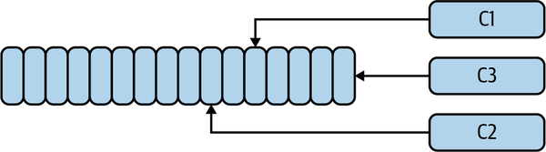

*Figure 5-4. An example of a topic with multiple consumers. Each consumer has its cursor at a different point in the log.*


As mentioned previously, a topic is implemented as an immutable log (or a series of immutable logs), and as such, where the cursor is in the log is a matter of where it is relative to the beginning (oldest saved message) or end (most current message) of the log. The broker keeps track of the cursor and increments it based on acknowledgment from the consumer. In the simplified example depicted in [Figure 5-5](https://learning.oreilly.com/library/view/mastering-apache-pulsar/9781492084891/ch05.html#as_the_consumer_consumes_the_oldest_mes), the broker sends a message to the consumer, and once it’s acknowledged, the broker moves the cursor one spot.

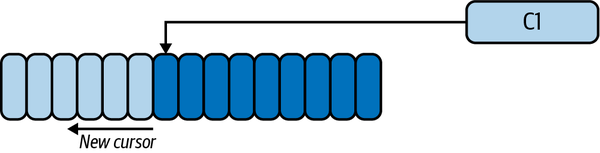

*Figure 5-5. As the consumer consumes the oldest message, the broker moves the cursor closer to the most current message in the log.*


How Pulsar stores the cursor for each subscription is a final detail worth exploring. As we’ve discussed so far in this book, Pulsar brokers are stateless. The cursor, however, is *stateful*, in that it is a representation of where a consumer is in the log. Pulsar stores each offset in a cursor ledger that is backed by Apache BookKeeper. It has all the guarantees of storage we discussed in [Chapter 4](https://learning.oreilly.com/library/view/mastering-apache-pulsar/9781492084891/ch04.html#pulsar_internals). [Figure 5-6](https://learning.oreilly.com/library/view/mastering-apache-pulsar/9781492084891/ch05.html#pulsar_cursor_ledgerdot_each_cursor_is) shows how the cursor ledger works. Each cursor is stored in a ledger (log), and as it updates, the new position is stored. The log is truncated over time because the current cursor is the most important component of storing the data.

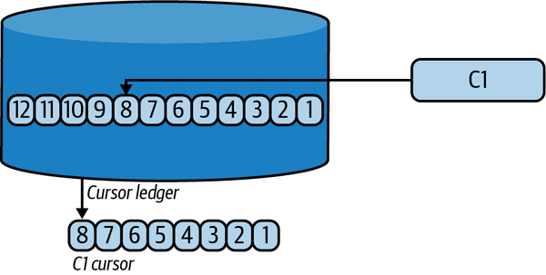

*Figure 5-6. Pulsar cursor ledger. Each cursor is stored as a ledger in BookKeeper to maintain the stateless nature of the broker.*


Now that you have a good understanding of subscriptions and cursors, it’s time to focus on subscription types.

## Exclusive

For some applications, developers may want to have only one consumer on a Pulsar topic (partitioned or unpartitioned). The exclusive subscription provides a one-to-one relationship between the consumer and the subscription. Since subscriptions are independent from a topic, multiple exclusive subscriptions can exist for one topic. To define an exclusive subscription in code, you can explicitly state you’re intending an exclusive subscription. If you don’t specify a subscription type, an exclusive subscription will be created:

```
Consumer consumer = client.newConsumer()
        .topic("my-topic")
        .subscriptionName("my-subscription")
        .ackTimeout(10, TimeUnit.SECONDS)
        .subscriptionType(SubscriptionType.Exclusive)// Optional 
        .subscribe();
```

What happens when another consumer tries to join an exclusive subscription? If there is an active consumer, the new consumer will be rejected (see [Figure 5-7](https://learning.oreilly.com/library/view/mastering-apache-pulsar/9781492084891/ch05.html#only_one_consumer_can_utilize_this_excl)).

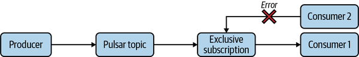

*Figure 5-7. Only one consumer can utilize this exclusive subscription. When a second consumer tries it, it is rejected by the broker.*

An exclusive subscription is valuable for the following reasons:

- Simplicity
- Ordering guarantees

In terms of simplicity, an exclusive subscription ensures that all messages are delivered to one consumer. For many applications, the most important aspect of the application is ensured message delivery. With fewer moving parts, it’s much easier for programmers and operators to debug applications and ensure behavior.

In terms of message delivery guarantees, if strict order is a must for an application (i.e., every message needs to be processed in a strict, time-ordered sequence), an exclusive subscription is one way to help ensure ordering. As we walk through the other types of subscriptions, you’ll get a better idea of why this is.

## Shared

In contrast to an exclusive subscription, a shared subscription allows for multiple consumers. In a shared subscription, multiple consumers expect to receive messages from the topic in a round-robin fashion. This means there is no logical order to which messages in the topic will be delivered to a particular consumer. [Figure 5-8](https://learning.oreilly.com/library/view/mastering-apache-pulsar/9781492084891/ch05.html#in_this_shared_subscriptioncomma_consu) depicts this scenario. A shared subscription has the advantage of simplicity because you can add more consumers to the subscription without incurring any additional errors while effectively increasing the number of messages that can be consumed in a period of time.

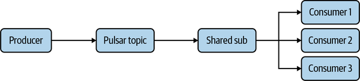

*Figure 5-8. In this shared subscription, Consumers 1, 2, and 3 consume from the topic in a round-robin fashion.*


Defining a consumer with a round-robin description is as simple as ensuring a subscription type as shared. As mentioned before, you can add many consumers to a shared subscription without running into any limitations. Messages will be delivered to each consumer in a round-robin fashion:

```
Consumer consumer = client.newConsumer()
        .topic("my-topic")
        .subscriptionName("my-subscription")
        .ackTimeout(10, TimeUnit.SECONDS)
        .subscriptionType(SubscriptionType.Shared)
        .subscribe();
```

There are a few limitations of a shared subscription. Following are the most notable or impactful:

- Message ordering guarantees
- Acknowledgment schemes

Since there is no concept of order or any relationship between the consumer and the topic in a shared subscription, there is no guarantee of ordering. Fortunately, for the vast majority of messaging use cases, ordering is not necessary. Acknowledgment is a complex issue that we’ll look at more closely later in this chapter. However, the limitations with a shared subscription can be explained without the full context of acknowledgment.

In a shared subscription, messages are sent to consumers one at a time (serially), in round-robin fashion. This means that if the consumers must acknowledge the message, they have to acknowledge them one at a time instead of in bulk. Each acknowledgment takes network bandwidth (though not a lot) and time, so for a large number of messages, individual acknowledgment may be untenable.

## Key_Shared

A Key_Shared subscription is similar to a shared subscription in that it allows for multiple consumers on a topic. The notable difference between the two is that Key_Shared subscriptions add an additional constraint in that consumers on the subscription are responsible for a key or some range of keys. Before we jump into how a Key_Shared subscription works, let’s take a step back and talk about keys in Apache Pulsar.

Pulsar messages are simply bytes of data. Pulsar messages can be human readable, like a JSON (JavaScript Object Notation) blob:

```
{“name”: “Jowanza”, “age”:100, “vehicles”: [“Subaru”, “Vespa”, “Volkswagen”]}
```

Or they can simply be a string of nonsensical text:

```
"3q8093hdosdoaspidipas"
```

To organize these messages, a key is a piece of metadata associated with the message. Returning to our JSON blob, a key can be represented in JSON as follows:

```
{"key":"baseball player", "content":{"name": "Kerry Wood", "profession": 
    "baseball player"}
```

The key acts as an organizational strategy for the data in the topic. For data formats like JSON, Avro, and Protocol Buffers (Protobuf), it’s common to use a data field or key to represent the message key (as demonstrated in the preceding code). Another strategy is to use the concatenation of multiple data fields as a key.

The Key_Shared subscription works as shown in [Figure 5-9](https://learning.oreilly.com/library/view/mastering-apache-pulsar/9781492084891/ch05.html#in_this_key_shared_subscriptioncomma_co), where a consumer receives messages for a key (or range of keys).

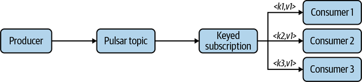

*Figure 5-9. In this Key_Shared subscription, Consumer 1 receives all messages for K1, Consumer 2 receives all messages for K2, and Consumer 3 receives all messages for K3.*


In this example, we’re only looking at three keys that conveniently match with three consumers. In real applications, such a clean matching of keys with consumers is unlikely. In Pulsar, there are two ways to handle this problem: have Pulsar manage the process or implement a solution to the process. Let’s discuss each solution in more detail.

When defining a Key_Shared subscription, it’s necessary to define both the subscription type and the specific policy, or how the keys should be distributed among the consumers:

```
Consumer < String > consumer = client.newConsumer(Schema.JSON)
    .subscriptionMode(SubscriptionMode.Durable)
    .topic("our-topic")
    .consumerName("auto-hashed-consumer")
    .subscriptionName("auto-hashed")
    .subscriptionType(SubscriptionType.Key_Shared)
    .keySharedPolicy(KeySharedPolicy.autoSplitHashRange())
    .subscribe();
```

The way the keys are distributed among the consumers in the subscription is determined by the `keySharedPolicy`. To understand why this is significant, we need to understand the idea behind consistent hashing in distributed systems. In the shared subscription model, each message is routed to each consumer, as shown in [Figure 5-10](https://learning.oreilly.com/library/view/mastering-apache-pulsar/9781492084891/ch05.html#in_this_shared_subscriptioncomma_cons).

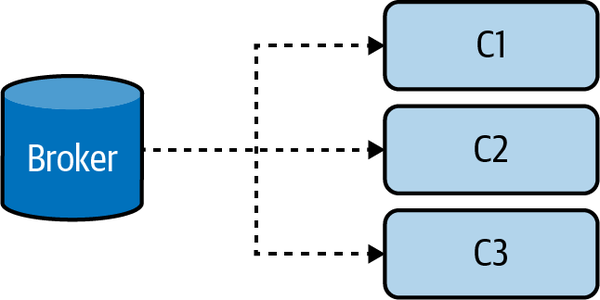

*Figure 5-10. In this shared subscription, consumers C1, C2, and C3 receive messages in a round-robin fashion.*


The weakness of the shared subscription has to do with ordering guarantees. Since no set of messages is the responsibility of a consumer (or group of consumers), we cannot say anything definitive about the messages. To improve the ordering guarantee around message processing, we need some kind of guarantee that a group of messages is processed by an individual consumer. The key in a Pulsar message can be used as an identifier for a message, and it can link the message to a specific consumer. However, it must guarantee that the message reaches the same consumer every time.

Pulsar provides two approaches to provide this guarantee: auto hashing and sticky hashing. *Hashing* is a process for converting arbitrary values into values of a fixed size. An example is converting a name into a number. Since keys on Pulsar messages can be any arbitrary value, hashing provides a way to convert that value into a numerical value that each consumer can use. With each key converted into a hashed value, consumers to the subscription are then assigned a hash value range (see [Figure 5-11](https://learning.oreilly.com/library/view/mastering-apache-pulsar/9781492084891/ch05.html#in_this_key_shared_subscriptioncomma_a)). In a sticky hash, the consumer range values are set manually by the client. The ranges are “sticky” in that all hashes in a particular range go to one consumer.

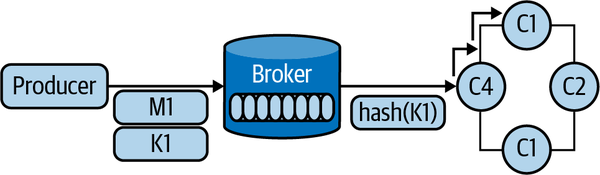

*Figure 5-11. In this Key_Shared subscription, a producer produces a message with K1 and that key is hashed and shared with a consumer in the hash range.*


For a consumer in the sticky hash range, you can set the policy based on a range value. In the following example, I used the node count:

```
       consumer = client.newConsumer(Schema.STRING)
           .subscriptionMode(SubscriptionMode.Durable)
           .topic("persistent://public/default/sticky")
           .consumerName("my-consumer")
           .subscriptionName("sticky-sub")
           .subscriptionType(SubscriptionType.Key_Shared)
           .keySharedPolicy(KeySharedPolicy.stickyHashRange().ranges(range))
           .subscribe();
```

An alternative to the sticky hash is the auto hash. In this mode, Pulsar automatically balances the hash ranges across available consumers. The auto hash uses [consistent hashing](https://oreil.ly/41G34) to ensure that the load remains equally distributed as consumers add and drop from the subscription (see [Figure 5-12](https://learning.oreilly.com/library/view/mastering-apache-pulsar/9781492084891/ch05.html#consistent_hashingdot_for_nodes_acomma)). Upsides to auto hashing are that you can “set it and forget it” and it enables delivery to the right consumer (see [Figure 5-13](https://learning.oreilly.com/library/view/mastering-apache-pulsar/9781492084891/ch05.html#in_this_key_shared_subscriptioncomma_th)).

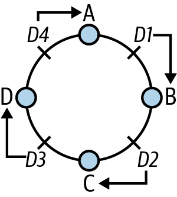

*Figure 5-12. Consistent hashing. For Nodes A, B, C, and D, Messages D1–D4 are placed within the hashing ring according to the hash range of the consumer.*

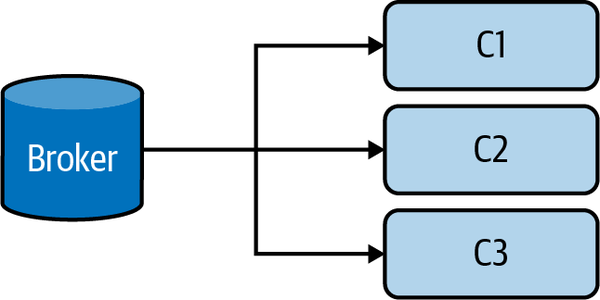

*Figure 5-13. In this Key_Shared subscription, the broker knows exactly which consumer should get a message based on the key.*

In the event of a failure, the hash ring will remove the failing node and the keys will continue to move in a clockwise fashion (see [Figure 5-14](https://learning.oreilly.com/library/view/mastering-apache-pulsar/9781492084891/ch05.html#when_a_consumer_goes_offline_in_a_key_s)).

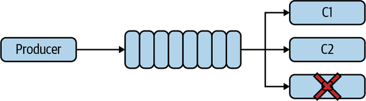

*Figure 5-14. When a consumer goes offline in a Key_Shared subscription, the “ring” will change and C1 and C2 will receive new messages.*

## Failover

A failover subscription allows for multiple consumers to connect to the topic. The broker chooses a “leader” (typically the first consumer to connect to the subscription), and messages are delivered to that consumer as long as the consumer and leader are connected, as depicted in [Figure 5-15](https://learning.oreilly.com/library/view/mastering-apache-pulsar/9781492084891/ch05.html#a_failover_subscriptiondot_once_the_act). If that consumer goes offline, the messages are delivered to a backup consumer. It is important to note that while there are standby consumers in this subscription mode, only one consumer at a time will receive messages. Ordering can be guaranteed in this subscription model, and cumulative acknowledgments are possible in this mode (more on this soon).

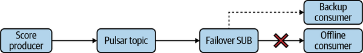

*Figure 5-15. A failover subscription. Once the active consumer goes offline, the messages in the subscription are shared with the backup consumer.*


A failover subscription is defined by setting the `subscriptionType` to `SubscriptionType.Failover`, as shown in the following code snippet:

```
Consumer consumer = client.newConsumer()
        .topic("my-topic")
        .subscriptionName("my-subscription")
        .ackTimeout(10, TimeUnit.SECONDS)
        .subscriptionType(SubscriptionType.Failover)
        .subscribe();
```

The use case for a failover subscription is an application where strict ordering and quick processing of messages are equally important.

Now that we’ve covered all the subscription modes in Pulsar, we can move on to another important concept: acknowledgments.

# Acknowledgments

Acknowledgments are a vital mechanism in Pulsar. An acknowledgment is a communication sent from a consumer to a Pulsar broker validating that a specific message or group of messages was consumed. Pulsar supports two types of acknowledgments: individual and cumulative. This section will cover both.

Acknowledgments (or acks) are used in every contemporary messaging system. In traditional pub/sub systems, an acknowledgment tells the broker that it is OK to delete a message because it’s no longer needed by the consumer. In Pulsar, acknowledgments serve a similar but slightly more nuanced purpose.

## Individual Ack

By default, each message within a Pulsar topic needs acknowledgment. As a consumer processes a message, it sends an acknowledgment to the broker (see [Figure 5-16](https://learning.oreilly.com/library/view/mastering-apache-pulsar/9781492084891/ch05.html#individual_ackdot_each_message_in_the_s)). For some subscription modes, the individual ack is the only ack strategy available.

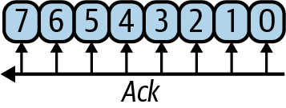

*Figure 5-16. Individual ack. Each message in the subscription must be acknowledged by the broker serially.*


Individual acks ensure that each message in the subscription has been consumed. All subscription modes support individual acks, as shown in [Table 5-1](https://learning.oreilly.com/library/view/mastering-apache-pulsar/9781492084891/ch05.html#subscription_modes_and_their_support_f).

Individual acks in code require acknowledging a received message, as shown here:

```
        String data = new String(message.getData());
        log.info("Consumer received : " + data);
        consumer.acknowledge(message);
        message = consumer.receive(100, TimeUnit.MILLISECONDS);
```

An alternative to acknowledging each message individually is to acknowledge batches of them. There are some advantages of batch acknowledgment, which we’ll cover in the next section.

| Subscription mode | Supports individual ack |
| :---------------- | :---------------------- |
| Exclusive         | Yes                     |
| Shared            | Yes                     |
| Key_Shared        | Yes                     |
| Failover          | Yes                     |

## Cumulative Ack

A cumulative acknowledgment acknowledges messages at an offset in the stream, and all messages delivered before it are acknowledged (automatically) as well (see [Figure 5-17](https://learning.oreilly.com/library/view/mastering-apache-pulsar/9781492084891/ch05.html#cumulative_ackdot_the_consumer_acknowle)). This strategy reduces the number of acknowledgments and enables the consumers to operate in a “batch” workflow. [Table 5-2](https://learning.oreilly.com/library/view/mastering-apache-pulsar/9781492084891/ch05.html#subscription_modes_and_their_support_fo) summarizes the subscription modes supporting cumulative acks.

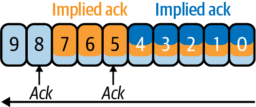

*Figure 5-17. Cumulative ack. The consumer acknowledges a message at a specific cursor (offset) and all messages before that point in the cursor are considered acknowledged by the broker.*


| Subscription type | Supports cumulative ack |
| :---------------- | :---------------------- |
| Exclusive         | Yes                     |
| Shared            | No                      |
| Key_Shared        | Yes                     |
| Failover          | Yes                     |

# Schemas

Schemas are an optional but influential part of the Apache Pulsar ecosystem. Users can enable both schemas and schema validation for topics. When a schema is enabled, producers must adhere to it, and consumers will know what to expect from the data’s shape. In [Chapter 6](https://learning.oreilly.com/library/view/mastering-apache-pulsar/9781492084891/ch06.html#producers), we’ll cover the Pulsar schema registry and end-to-end workflows; here, we’ll focus on consumers and how they interact with schemas in Apache Pulsar.

## Consumer Schema Management

Pulsar consumers can interact with schemas through two mechanisms. Suppose a schema is set on a topic, and schema validation is enforced. In that case, all a consumer needs to do is consume messages and deserialize them according to the schema (send the schema with the message). Alternatively, if a schema is not set on a topic, a consumer can enable it and register it with the schema registry (see [Figure 5-18](https://learning.oreilly.com/library/view/mastering-apache-pulsar/9781492084891/ch05.html#a_consumer_retrieves_a_schema_to_consum)). At first glance, it may seem dangerous to allow a consumer to add a schema. After all, the consumer is supposed to consume messages and should not determine the shape of messages. However, since the consumer is part of the entire message lifecycle, safely enabling consumers to register schemas has some positive ramifications, which we’ll cover in [Chapter 6](https://learning.oreilly.com/library/view/mastering-apache-pulsar/9781492084891/ch06.html#producers).

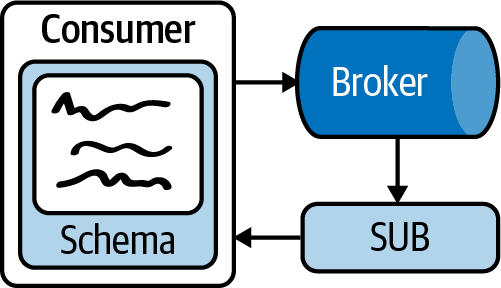

*Figure 5-18. A consumer retrieves a schema to consume from a subscription.*

# Consumption Modes

A theme throughout this book is that Apache Pulsar is intentionally configurable. In addition to configuring subscriptions, schemas, and acknowledgments, Pulsar end users can also configure consumption. Pulsar is concerned with message order and delivery guarantees, and it seems natural that consuming the messages serially (one at a time) may be best. However, providing flexibility on how messages get delivered to Pulsar topics and eventually consumed enables richer interactions and more scalability.

## Batching

The batching strategy for messages will be covered in depth in [Chapter 6](https://learning.oreilly.com/library/view/mastering-apache-pulsar/9781492084891/ch06.html#producers). For now, we’ll focus on what batching is and the implications for batching on a Pulsar consumer.

When a Pulsar producer publishes messages to a Pulsar consumer, the messages can be published one at a time. There are some unambiguous upsides of publishing messages one at a time, but there are also some downsides. The main downside is that connecting to a Pulsar broker is not a free operation. For producers that need to publish many messages per second, it may be unfeasible or dangerous to open and close connections that rapidly.

Additionally, in most cases sending messages immediately and serially is not beneficial to the entire application flow. A reasonable strategy would be to send Pulsar messages based on a maximum message volume or time period. In Pulsar, this message delivery mechanism is known as batching.

How does batching impact a consumer? In most cases, batching does not have a material impact on the consumer. As discussed in the previous section, each message in the batch needs to be acknowledged by the consumer. Before Pulsar 2.8, a consumer would acknowledge an entire batch of messages. In most cases, this is precisely the behavior you want; however, what if a consumer dies after consuming all but the last two messages in a batch? The consumer would send a negative acknowledgment for the batch and could process messages from that batch again (see [Figure 5-19](https://learning.oreilly.com/library/view/mastering-apache-pulsar/9781492084891/ch05.html#in_this_representation_of_consumer_batc)).

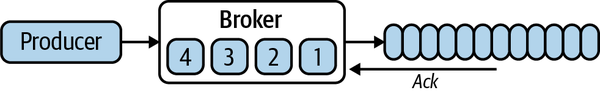

*Figure 5-19. In this representation of consumer batch consumption, a consumer sends a negative acknowledgment for the batch and can process messages from that batch again.*


In Pulsar 2.8, a batch index was introduced. This index gives the consumer more flexibility in determining precisely where in the batch it ended its processing. This index removes the complexity of managing the index for the consumer and provides transparency for the broker.

## Chunking

An alternative mechanism to batching messages in Pulsar is chunking. Instead of configuring a consumer to send a message based on a time interval or the maximum number of messages, chunking splits larger messages into chunks. In this section, we’ll discuss how a chunked message impacts a consumer. The chunking mechanism will be covered in detail in [Chapter 6](https://learning.oreilly.com/library/view/mastering-apache-pulsar/9781492084891/ch06.html#producers).

When messages are chunked, they arrive at a consumer chunked with metadata to know the chunk’s number of partitions. The consumer awaits each part of the chunk to stitch it back together before the acknowledgment (see [Figure 5-20](https://learning.oreilly.com/library/view/mastering-apache-pulsar/9781492084891/ch05.html#when_chunking_for_large_payloadscomma_m)). Chunking is essential because it provides a mechanism for consuming large messages in Pulsar without causing cascading failures. Additionally, Pulsar provides this functionality transparently to the consumer, which receives metadata about chunked messages for proper processing and acknowledgment.

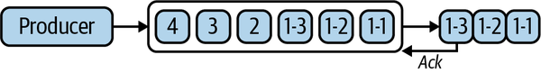

*Figure 5-20. When chunking for large payloads, messages are split before being sent to the consumer.*

# Advanced Configuration

Throughout this chapter, we’ve discussed Pulsar’s customization. With each release, the Pulsar developers enable more customization to enable richer interactions and expand the number of use cases for which Pulsar is suitable. To round out this chapter on consumers, we’ll cover two additional configurations and features possible with Pulsar: delayed messages and time to live (TTL).

## Delayed Messages

In [Chapter 3](https://learning.oreilly.com/library/view/mastering-apache-pulsar/9781492084891/ch03.html#pulsar), we talked about Iterable, a marketing automation company that rebuilt its backend system to utilize Apache Pulsar. One use case cited by Iterable is the necessity to delay messages for future delivery for email automation purposes. Pulsar enables delayed message functionality. Pulsar delayed messages only work in a shared subscription mode. When a message is marked as delayed, the `DelayedDeliveryTracker` configuration tracks the message and ensures that it is delivered at the delayed time.

From the consumer perspective, when the delayed message arrives in the Pulsar topic, `DelayedDeliveryTracker` will cause a timeout when the consumer attempts to consume the message (see [Figure 5-21](https://learning.oreilly.com/library/view/mastering-apache-pulsar/9781492084891/ch05.html#delayed_messages_in_pulsardot_the_pulsa)). The delayed message illustrates Pulsar’s features and modularity, working together to provide an elegant experience outside Pulsar’s initial design scope. Delayed messages have use cases in notification systems, email systems, and administration systems, to name a few.

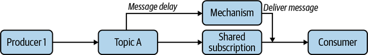

*Figure 5-21. Delayed messages in Pulsar. The Pulsar broker manages delaying the message by storing it in BookKeeper temporarily and resurfacing it when needed.*


Delayed messages are consumed by Pulsar consumers like any other message. From the producer side, setting a delayed message with the client library looks like this:

```
// message to be delivered at the configured delay interval of 5 minutes
producer.newMessage().deliverAfter(5L, TimeUnit.Minute).
    value("Hello Moto!").send();
```

## Retention Policy

At this point, you may be wondering what Pulsar does with messages that have already been acknowledged by all subscribers of a topic. If every subscriber acknowledges a message, this is an indication that Pulsar should no longer store the message. We would store the message for replaying the topic, for new subscriptions, and for other long-term storage needs. Pulsar provides two ways for an operator to configure the storage of acknowledged messages.

Using the Pulsar Admin CLI, you can set the retention for acknowledged messages by time or by size. This configuration is set at a namespace level and all topics in that namespace adhere to the policy. Here is an example of setting the policy:

```
$ pulsar-admin namespaces set-retention my-tenant/new-namespace \
 --size 10G \
 --time 3h
```

In this command, we set the namespace limit to 10 GB of space and the time limit to three hours. [Table 5-3](https://learning.oreilly.com/library/view/mastering-apache-pulsar/9781492084891/ch05.html#retention_policy_behavior_in_pulsar) summarizes the range of values for this API.

| Time limit (hours) | Size limit (GB) | Behavior                                                 |
| :----------------- | :-------------- | :------------------------------------------------------- |
| –1                 | –1              | Stores data forever. No limit on size or time.           |
| –1                 | > 0             | Stores data until the size limit is reached.             |
| > 0                | –1              | Stores data only based on the time limit.                |
| 0                  | 0               | Message retention for acknowledged messages is disabled. |
| 0                  | > 0             | Not valid.                                               |
| > 0                | 0               | Not valid.                                               |
| > 0                | > 0             | Size or time limit (whichever is reached first).         |

## Backlog Quota

Many of the applications that utilize a real-time backend such as Apache Pulsar have requirements about how long messages that enter the system are relevant. For example, in a smart-home system, a messaging platform that handles the state of lights (whether the lights are on, off, or dimmed) may run behind in message consumption. If the consumer has thousands of state changes to catch up on, it may make more sense to ignore older messages and begin reacting to newly arriving ones.

By default, Apache Pulsar stores all unacknowledged messages. For most cases, it’s hard to find fault with this default behavior. However, when the consumer is running behind, it may make sense to drop those unacknowledged messages in favor of newly arriving ones. The backlog quota provides a similar interface for managing unacknowledged messages that the retention policy does for acknowledged messages.

Backlog quotas are set on a namespace level and apply to all the topics in the namespace. You can use the Pulsar Admin CLI to set the backlog quote for the namespace:

```
$ pulsar-admin namespaces set-backlog-quota my-tenant/my-namespace \
  --limit 2G \
  --limitTime 36000 \
  --policy producer_request_hold
```

Similar to the retention policy, you can limit the size and time that you keep unacknowledged messages. You can also set a policy that dictates how the system will behave if the quotas are reached, as shown in [Table 5-4](https://learning.oreilly.com/library/view/mastering-apache-pulsar/9781492084891/ch05.html#policies_and_their_behavior).

| Policy                      | Behavior                                                     |
| :-------------------------- | :----------------------------------------------------------- |
| `producer_request_hold`     | The broker will hold and not persist the producer request payload. |
| `producer_exception`        | The broker will disconnect from the client by throwing an exception. |
| `consumer_backlog_eviction` | The broker will begin discarding backlog messages.           |

In addition to backlog quotes and retention policies, Pulsar also allows you to set a message expiry or time to live (TTL) at a namespace level. This is useful if you want to just set a strictly time-based mechanism for your unacknowledged messages, as shown in the following code:

```
$ pulsar-admin namespaces set-message-ttl my-tenant/my-namespace \
  --messageTTL 120 # In seconds
```

Backlog quotas and retention policies may feel similar, but they serve very different purposes. Backlog quotas are all about the behavior of unacknowledged messages, and retention policies are all about how long to keep data after it’s been acknowledged. The good news is that both can be set on a namespace level and both can be set to infinite if it’s too hard to decide on a TTL. [Table 5-5](https://learning.oreilly.com/library/view/mastering-apache-pulsar/9781492084891/ch05.html#a_summary_of_backlog_quotas_and_retenti) summarizes the differences between backlog quotas and retention policies.

|                       | Backlog Quotas | Retention Policies |
| :-------------------- | :------------- | :----------------- |
| **Time based**        | Yes (optional) | Yes (optional)     |
| **Size based**        | Yes (optional) | Yes (optional)     |
| **Set at**            | Namespace      | Namespace          |
| **Behavior when met** | Configurable   | Delete messages    |
| **Acked or unacked**  | Unacked        | Acked              |

# Configuring a Consumer

We’ve spent most of this chapter discussing features available to Pulsar consumers. In this section, we’ll discuss how to configure a consumer. As mentioned previously, Pulsar has officially supported client libraries in Java, Python, and Go. Here we’ll focus on the Java library, and discuss Python and Go when it’s easier to illustrate a client library feature with those languages. We’ll go through each option for configuring your consumer and what that configuration change will affect.

## Replay

One of the selling points you’ll hear about systems like Apache Pulsar, Kafka, and others is that they offer the ability to *replay* a topic. This means a consumer can consume messages in the order in which they arrived at the topic (or topic partition for partitioned topics). In Pulsar there are three ways you can replay data in a topic:

- Manually set the cursor for a consumer back to the earliest offset (see [Figure 5-22](https://learning.oreilly.com/library/view/mastering-apache-pulsar/9781492084891/ch05.html#consumer_reset))

  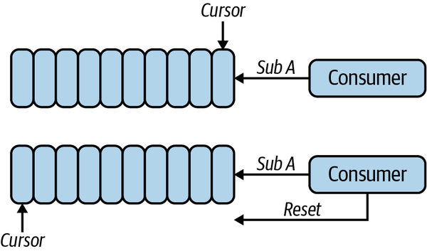

  *Figure 5-22. A consumer resets the cursor for the subscription. This action would set the cursor back to the earliest stored message in BookKeeper.*

- Negatively acknowledge a message (see [Figure 5-23](https://learning.oreilly.com/library/view/mastering-apache-pulsar/9781492084891/ch05.html#negatively_acknowledges))

  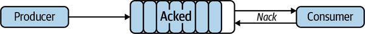

  *Figure 5-23. A consumer negatively acknowledges the latest message in the subscription. Unlike all other messages in the subscription, this message is treated as if it wasn’t ever sent to the consumer.*

- Reset the cursor for the subscription via the Pulsar CLI or API (see [Figure 5-24](https://learning.oreilly.com/library/view/mastering-apache-pulsar/9781492084891/ch05.html#reset_subscription))

  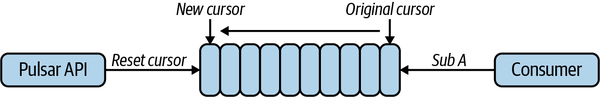

  *Figure 5-24. A Pulsar Admin API user resets a subscription to the earliest offset. The consumers on this subscription will start to consume messages from the earliest point stored in BookKeeper.*
  

We can manually set the cursor by using the consumer library:

```
import org.apache.pulsar.client.api.MessageId;
import org.apache.pulsar.client.api.Reader;

Reader<byte[]> reader = pulsarClient.newReader()
    .topic("read-from-topic")
    .startMessageId(MessageId.earliest) // get data at earliest offset
    .create();

while (true) {
    Message message = reader.readNext();

    // Get messages after this point
}
```

A negative acknowledgment tells the Pulsar broker that your subscription was not able to process the message. You can use the consumer API to negatively acknowledge a message and it will be queued for redelivery, as shown here:

```
   Consumer<byte[]> consumer =
        Client
            .newConsumer()
            .subscriptionType(SubscriptionType.Key_Shared)
            .subscriptionName("abc-sub")
            .topic("abbc")
            .subscribe();
    while (true) {
      Message<byte[]> message = consumer.receive(100, TimeUnit.MILLISECONDS);
      if (message != null) {
        System.out.println(new String(message.getData()));
        consumer.negativeAcknowledge(message);
      }
```

The final alternative for resetting a cursor for a subscription is to do so from the administrative APIs in Pulsar. You can use the Pulsar CLI to do so with the following command:

```
$ pulsar-admin topics reset-cursor topic a --subscription my-subscription
```

Or you can use the Admin API:

```
POST/admin/persistent/:tenant/:namespace/
    :destination/subscription/:subName/resetcursor
```

Replay comes is useful for a number of scenarios, including the following:

- Allowing new consumers to read the entire history of a topic
- Auditing a topic
- Stream processing

## Dead Letter Topics

In the traditional messaging world, a dead letter queue is a queue in which messages that are unable to be processed to the normal flow are sent. Messages may not be processed for several reasons:

- The message does not adhere to the shared schema and cannot be processed by the consumer.
- The consumer was not able to process the message in time.
- The consumer failed when processing the message.

In Pulsar, dead letter queues can serve the same purpose. A dead letter is a topic that is preconfigured to tell the broker where messages should go in the event of a failure to process. In Pulsar there are two ways messages can fail:

- Negative acknowledgment (telling the broker you do not want to acknowledge the message)
- Acknowledgment timeouts (not processing the message with time left)

You can define a dead letter topic when setting up a subscription:

```
Consumer<byte[]> consumer = pulsarClient.newConsumer(Schema.BYTES)
              .topic(topic)
              .subscriptionName("hello-moto")
              .subscriptionType(SubscriptionType.Shared)
              .deadLetterPolicy(DeadLetterPolicy.builder()
                    .maxRedeliverCount(maxRedeliveryCount)
                    .build())
              .subscribe();
```

By default, the dead letter topic will have a name that looks like this:

```
<topicname>-<subscriptionname>-DLQ
```

You can set the dead letter topic name manually if you wish:

```
Consumer<byte[]> consumer = pulsarClient.newConsumer(Schema.BYTES)
              .topic(topic)
              .subscriptionName("hello-moto")
              .subscriptionType(SubscriptionType.Shared)
              .deadLetterPolicy(DeadLetterPolicy.builder()
                    .maxRedeliverCount(maxRedeliveryCount)
                    .deadLetterTopic("hello-moto-dlq")
                    .build())
              .subscribe();
```

It’s important to remember that dead letter topics are on a subscription basis. If one subscription encounters a problem and requires dead lettering, others are likely to as well.

## Retry Letter Topics

For some applications, automatically retrying a negatively acknowledged message may be appropriate. Retry letter topics provide a mechanism for a consumer to configure this behavior. A retry letter topic requires the following:

- Retry must be enabled to support this style of delivery.
- A topic must be available to store the messages queued to be retried.

You can define a retry letter topic with the Pulsar client library:

```
Consumer<byte[]> consumer = pulsarClient.newConsumer(Schema.BYTES)
  .topic(topic)
  .subscriptionName("scary-hours")
  .subscriptionType(SubscriptionType.Shared)
  .enableRetry(true)
  .receiverQueueSize(100)
  .deadLetterPolicy(DeadLetterPolicy.builder()
    .maxRedeliverCount(maxRedeliveryCount)
    .retryLetterTopic("persistent://my-property/my-ns/scary-hours-retry-Retry")
    .build())
  .subscriptionInitialPosition(SubscriptionInitialPosition.Earliest)
  .subscribe();
```

# Summary

In this chapter, we covered what it means to be a consumer in Apache Pulsar. More than simply reading messages off a queue, consumers are where the “rubber meets the road” for streaming applications. We discussed many topics, including:

- How messages are chunked to consumers
- Acknowledgment strategies for consumers
- Pulsar’s subscription model
- Some techniques for configuring Pulsar brokers

You should now be equipped with enough information to tackle the other side of the equation: how the producer gets data into Pulsar.