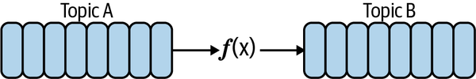
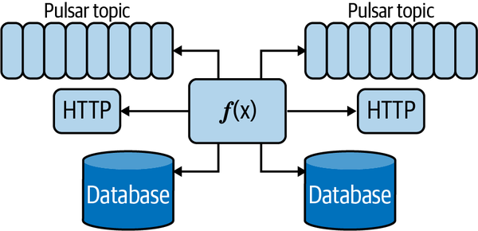
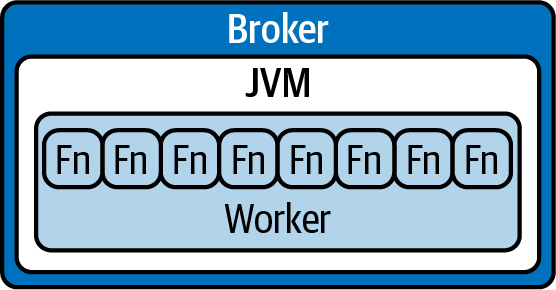
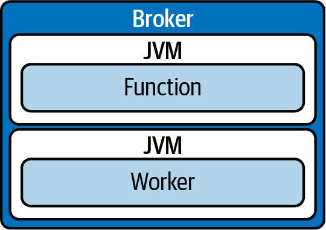
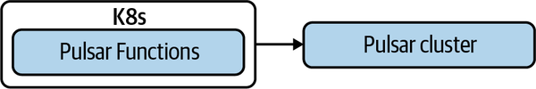
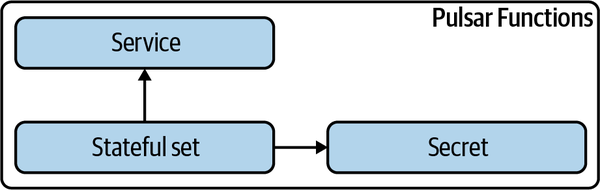

# Chapter 8. Pulsar Functions

In [Chapter 7](https://learning.oreilly.com/library/view/mastering-apache-pulsar/9781492084891/ch07.html#pulsar_io-id000027) I hinted that Pulsar Functions are the bedrock technology used in Pulsar IO. Now we will explore what makes Pulsar Functions unique and why they contribute to make Pulsar an enticing option for an event streaming system.

I’ve worked with several stream processing engines during my career, from Apache Storm and Spark Streaming to Flink and Kafka Streams. Pulsar Functions are a unique and, perhaps, one of the more agile approaches to the stream processing problem (see [Figure 8-1](https://learning.oreilly.com/library/view/mastering-apache-pulsar/9781492084891/ch08.html#pulsar_functions_have_a_topic_as_input)). Pulsar Functions take a problem that requires a large and cumbersome runtime and distill it down to a problem that only requires creating functions that have a topic as an input and a topic as an output. In this chapter you’ll learn the reasoning behind Pulsar Functions as a stream processing system. You’ll also learn what makes Pulsar Functions unique and what its limitations are. Finally, we’ll talk about the deployment models for Pulsar Functions and walk through some use cases.



*Figure 8-1. Pulsar Functions have a topic as input and a topic as output, and they perform some logic on the data they ingest.*

# Stream Processing

Organizing and collecting event streams is the first requirement for getting value from real-time data, but enriching, routing, deleting, and triggering actions based on event streams is where the rubber meets the road. Stream processing is the processing of messages in an event stream. At its simplest form, a stream processing system subscribes to an event stream and processes each message according to some user-defined logic. In addition, stream processing systems typically have some requirements around low latency. For example, for some systems, submillisecond latency is required for processing messages that arrive in the event streams storage layer.

In this book, we’ve explored some of the rich APIs and interaction paradigms Apache Pulsar provides. This list includes Pulsar’s approach to schema management, the flexibility of Pulsar’s messaging model allowing support of traditional queue architectures and event streaming, and Pulsar’s unique publishing topologies. In addition, Pulsar provides an elegant mechanism for storing messages and APIs for varied ways to consume those messages. Finally, Pulsar Functions were born out of a necessity to extend the simplicity of Pulsar to the stream processing world. To appreciate Pulsar’s approach to stream processing, it’s worth taking a look at some of the systems that tackle stream processing.

But first, let’s examine what a stream processing system is. Stream processing systems consume messages from some upstream system, perform some work on the messages, and then do something with the messages afterward. Stream processing systems have a lot of similarities with a plain consumer; we covered this in [Chapter 6](https://learning.oreilly.com/library/view/mastering-apache-pulsar/9781492084891/ch06.html#producers). However, stream processing systems have one additional requirement: they must understand not only the messages as they consume them but also how the messages relate to one another in time. More concretely, the order of the messages is vital for the system to function and for messages to be processed.

Dealing with message order requires the stream processing system to keep track of the messages and establish timeliness. For example, a stream processing system may say a message is “on time” if it arrives within a 10-second window and is late if it arrives afterward. However, keeping track of the state of messages within a time window is a complex problem and outside the scope of a single consumer. Therefore, stream processing systems like Spark Streaming and Flink are built to manage the complexity of stream processing at scale.

[Figure 8-1](https://learning.oreilly.com/library/view/mastering-apache-pulsar/9781492084891/ch08.html#pulsar_functions_have_a_topic_as_input) illustrates the bare-bones requirements for a distributed stream processing engine like Apache Spark or Flink. These include an orchestration engine, a master-worker architecture, and many times, an additional component for state management. This may seem like a considerable amount of overhead. However, you get a lot in return.

Among other things, you get:

- Performance
- State management guarantees
- Failover
- Checkpointing
- Watermarking

Pulsar Functions, by contrast, were not developed to solve all of these problems in event processing. Instead, Pulsar Functions exist to provide a framework for everyday needs in event processing that can be done using tools already in a Pulsar deployment. Pulsar Functions can also perform out-of-band actions (see [Figure 8-2](https://learning.oreilly.com/library/view/mastering-apache-pulsar/9781492084891/ch08.html#pulsar_functions_can_perform_out-of-ban)).



*Figure 8-2. Pulsar Functions can perform out-of-band actions such as calling HTTP functions and reaching out to databases, but they ultimately should publish their output to a new topic.*


# Pulsar Functions Architecture

In the preceding section, we talked about the complexity of modern stream processing systems and why that complexity is necessary. Pulsar Functions do not aim to solve all the use cases of modern, distributed event processing. Instead, Pulsar Functions exist to solve event processing cases, including stateless cases and cases with simple state management needs. With that narrow focus, Pulsar Functions have a simplified runtime and isolation environment. In this section, we’ll walk through the Pulsar Functions architecture—specifically, the runtime and the isolation characteristics.

## Runtime

Pulsar Functions support three runtime environments:

- Thread-based runtime
- Process-based runtime
- Kubernetes-based runtime

Pulsar Functions can run directly on the Pulsar broker, on separate processes within the Pulsar deployment, or on Kubernetes. In the Pulsar broker, functions can run as a thread or process. Deploying a separate environment for Pulsar Functions to run, the functions have the same options of a thread or process (see [Figure 8-3](https://learning.oreilly.com/library/view/mastering-apache-pulsar/9781492084891/ch08.html#an_example_of_how_pulsar_functions_oper)). On Kubernetes, Pulsar Functions run as a separate container. In the next section, we’ll walk through the isolation benefits of each of these options.



*Figure 8-3. An example of how Pulsar Functions operate when run as a process within the broker. The worker runs on the Java virtual machine and handles the lifecycle of each function.*

## Isolation

Pulsar Functions run in an environment with limited resources. Therefore, the default is the thread-based runtime with a virtual machine shared with other Pulsar Functions. The thread-based runtime is a model that many other stream processing engines use by default. Threads provide adequate isolation, assuming the threading framework is programmed well. However, the thread model does include shared memory with other threads and may have unintended consequences, thereby making it unsuitable for some use cases.

An alternative runtime is a process-based runtime. In this runtime, every Pulsar function spawns its process without shared memory or resources. Pulsar Functions in Go and Python utilize this runtime by default because they cannot run as a JVM thread. While the process-based runtime is more memory safe, you may utilize more resources than you need and require slightly more overhead to manage these use cases (see [Figure 8-4](https://learning.oreilly.com/library/view/mastering-apache-pulsar/9781492084891/ch08.html#an_example_of_functions_and_workers_a_j)).



*Figure 8-4. An example of functions and workers a JVM environment. In this configuration, the functions are isolated from each other.*

The final option for a Pulsar Functions runtime is Kubernetes. The Kubernetes deployment deploys Pulsar Functions as a K8s job with some additional parameters and security configuration (see [Figure 8-5](https://learning.oreilly.com/library/view/mastering-apache-pulsar/9781492084891/ch08.html#pulsar_functions_on_kubernetes_left_par)). Kubernetes provides isolation in the most meaningful way by deploying functions on separate containers. In addition to isolation, Kubernetes deployments provide a more straightforward path for Pulsar Functions to support more runtimes outside of Java, Go, and Python (see [Figure 8-6](https://learning.oreilly.com/library/view/mastering-apache-pulsar/9781492084891/ch08.html#when_pulsar_functions_run_on_kubernetes)).



*Figure 8-5. Pulsar Functions on Kubernetes (K8s). In this environment, functions are isolated from the Pulsar broker, and Kubernetes manages orchestrating the functions.*



*Figure 8-6. When Pulsar Functions run on Kubernetes, the functions run as a stateful set. Functions can be exposed as services and can use secrets for encryption/decryption as well as authentication.*

# Isolation with Kubernetes Function Deployments

As noted previously, one of the mechanisms for providing isolation in Pulsar Functions is through Kubernetes deployments. Kubernetes deployments of Pulsar Functions move the scheduling from Pulsar to Kubernetes, and utilize the abstractions provided by Kubernetes.

Earlier in this chapter, we talked at length about the simplicity of Pulsar Functions and how an external system is not required to run them. Now we’re talking about explicitly using an external system to run them and how that may be better for more complex deployments of Pulsar Functions. Pulsar Functions are one of the selling points of Pulsar to many teams selecting an event streaming solution. However, as teams scale up and usage grows more complex, Pulsar Functions have evolved beyond their intended use case.

The future of Pulsar Functions will be on the broker for simple use cases that are close to the original intent of Pulsar, and Kubernetes deployments will be for complex use cases and topologies.

# Use Cases

Now that you understand the Pulsar Functions runtime and execution model, let’s explore some code samples and use cases. First, we’ll cover how Pulsar Functions are created. The most common use for Pulsar Functions is the simple event processing pipeline, which we’ll cover next. It’s the most straightforward use case to display the simplicity and elegance of Pulsar Functions. The third and fourth subsections will showcase some of the state management capabilities of Pulsar Functions.

## Creating Pulsar Functions

You can create Pulsar Functions in two ways:

- The Admin CLI
- The Admin REST API

Both require either a JAR file (for use with the Java native implementation) or a Go or Python file (for use with those implementations).

To create a new Pulsar function, first you write a class that implements the Pulsar Functions interface:

```
import org.apache.pulsar.functions.api.Context;
import org.apache.pulsar.functions.api.Function;

public class ExclamationFunction implements Function<String, String> {
   @Override
   public String process(String input, Context context) {
       return String.format("%s!", input);
   }
}
```

Then you create the function with the Pulsar Admin CLI:

```
$ bin/pulsar-admin functions create \
  --jar target/my-jar-with-dependencies.jar \
  --classname org.example.functions.ExclamationFunction \
  --tenant public \
  --namespace default \
  --name word-count \
  --inputs persistent://public/default/normal \
  --output persistent://public/default/exclaimed
```

We specified the JAR file with all dependencies (known as a fat Jar), including the class name, tenant, namespace, function name, input topic, and output topic.

## Simple Event Processing

Many event processing pipelines require small operations or validations on messages as they arrive in the stream processing system. For example, imagine a battery-powered, internet-connected device that sends its status to a Pulsar topic every few seconds. The status may include:

- The device states (on or off)
- The battery life remaining in the device
- Some location data about where the device is deployed

An event processing application can process new messages as they arrive and send an alert to the owner of devices that have 10% or less battery life left. Let’s see what this looks like with Pulsar Functions.

We can create a schema that matches what we’ve described. But first let’s make it an Avro schema:

```
{
    "namespace": "sensordata",
    "type": "record",
    "name": "SensorData",
    "fields":[
         {
            "name": "deviceId",
            "type": {
                "type": "string",
                "logicalType": "uuid"
            }
         },
         {
            "name": "timestamp",
            "type": {
                "type": "long",
                "logicalType": "timestamp-millis"
            }
         },
         {
            "name": "power", 
             "type": “int”
         }
    ]
}
```

As we’ve discussed in this chapter, Pulsar Functions consume messages from a topic and then publish them to a topic after processing. So, for our pipeline, we can move messages on devices that have 10% or less battery life left to a topic for notification and ignore messages on devices that have more than 10% battery life left:

```
package org.example.functions;
import org.apache.pulsar.functions.api.Context;
import org.apache.pulsar.functions.api.Function;

public class SensorData {
   private String deviceId;
   private Long timestamp;
   private int power;

   public SensorData(String deviceId, Long timestamp, int power) {
       this.deviceId = deviceId;
       this.timestamp = timestamp;
       this.power = power;
   }

   // Standard setters and getters
}

public class DeviceChecker implements Function<SensorData, String> {
   @Override
   public String process(SensorData input, Context context) {
       if(input.power < 10){
         return input.deviceId;
       }
   }
}
```

We can run our Pulsar function for checking devices with the following Pulsar CLI commands:

```
$ bin/pulsar-admin functions create \
  --jar target/my-jar-with-dependencies.jar \
  --classname org.example.functions.DeviceChecker \
  --tenant public \
  --namespace default \
  --name device-check \
  --inputs persistent://public/default/devices \
  --output persistent://public/default/almost-dead-devices
```

For event processing pipelines with simple requirements, we can easily use Pulsar Functions to create a robust implementation for them.

## Topic Hygiene

Topic hygiene is the process of cleaning up topics after raw ingestion. While data in Pulsar likely has a schema, some aspects of the topic are unusable for the application. Some common examples of raw data that isn’t suitable for vast consumption include sensitive data that needs to be scrubbed, topics that need to be translated to a suitable language for the consumer, and topics with a deeply nested schema that benefits from being normalized before consumption. Pulsar Functions are a great framework for performing each of these actions. Each task requires a message-level transformation that can be accomplished in a modern programming language. Let’s walk through an example of each.

### Sensitivity scrubbing

In this example, we have a topic with employee data. One of the fields contains sensitive data: employees’ Social Security numbers (SSNs). In this function, we’ll replace the SSN with a string that looks like an SSN:

```
package org.example.functions;
import org.apache.pulsar.functions.api.Context;
import org.apache.pulsar.functions.api.Function;

public class EmployeeRecord {
   private String name;
   private String jobTitle;
   private String ssn;

   public EmployeeRecord(String name, String jobTitle, String ssn) {
       this.name = name;
       this.jobTitle = jobTitle;
       this.ssn = ssn;
   }

   // Standard setters and getters
}

public class EmployeeScrub implements Function<EmployeeRecord, EmployeeRecord> {
   @Override
   public EmployeeRecord process(EmployeeRecord input, Context context) {
       return new EmployeeRecord(input.name, inpt.jobTitle, "xxx-xx-xxxx");
   }
}
}
```

We can also create this function using the Pulsar CLI:

```
$ bin/pulsar-admin functions create \
  --jar target/my-jar-with-dependencies.jar \
  --classname org.example.functions.EmployeeScrub \
  --tenant public \
  --namespace default \
  --name employee-scrub \
  --inputs persistent://public/default/tainted-employees \
  --output persistent://public/default/cleaned-employees
```

### Language translation

In this next example, the input topic is a string schema. The string is in English and it’s translated into Spanish using a custom class, `org.jowanza.l⁠a⁠n⁠g⁠u⁠a⁠g⁠e⁠s.⁠s⁠p⁠a⁠n⁠i⁠s⁠h⁠.SpanishTranslator`. The function returns a string in Spanish:

```
package org.example.functions;
import org.apache.pulsar.functions.api.Context;
import org.apache.pulsar.functions.api.Function;
import org.jowanza.languages.spanish.SpanishTranslator;

public class TranslateToSpanish implements Function<String, String> {
   @Override
   public String process(String input, Context context) {
       return SpanishTranslator.translate(input); // Returns a string
   }
}
}
```

We can use the Pulsar Admin API to utilize the function:

```
$ bin/pulsar-admin functions create \
  --jar target/my-jar-with-dependencies.jar \
  --classname org.example.functions.TranslateToSpanish \
  --tenant public \
  --namespace default \
  --name spanish-translator-function \
  --inputs persistent://public/default/english \
  --output persistent://public/default/spanish
```

### Schema normalization

For schema normalization, we may have a topic whose data shape isn’t ideal, such as an array. We may want to take a value from the array and place it in a new schema:

```
package org.example.functions;
import org.apache.pulsar.functions.api.Context;
import org.apache.pulsar.functions.api.Function;

public class SensorData {
  private String deviceId;
  private int[] hours;

  public SensorData(String deviceId, int[] hours) {
      this.deviceId = deviceId;
      this.hours = hours;
  }

  // Standard setters and getters
}

public class NormalizedSensorData {
  private String deviceId;
  private int recentHour;

  public NormalizedSenorData(String deviceId, int recentHour) {
      this.deviceId = deviceId;
      this.recentHour = recentHour;
  }

  // Standard setters and getters
}

public class DataNormalizer implements Function<SensorData,
  NormalizedSensorData> {
  @Override
  public String process(SensorData input, Context context) {
    return new NormalizedSensorData(input.deviceId, input.hours[0]);
  }
}
```

We can run this Pulsar function with the CLI:

```
$ bin/pulsar-admin functions create \
  --jar target/my-jar-with-dependencies.jar \
  --classname org.example.functions.DataNormalizer \
  --tenant public \
  --namespace default \
  --name data-normalizer \
  --inputs persistent://public/default/regular \
  --output persistent://public/default/normalized
```

In each of these examples, we provided a small amount of logic and reliably deployed a stream processing job. Pulsar Functions are fully featured and can do more than stateless processing.

## Topic Accounting

In this chapter so far, we’ve focused on stateless stream processing, where previous or past values in the topic don’t influence the stream processing engine. For many stream processing cases, being stateless is perfectly adequate; however, keeping some state or reference point is vital. Fortunately, Apache Pulsar is all about storing state, and Pulsar Functions have a built-in mechanism for storing: *state storage.* State storage utilizes Apache BookKeeper to work as a key–value store in conjunction with Pulsar Functions.

One use case for state management is topic accounting, or keeping track of averages, counts, and other metrics in a topic. Pulsar supports a counter for state management as well as a generic state management API. We’ll explore both in the following examples.

### Incrementing counts

The classic example for incrementing counts is `WordCount`. Here is a double-word-count function I created that will count each word twice in a given sentence:

```
package org.example.functions;

import org.apache.pulsar.functions.api.Context;
import org.apache.pulsar.functions.api.Function;

import java.util.Arrays;

public class DoubleWordCountFunction implements Function<String, Void> {
    @Override
    public Void process(String input, Context context) throws Exception {
        Arrays.asList(input.split(" ")).forEach(word -> {
            String counterKey = word.toLowerCase();
            context.incrCounter(counterKey, 2);
        });
        return null;
    }
}
```

### Getting and setting state

I can set state in my functions by using a method defined on the `Context` object:

```
public class DataSetter implements Function<String, Void>{
 public void process (String input, Context context){
   context.setState("jowanza", "good guy".getBytes());
   return null;
 }

}
```

I can also retrieve state in a function by using the `Context` object:

```
public class DataGetter implements Function<String, Void>{
 public void process (String input, Context context){
   context.getState("jowanza"); // Byte Array of "good guy string"
   return null;
 }

}
```

# Summary

In this chapter we covered Pulsar Functions in depth. We started with the architecture, covered some runtime considerations, and then worked through some detailed examples of how to use Pulsar Functions. Now we’ll take a small break from methods of accessing Pulsar topics and talk about storage extensions for Pulsar. Understanding storage extensions will help us better understand Pulsar SQL.