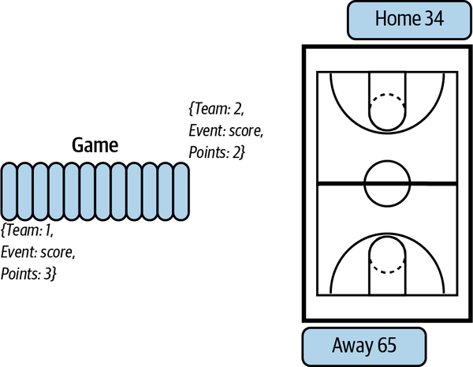
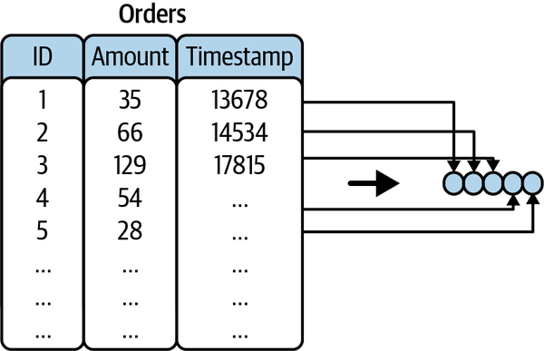
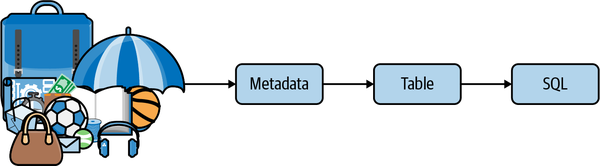
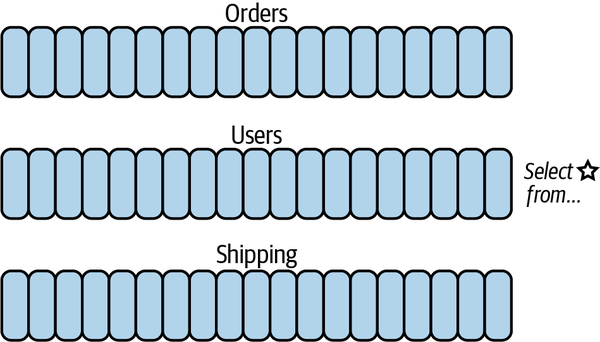
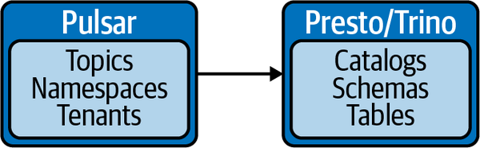
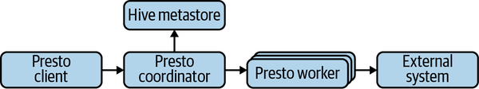
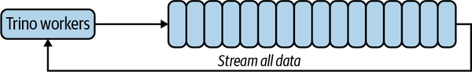
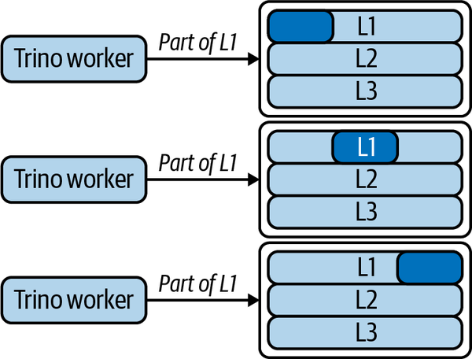
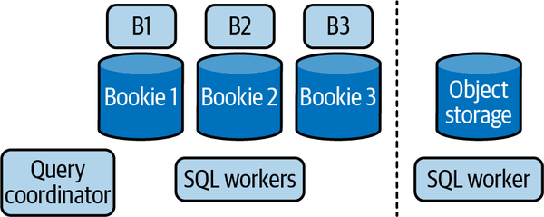

# Chapter 10. Pulsar SQL

At this point, we know we can interact with Pulsar in the following ways:

- Pulsar CLI
- Pulsar Admin API
- Pulsar clients
- Pulsar Functions
- Pulsar IO

Another way we can interact with Pulsar topics is through Structured Query Language (SQL). With Pulsar SQL, we can treat topics as tables and query them with SQL. However, before diving into how querying topics with SQL is possible, we should ask why do this at all? After all, using another tool or another language has some disadvantages that we should consider as well. Among these disadvantages are:

- Increased complexity from managing more semantics
- Cost considerations
- Cognitive overhead from managing new tools

We know Apache Pulsar is a storage system for event streams. With that lens, we can see the necessity and utility of alternative data interaction mechanisms. For example, with Pulsar Functions, we get a simple API that allows us to manipulate messages one at a time. With Pulsar IO, we get a repeatable mechanism for moving data to and from Pulsar topics. What advantage does querying a topic with SQL bring to the table?

SQL is the most ubiquitous programming language. Analytics engineers, designers, programmers, data scientists, and executives can all utilize it. In addition, popular databases like PostgreSQL, MySQL, Oracle, and Redshift all use a dialect of SQL to query data. Pulsar topics contain event data and are often the ingress point for an application. Enabling more people to access the data at this point in the pipeline can unlock new insights and new applications, and potentially detect problems early in the pipeline.

While querying a topic with SQL may sound convenient, the abstraction is much more potent than that. By understanding the interchange between streams and tables, we can use streams when appropriate and tables when appropriate. Or we can *have our cake and eat it too.* This chapter will dive deeper into this idea of streams and tables and extend our understanding of how these abstractions can enhance our architectures. It will end by walking through using Pulsar SQL to solve some real-world problems.

# Streams as Tables

Many modern applications require the storage, manipulation, and retrieval of data. A canonical example of an application with these requirements is a to-do list. The to-do list needs to store, edit, and retrieve all of your tasks. How should the current state of the list be represented? In an event stream model, we may create a topic for the list. Each time we make a change to the list, we publish data to that stream. On the consumer end of the application, the client can subscribe to the same topic and update the list as dictated by the topic. In addition to updating the state based on the last message in the topic, we can also re-create any state in the past by replaying the topic from the start (see [Figure 10-1](https://learning.oreilly.com/library/view/mastering-apache-pulsar/9781492084891/ch10.html#a_basketball_game_as_an_event_streamdot)).

An alternative to this event stream is the table or database way of collecting the data. In this model, every time a change is made to the to-do list, we can either create a new row in the table or edit an existing row. We can always retrieve the current state of affairs and edit that state in this paradigm, but we cannot reconstruct all previous states from the current table (see [Figure 10-2](https://learning.oreilly.com/library/view/mastering-apache-pulsar/9781492084891/ch10.html#a_table_representing_orders_can_be_cons)).[^i]

[^i]: In a table model, you can create tables that are “history” tables which keep track of all the changes in a stream. 


Is there anything inherently better about the table paradigm than the stream paradigm? No. Each paradigm exposes a level of granularity that is appropriate for the problem. If you consider the differences between the two in more detail, you may realize the relationship between them.

To make the duality of streams and tables a little more apparent, let’s explore an example. Imagine building a score tracker for a basketball game. As the game is in play, many events can occur. Players can score points, commit turnovers, steal the basketball, and block shots, among other activities (see [Figure 10-1](https://learning.oreilly.com/library/view/mastering-apache-pulsar/9781492084891/ch10.html#a_basketball_game_as_an_event_streamdot)).



*Figure 10-1. A basketball game as an event stream. As each team has an event (scores points), a new entry is added to the topic.*


For our purposes, we’ll focus on the task of keeping track of the score. We can model the score as an event with the following schema:

```
{ "team" : <team_id>,
"event": "score",
"points": <number>}
```

Each time the score increases, our application can publish a message with the team and the incremental score value. At any point, we can calculate the score by summing all of the score events that have taken place from the beginning of the topic until this moment. If we know the score now, we can append the new event to the existing score. Whenever we sum the complete history of that topic, we are creating a table view. We represent our score as what it is at this exact moment. When we append updates to a stream of scores, that is the event stream model. To summarize, aggregating actions on a stream allows us to represent that stream as a table.

Focusing on this point a little more, there is an interchangeability between streams and tables. A properly represented and designed event system can be represented as a table. Consider [Figure 10-2](https://learning.oreilly.com/library/view/mastering-apache-pulsar/9781492084891/ch10.html#a_table_representing_orders_can_be_cons), which shows a stream of orders with IDs, amounts, and timestamps. We can explore a few ways in which we can go from the stream of orders to table views and summaries.



*Figure 10-2. A table representing orders can be constructed from a stream of individual orders.*


Suppose we have an orders topic with the following schema:

```
{ "id": <int>,
"amount": <double>
"timestamp": <long>
}
```

Now suppose we want to summarize all sales for the past 24 hours in the stream. We could express this with SQL that looks something like this:

```
Select sum(amount) from orders where time_stamp_function(timestamp, 24h);
```

Further, if we want to get sales for a specific ID, we can make some more adjustments to our query:

```
Select sum(amount) from orders where time_stamp_function(timestamp, 24h) and id=1;
```

Additionally, we can find all sales in the past 24 hours that were over $100:

```
Select id, amount from orders where time_stamp_function(timestamp, 24h) and amount > 100;
```

Going from a stream to a table gives us a new way to express stream processing and has some immediate real-world value. One question that warrants further investigation is, what does it mean to have a table that is unbounded? To answer that question, we need to better understand the history of querying data and querying streams of data.

# SQL-on-Anything Engines

In the 2000s, Doug Cutting and Mike Cafarella invented the Hadoop Distributed File System (HDFS) at Yahoo!. [Hadoop](https://oreil.ly/NFzbt) provided a highly distributed and user-configurable way to store data at scale. One of the unique aspects of Hadoop was that it did not try to couple the query engine (how data was retrieved from it) with how the data was stored. Let’s unpack that idea a little bit to clearly understand some of the differences between Hadoop and its predecessors.

In a traditional relational database management system (RDBMS), the database engine provides a set of abstractions to order the data. These abstractions are known as databases, schemas, and tables. Users can use these abstractions to store, augment, and retrieve data. Additionally, the database query engine is optimized to retrieve data based on abstractions. Databases like MySQL and Postgres use these abstractions, and if you’ve worked on a web application, you’ve likely used one of these databases as a backend.

A key component to the design of the original RDBMS was data locality. Data stored in these systems resided on the same machine where the query engine was and where queries were executed. The advantage of this architecture is that it requires minimal orchestration to retrieve data. When a user queries data in an RDBMS, all the data is stored on the machine disk and retrieved. Contrast this with HDFS. When a user asks for data, data may be stored across several machines, and orchestration is required to retrieve the data.

One convenient aspect of the RDBMS, and perhaps its lasting legacy, is Structured Query Language (SQL). SQL provides a convenient dialect for describing, manipulating, and retrieving data. In the early days of Hadoop, an interface like SQL did not exist for retrieving data from HDFS. Instead, users wrote MapReduce jobs that provided a low-level abstraction to retrieving and manipulating data. After several years of MapReduce, Hive, a SQL interface for Hadoop, was born. Hive improved the usability of HDFS considerably. Now, anyone with knowledge of SQL could retrieve data from HDFS, and the necessity for specialized developers who knew MapReduce was minimized. The way Hive worked is that it utilized metadata about the data stored in HDFS to create catalogs, and then those catalogs could be queried by SQL with the right parsers (see [Figure 10-3](https://learning.oreilly.com/library/view/mastering-apache-pulsar/9781492084891/ch10.html#given_raw_datacomma_utilizing_its_metad)).



*Figure 10-3. Given raw data, utilizing its metadata, and organizing the data into tables, we can use SQL to query it. SQL-on-Anything engines use this technique to query data ranging from event streams to CSV files.*


Since the release of Hive, several open source projects were born to address some of its problems that were never overcome by the Hive SQL query engine itself: namely, poor performance and a complex deployment topology. Presto and Spark are two of the most notable projects that fit this classification. Presto and Spark were initially designed to solve the problems found with Hive (or querying distributed data more broadly). However, as the industry moves to new tools like object storage and streaming platforms, the need to provide a SQL engine over data stored in these systems was apparent. Spark and Presto are known as SQL-on-Anything engines today. They provide SQL over several other systems. For Pulsar, Presto provides a SQL engine over Pulsar topics, and that effort is known as Pulsar SQL.

## Apache Flink: An Alternative Perspective

Apache Flink is an open source stream and batch processing engine. Flink is not a SQL-on-Anything engine. Still, I believe that spending a little bit of time talking about Flink’s differences should crystallize the value of the SQL-on-Anything engine.

Flink’s specialty is querying messaging systems or events. While Flink can be used as a general-purpose engine to query flat files like Hive or Spark, this isn’t where it shines. In addition, Flink utilizes type systems and serialization to expose arbitrary message data as a table. Flink SQL is a SQL engine for Flink that builds on the streams as tables concept to offer a simple SQL language for querying event data (see [Figure 10-4](https://learning.oreilly.com/library/view/mastering-apache-pulsar/9781492084891/ch10.html#in_apache_flinkcomma_sql_users_can_quer)).



*Figure 10-4. In Apache Flink, SQL users can query any stream with an ANSI SQL syntax, bringing table semantics to unbounded streams.*


Flink SQL looks just like SQL over streams of data:

```
SELECT select_list FROM table_expression [ WHERE boolean_expression ]
```

If we analyze Flink SQL, we can see that instead of being a SQL-on-Anything engine, it’s deliberately a SQL-on-Streams engine. For Pulsar, Flink SQL is an appropriate alternative to the Presto implementation of Pulsar SQL. Why does Pulsar use Presto instead of Flink for SQL implementation? The main reason is that Presto is embeddable. This means you can run Presto alongside a Pulsar deployment. To contrast this with Flink SQL, a deployment would require an eternal deployment of Flink to enable Flink SQL.

## Presto/Trino

Presto is a distributed SQL-on-Everything engine developed at Facebook. Presto’s initial scope was as a distributed query engine for Hadoop; however, due to its pluggable architecture and few moving parts, it has evolved to be the query engine for any system (with a bit of work).

Trino is a fork of Presto. Without getting too involved, Presto is open source but managed by Facebook. Since Presto was made freely available, many companies have gotten involved with the project, suggesting improvements and contributing code. Ultimately, Facebook decides what goes into Presto and what doesn’t, and some Presto contributors grew tired of Presto’s ownership and forked the project. The project is now Trino, and Trino is housed in an open source foundation called the PrestoDB Foundation.

Every project that utilized Presto had to decide whether it would stay with the Facebook version of Presto or move to Trino. Apache Pulsar decided to go with Trino, and so throughout the rest of the book, I’ll refer to Presto as “Trino.”

# How Pulsar SQL Works

At its heart, Pulsar SQL is an implementation of a Trino connector. The Trino connector acts as a Pulsar consumer, utilizing metadata stored about each topic to effectively query data (see [Figure 10-5](https://learning.oreilly.com/library/view/mastering-apache-pulsar/9781492084891/ch10.html#a_high-level_view_of_pulsar_sqldot_puls)).



*Figure 10-5. A high-level view of Pulsar SQL. Pulsar concepts are translated to Trino concepts and executed by Trino.*


Trino, like Pulsar, is a distributed system with many components. Trino clusters have a few responsibilities, including the following:

- Querying data from external sources
- Coordinating distributed work
- Managing user permissions
- Caching data
- Storing metadata

A Trino cluster has worker nodes that interact with external systems, coordinators that manage orchestration for work, and meta stores to manage the internal representation of data. [Figure 10-6](https://learning.oreilly.com/library/view/mastering-apache-pulsar/9781492084891/ch10.html#in_a_trino_clustercomma_worker_nodes_in) provides a representation of a Trino cluster.



*Figure 10-6. In a Trino cluster, worker nodes interact with external systems, coordinators manage orchestration for work, and meta stores manage the internal representation of data.*


When implementing a Pulsar SQL interface, we have two options. One option is to read data from the topic, like a Pulsar client would (see [Figure 10-7](https://learning.oreilly.com/library/view/mastering-apache-pulsar/9781492084891/ch10.html#in_this_examplecomma_the_entire_topic_i)). The other is to read directly from where the data is stored in Pulsar (BookKeeper for most data and object storage for any offloaded data). Let’s talk about the trade-offs of each approach.



*Figure 10-7. In this example, the entire topic is streamed out to Trino for processing on every request.*


As we’ve discussed, Pulsar is novel in that it separates storage from other needs in the system through BookKeeper. In addition to being separate, BookKeeper storage is also redundant, in that the same ledger is stored across multiple bookies. Storing the data across multiple bookies makes it possible to parallelize queries to retrieve the data as well (see [Figure 10-8](https://learning.oreilly.com/library/view/mastering-apache-pulsar/9781492084891/ch10.html#a_group_of_trino_workers_retrieving_dat)).



*Figure 10-8. A group of Trino workers retrieving data from Ledger 1 (L1). Each worker can retrieve only parts of the ledger, and then bring the parts back together, decreasing retrieval time.*


We’ve also talked about how Pulsar SQL retrieves data from object storage (for tiered storage) and how [Trino](https://oreil.ly/WmTep) already supports a highly parallelized and performant implementation for reading from S3. All told, Trino is the perfect engine for retrieving data from Pulsar, since retrieving data is not a stream processing job, but more of an information retrieval job (see [Figure 10-9](https://learning.oreilly.com/library/view/mastering-apache-pulsar/9781492084891/ch10.html#trino_utilizes_the_pulsar_architecture)).



*Figure 10-9. Trino utilizes the Pulsar architecture to provide performant information retrieval that can be easily parallelized.*

# Configuring Pulsar SQL

By default, Pulsar ships with an embedded Trino instance. Including Trino as a default option enables users who are new to Pulsar SQL to use Trino without standing up a Trino cluster. In this section, we’ll focus on the embedded version of Pulsar SQL. If you’re interested in deploying your own Trino cluster to run Pulsar SQL, I recommend following the instructions in the [Pulsar documentation](https://oreil.ly/W2uzb).

To configure Pulsar SQL, we need to edit the *pulsar.properties* file, which can be found at the following location:

```
${project.root}/conf/presto/catalog/pulsar.properties
```

The *pulsar.properties* file looks like this:

```
# name of the connector to be displayed in the catalog
connector.name=pulsar

# the url of Pulsar broker service
pulsar.web-service-url=http://localhost:8080

# URI of Zookeeper cluster
pulsar.zookeeper-uri=localhost:2181

# minimum number of entries to read at a single time
pulsar.entry-read-batch-size=100

# default number of splits to use per query
pulsar.target-num-splits=4
```

If you have multiple Pulsar brokers, you can configure them in the following way:

```
pulsar.web-service-url=http://localhost:8080,localhost:8081,localhost:8082
pulsar.zookeeper-uri=localhost1,localhost2:2181
```

To start a Pulsar SQL cluster, you can use the CLI tools:

```
$ ./bin/pulsar sql-worker –help
Usage: launcher [options] command

Commands: run, start, stop, restart, kill, status

Options:
  -h, --help            show this help message and exit
  -v, --verbose         Run verbosely
  --etc-dir=DIR         Defaults to INSTALL_PATH/etc
  --launcher-config=FILE
                        Defaults to INSTALL_PATH/bin/launcher.properties
  --node-config=FILE    Defaults to ETC_DIR/node.properties
  --jvm-config=FILE     Defaults to ETC_DIR/jvm.config
  --config=FILE         Defaults to ETC_DIR/config.properties
  --log-levels-file=FILE
                        Defaults to ETC_DIR/log.properties
  --data-dir=DIR        Defaults to INSTALL_PATH
  --pid-file=FILE       Defaults to DATA_DIR/var/run/launcher.pid
  --launcher-log-file=FILE
                        Defaults to DATA_DIR/var/log/launcher.log (only in
                        daemon mode)
  --server-log-file=FILE
                        Defaults to DATA_DIR/var/log/server.log (only in
                        daemon mode)
  -D NAME=VALUE         Set a Java system property
```

To start Pulsar SQL, you can run the following command:

```
$ ./bin/pulsar sql-worker start
```

Let’s run an end-to-end example to show how Pulsar SQL works.

Publish data to a topic:

```
public class Test {
    
     public static class Person {
        private int id = 1;
        private String name;
        private long date;
     }
    
     public static void main(String[] args) throws Exception {
        PulsarClient pulsarClient = PulsarClient.builder()
        	.serviceUrl("pulsar://localhost:6650").build();
        Producer<Person> producer = pulsarClient
        	.newProducer(AvroSchema.of(Person.class)).topic("person_topic")
        	.create();
        
        for (int i = 0; i < 1000; i++) {
            Person person = new Person();
            person.setid(i);
            person.setname("foo" + i);
            person.setdate(System.currentTimeMillis());
            producer.newMessage().value(person).send();
        }
        producer.close();
        pulsarClient.close();
     }
}
```

Start Pulsar SQL:

```
./bin/pulsar sql-worker run
```

Start the Pulsar cluster:

```
./bin/pulsar sql
```

Check that our data is in the catalog:

```
show tables in pulsar."public/default";
```

This returns `person_topic`.

Query our data:

```
select * from pulsar."public/default".person_topic;
```

This returns 1,000 rows of our generated data. Since we are no longer adding data to the topic, we see a static view. If we were to continually stream new data in our query, it would result in an infinite stream of records.

To recap, as long as we provide a type (Pojo, Avro, JSON, etc.) to our data, Pulsar SQL can expose our streams as tables. This is a powerful idea and useful for powering a number of applications, including dashboards and real-time systems.

# Performance Considerations

We talked a little about how Trino works, and it’s worth learning what the performance of Pulsar SQL will look like at scale.

The parallel architecture of Trino and the parallelism offered by BookKeeper and cloud object storage means that Trino is reliably scalable both horizontally and vertically. As we add more bookies and more object storage (for tiered storage), we can continue to scale our Trino cluster and keep performance for Pulsar SQL queries in lockstep with our needs.

In some real-world scenarios, Pulsar SQL has been measurably fast. [Table 10-1](https://learning.oreilly.com/library/view/mastering-apache-pulsar/9781492084891/ch10.html#pulsar_sql_performance_metrics) summarizes these performance metrics.[^ii]

[^ii]: From the talk [“Interactive querying of streams using Apache Pulsar” by Jerry Peng](https://oreil.ly/CkYlE). 


| Configuration                                       | JSON (compressed) parsing performance | Avro (compressed) parsing performance |
| :-------------------------------------------------- | :------------------------------------ | :------------------------------------ |
| 3 nodes 12 CPU cores 128 GB RAM 2X1.2 TB NVME disks | ~ 60 million rows per second          | ~ 50 million rows per second          |

# Summary

This chapter covered the use cases for Pulsar SQL, and detailed the Pulsar SQL architecture and the steps for setting up Pulsar SQL in a Pulsar cluster to emphasize the value of having an interchangeable method between streams and tables. Pulsar SQL is the final mechanism for communicating with Pulsar that we’ll cover in this book. For the remaining three chapters, we’ll talk about the following:

- Deploying Pulsar in various environments
- Operating Pulsar
- My thoughts on the future of Pulsar

