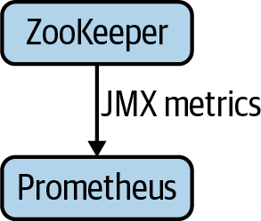

# Chapter 12. Operating Pulsar

As you saw in [Chapter 11](https://learning.oreilly.com/library/view/mastering-apache-pulsar/9781492084891/ch11.html#deploying_pulsar), deploying Pulsar can take some effort, but how can we ensure its reliability once it’s deployed and in use? First, we need to be able to measure aspects of our system. Second, we need to understand the metrics in isolation. Third, we need to understand the interaction between metrics. And finally, we need to be able to understand when the preceding points deviate from our expectations. If we take a step back to consider everything required to operate a system successfully, it may be overwhelming to us. Fortunately, Pulsar makes metrics collection simple by providing a slew of metrics by default. This chapter will walk through those metrics and provide some context on which metrics are helpful to keep an eye on if you’re new to operating Apache Pulsar.

Before we explore each section, it’s essential to understand the types of metrics provided by Pulsar:

- Counter

  A counter is a cumulative metric, and it increases monotonically. Counters help visualize the total number of a metric occurring over a given duration.

- Gauge

  A gauge represents a single numeric value. Gauges are suitable for representing what is going on at the exact moment versus a historical look.

- Histogram

  A histogram is a sampled representation of observations. A histogram is suitable for getting counts of metrics in a specific bucket of time.

- Summary

  A summary is a histogram over a sliding window.

# Apache BookKeeper Metrics

Apache BookKeeper is the storage engine for Pulsar, and as it is a critical component, understanding its behavior is paramount. BookKeeper metrics break down into three categories:

- Server metrics

  Metrics concerning the bookie (BookKeeper server)

- Journal metrics

  Metrics concerning the read/write operations of the bookie’s journal

- Storage metrics

  Metrics concerning how much data is stored on the bookie

We’ll walk through all of these metrics and discuss which are the most valuable to get started in monitoring Pulsar.

## Server Metrics

Server metrics provide some key metrics around the BookKeeper server status. They can tell you things like the following:

- Whether the bookie is available in read or write mode
- How many `ADD_ENTRY` requests are going to the bookie
- The number of `READ BYTES` the bookie is processing

These metrics are helpful in managing the day-to-day operations of BookKeeper as well as diagnosing problems in the event of an outage. Following is a list of server metrics:

- `bookie_SERVER_STATUS` (Gauge)

  This metric can have one of two values:1 means the bookie is running in a writable mode.0 means the bookie is running in a read-only mode.Many of the bookie metrics are about the size of data transfer. This metric is valuable to ensure that all bookies are in a writable mode before troubleshooting any further.

- `bookkeeper_server_ADD_ENTRY_count` (Counter)

  This metric represents the total number of `ADD_ENTRY` requests received by the bookie.

- `bookkeeper_server_READ_ENTRY_count` (Counter)

  This metric represents the total number of `READ_ENTRY` requests received by the bookie.

- `bookie_WRITE_BYTES` (Counter)

  This metric represents the cumulative bytes written to a bookie.

- `bookie_READ_BYTES` (Counter)

  This metric represents the cumulative bytes read from a bookie.

- `bookkeeper_server_ADD_ENTRY_REQUEST` (Summary)

  This metric represents the request latency for `ADD_ENTRY` requests for a bookie. It will tell you approximately how long it takes to fulfill an `ADD_ENTRY` request. This is a good metric to keep a close eye on because increased latency here is a good indication of an underprovisioned bookie.

- `bookkeeper_server_READ_ENTRY_REQUEST` (Summary)

  This metric represents the request latency for `READ_ENTRY` requests for a bookie. It will tell you approximately how long it takes to fulfill a `READ_ENTRY` request. We expect this metric to be consistent but highly correlated with consumer activity in the cluster.

## Journal Metrics

Journal metrics provide some detailed metrics on a per-bookie basis. They tell you things like:

- Journal queue size
- Journal latency when syncing
- Journal request latency

These metrics can be critical when diagnosing problems around end-to-end performance with BookKeeper. Journal metrics include the following:

- `bookie_journal_JOURNAL_SYNC_count` (Counter)

  This metric represents the total number of journal *fsync* operations occurring on the bookie.

- `bookie_journal_JOURNAL_QUEUE_SIZE` (Gauge)

  This metric represents the number of pending requests waiting to be appended to the bookie journal. This is a good metric to watch closely because when this queue gets large, it’s an indication that there may be problems somewhere within the system.

- `bookie_journal_JOURNAL_FORCE_WRITE_QUEUE_SIZE` (Gauge)

  This metric represents the total number of *fsync* requests pending in the write queue.

- `bookie_journal_JOURNAL_CB_QUEUE_SIZE` (Gauge)

  This metric represents the total number of callbacks pending in the callback queue.

- `bookie_journal_JOURNAL_ADD_ENTRY` (Summary)

  This metric provides the request latency of appending new entries to the journal.

- `bookie_journal_JOURNAL_SYNC` (Summary)

  This metric summarizes the *fsync* latency of syncing data to the journal’s disk.

## Storage Metrics

Storage metrics tell you statistics about how much a bookie is storing on a few dimensions. Storage metrics can provide insight into the following:

- Total number of ledgers
- Total number of entries
- Write and read cache

These metrics are valuable for diagnosing that everything is working properly as well as knowing when to add additional bookies to the cluster. They include the following:

- `bookie_ledgers_count` (Gauge)

  This metric counts the total number of ledgers stored in the bookie.

- `bookie_entries_count` (Gauge)

  This metric counts the total number of entries stored within a bookie.

- `bookie_write_cache_size` (Gauge)

  This metric is a count of the total bookie write cache size in bytes.

- `bookie_read_cache_size` (Gauge)

  This metric is a count of the total bookie read cache size in bytes.

- `bookie_DELETED_LEDGER_COUNT` (Counter)

  This metric represents the total number of ledgers that the bookie has deleted.

- `bookie_ledger_writable_dirs` (Gauge)

  This metric represents the total number of writable directories available on the bookie.

# Apache ZooKeeper Metrics

Apache ZooKeeper stores metadata for both BookKeeper and Pulsar; a Pulsar deployment would not work correctly without a fully operational ZooKeeper cluster. There are two types of ZooKeeper metrics:

- Server metrics

  Metrics about specific behavior related to the ZooKeeper deployment topology

- Request metrics

  Metrics concerning the rate and volume of data arriving at and leaving the ZooKeeper cluster

This section explains these metrics and how to use them to monitor Pulsar effectively. We’ll cover metrics forwarding later in this chapter; for now, note that ZooKeeper metrics can all be forwarded to Prometheus (see [Figure 12-1](https://learning.oreilly.com/library/view/mastering-apache-pulsar/9781492084891/ch12.html#jmx_metrics_are_collected_by_prometheus)).



*Figure 12-1. Java Management Extensions (JMX) metrics are collected by Prometheus, a time series database and metrics server.*

## Server Metrics

Server metrics are another tool in our arsenal for ensuring that our ZooKeeper cluster is operational. Server metrics can tell you things like:

- How many z-nodes are in the cluster
- Active client connections
- The data storage on the nodes

This information is critical for a quick glance as well as useful to check in the event of an outage or performance degradation event. The server metrics on ZooKeeper include the following:

- `zookeeper_server_znode_count` (Gauge)

  This metric represents is the total number of z-nodes stored in ZooKeeper.

- `zookeeper_server_data_size_bytes` (Gauge)

  This metric is the total size (in bytes) of the z-nodes stored in ZooKeeper.

- `zookeeper_server_connections` (Gauge)

  This metric represents the total number of open connections to ZooKeeper. It is helpful when debugging the connectivity of Pulsar nodes and bookies to ZooKeeper. This metric may be a leading indicator of bookies and Pulsar nodes going offline.

- `zookeeper_server_watches_count` (Gauge)

  This metric represents the total number of watchers registered in ZooKeeper.

- `zookeeper_server_ephemerals_count` (Gauge)

  This metric represents the total number of ephemeral z-nodes in ZooKeeper.

## Request Metrics

Request metrics track the performance and load of ZooKeeper. Since ZooKeeper plays a critical role in tracking metadata around topics and how the data is stored, this is a critical metric to track. ZooKeeper request metrics include the following:

- `zookeeper_server_requests` (Counter)

  This metric represents the total number of requests received by ZooKeeper.

- `zookeeper_server_requests_latency_ms` (Summary)

  This metric summarizes the request latency (in milliseconds). It provides both the read and write latencies for ZooKeeper. Of all the metrics provided by ZooKeeper, this is perhaps the most valuable. Increased read and write latency outside of expectations with traffic is a good indication that something is wrong.

# Topic Metrics

Topics are the units that Pulsar consumers and producers wish to monitor closely. For Pulsar topics, there are metrics around message egress and ingress, subscription counts, latencies, and size. Following is a list of each metric and some pointers that may be valuable when starting to monitor Pulsar:

- `pulsar_subscriptions_count` (Gauge)

  This metric represents the number of subscriptions to the given topic. It is valuable for validating behavior in a Pulsar cluster. If subscription counts don’t match what you expected from the number of consumers deployed, something may be amiss.

- `pulsar_producers_count` (Gauge)

  This metric represents the number of active producers for a given topic.

- `pulsar_consumers_count` (Gauge)

  This metric represents the number of active consumers for a topic.

- `pulsar_rate_in` (Gauge)

  This metric represents the total message rate into Pulsar for the given topic, measured in messages per second.

- `pulsar_rate_out` (Gauge)

  This metric represents the total message rate out of Pulsar for the given topic, measured in messages per second.

- `pulsar_throughput_in` (Gauge)

  This metric represents the total throughput into Pulsar for the given topic, measured in bytes per second.

- `pulsar_throughput_out` (Gauge)

  This metric represents the total throughput out of Pulsar for the given topic, measured in bytes per second.

- `pulsar_storage_size` (Gauge)

  This metric represents the total size in bytes for the given Pulsar topic.

- `pulsar_storage_backlog_size` (Gauge)

  This metric represents the total backlog size in messages for the given Pulsar topic.

- `pulsar_storage_offloaded_size` (Gauge)

  This metric represents the total amount of data in bytes for the topic that has been offloaded to tiered storage.

- `pulsar_storage_backlog_quota_limit` (Gauge)

  This metric represents the total amount of data (in bytes) that limits the backlog quota.

- `pulsar_storage_write_rate` (Gauge)

  The metric represents the rate of message batches written to storage for the given topic, measured in message batches per second.

- `pulsar_storage_read_rate` (Gauge)

  The metric represents the rate of message batches read from storage for the given topic, measured in message batches per second.

- `pulsar_subscription_delayed` (Gauge)

  This metric represents the total number of message batches currently delayed from dispatching.

- `pulsar_storage_write_latency_le_*` (Histogram)

  This metric represents the rate of messages above a specifically identified threshold.

- `pulsar_entry_size_le_*` (Histogram)

  This metric represents the rate of messages above a specifically identified size threshold (in bytes).

- `pulsar_in_bytes_total` (Counter)

  This metric represents the total number of bytes received for a topic.

- `pulsar_in_messages_total` (Counter)

  This metric represents the total number of messages received for a given topic.

- `pulsar_out_bytes_total` (Counter)

  This metric represents the total number of bytes read for a given topic.

- `pulsar_out_messages_total` (Counter)

  This metric represents the total number of messages read from a given topic.

# Consumer Metrics

Misbehaving consumers are a concern for a Pulsar operator because a slow consumer can lead to a poor user experience and lost opportunity for streaming applications. Consumer metrics should ensure a smoothly operating Pulsar experience. Following is a list of consumer metrics for monitoring Pulsar:

- `pulsar_consumer_msg_rate_redeliver` (Gauge)

  This metric represents the total message rate per second being delivered to the consumer.

- `pulsar_consumer_unacked_messages` (Gauge)

  This metric represents the total number of unacknowledged messages for the consumer.

- `pulsar_consumer_blocked_on_unacked_messages` (Gauge)

  This metric represents whether a consumer is blocked because of unacknowledged messages. The metric can take one of two values:1 means the consumer is blocked.0 means the consumer is not blocked.

- `pulsar_consumer_msg_throughput_out` (Gauge)

  This metric represents the dispatch rate for the consumer, measured in messages per second.

- `pulsar_consumer_msg_rate_out` (Gauge)

  This metric represents the total dispatch throughout for a consumer, measured in bytes per second.

- `pulsar_consumer_available_permits` (Gauge)

  This metric represents the available permits for a consumer.

# Pulsar Transaction Metrics

Transactions are a new feature introduced in Pulsar 2.8. Pulsar transactions provide some global consistency to consumers and are helpful for a vast number of real-time applications. That said, Pulsar transactions can fail or may be aborted by the producer, and any deviant behavior should be closely monitored. The following metrics are available for Pulsar transactions:

- `pulsar_txn_active_count` (Gauge)

  This metric represents the total number of active transactions for a given coordinator.

- `pulsar_txn_created_count` (Counter)

  This metric represents a count of the total number of transactions created.

- `pulsar_txn_committed_count` (Counter)

  This metric represents the total number of committed transactions.

- `pulsar_txn_aborted_count` (Counter)

  This metric represents the total number of transactions aborted for the given coordinator.

- `pulsar_txn_timeout_count` (Counter)

  This metric represents the total number of transactions that have timed out.

- `pulsar_txn_append_log_count` (Counter)

  This metric represents the total number of append transaction logs.

- `pulsar_txn_execution_latency_le_*` (Histogram)

  This metric represents the distribution of transaction time in milliseconds.

# Pulsar Function Metrics

Pulsar Functions may be an integral part of your overall event processing system. As such, monitoring functions and ensuring that they behave according to our expectations is essential. Pulsar provides several metrics for Pulsar Functions that provide visibility into the functions’ exceptions, throughput, and other custom metrics (see [Figure 12-2](https://learning.oreilly.com/library/view/mastering-apache-pulsar/9781492084891/ch12.html#each_function_exports_its_metrics_indep)). Following is a list of the Pulsar function metrics:


*Figure 12-2. Each function exports its metrics independently and the metrics collector aggregates them.*

- `pulsar_function_processed_successfully_total` (Counter)

  This metric represents the total number of messages processed successfully by the given Pulsar function.

- `pulsar_function_processed_successfully_total_1min` (Counter)

  This metric represents the total number of messages processed successfully over the last minute by a given Pulsar function.

- `pulsar_function_system_exceptions_total` (Counter)

  This metric represents the total number of exceptions in the system related to functions in the specified namespace.

- `pulsar_function_system_exceptions_total_1min` (Counter)

  This metric represents the total number of exceptions in the system related to functions in the specified namespace during the last 60-second interval.

- `pulsar_function_user_exceptions_total` (Counter)

  This metric represents the total number of user exceptions for functions in a given namespace.

- `pulsar_function_user_exceptions_total_1min` (Counter)

  This metric represents the total number of user exceptions for functions in a given namespace in the last 60-second interval.

- `pulsar_function_process_latency_ms` (Summary)

  This metric represents the latency of a process in milliseconds.

- `pulsar_function_process_latency_ms_1min` (Summary)

  This metric represents the latency of a process in milliseconds over the last 60-second interval.

- `pulsar_function_last_invocation` (Gauge)

  This metric represents the timestamp of the last invocation of the function.

- `pulsar_function_received_total` (Counter)

  This metric represents the total number of messages received from a source for a given function.

- `pulsar_function_received_total_1min` (Counter)

  This metric represents the total number of messages received from a source for a given function in the last 60-second interval.

- `pulsar_function_user_metric_` (Summary)

  This metric is reserved for user definition.

# Advanced Operating Techniques

Operating Pulsar is equal parts good instrumentation (tracking the metrics just described) and experience (knowing what to look for). When attempting to provide trackable observability around a system, both breadth of metrics and an understanding of how they work in conjunction with one another is required. Pulsar provides a mechanism to get at that interaction point by enabling distributed tracing within a Pulsar system. Additionally, Pulsar provides a mechanism for exporting metrics to systems that are more suitable for analyzing the data extracted from Pulsar. We’ll explore these features in detail in the following few subsections.

## Interceptors and Tracing

One crucial consideration when monitoring an event streaming platform is understanding how messages traverse the system. In Pulsar, a message may start in a single topic and fan out over many more topics over time (see [Figure 12-3](https://learning.oreilly.com/library/view/mastering-apache-pulsar/9781492084891/ch12.html#a_tracing_webdot_the_purpose_of_distrib)). Obtaining a good grasp of the performance characteristics of this traversal is the primary goal of tracing.


*Figure 12-3. A tracing web. The purpose of distributed tracing is to understand where messages originate and terminate and where they go on their journey.*


For us to better understand tracing, it’s worth talking about interceptors. In Pulsar, interceptors run on the brokers and intercept messages coming into Pulsar or going out of Pulsar. Interceptors can be helpful for operations that strictly require message mutation before arriving at a consumer or a producer. The two most prominent use cases for interceptors are data validation and metadata addition. It’s probably not hard to imagine a producer interceptor being used for schema validation. In this scenario, the producer publishes a message to Pulsar, and before the message is written to the topic, an interceptor ensures that it matches the registered schema. You may also imagine an interceptor tagging a message with metadata like a timestamp before sending it along (see [Figure 12-4](https://learning.oreilly.com/library/view/mastering-apache-pulsar/9781492084891/ch12.html#the_interceptor_framework_in_apache_pul)).


*Figure 12-4. The interceptor framework in Apache Pulsar enables broker-side logic to be executed before arriving at the broker or consumer.*


Tracing is the process of adding metadata to a payload to trace its progress through a system. Pulsar utilizes consumer and producer interceptors for its distributed tracing implementation by intercepting the messages with metadata and integrating with a tracing system like Jaeger or Skywalking.

In practice, an example may look like this:

```
Consumer<Double> consumer = client.newConsumer(Schema.Double)
        .topic("my-topic")
        .subscriptionName("my-sub")
        .subscriptionType(SubscriptionType.Shared)
        .intercept(new TracingConsumerInterceptor<>())
        .subscribe();

Producer<String> producerB = client.newProducer(Schema.STRING)
        .topic("my-topic-2")
        .intercept(new TracingProducerInterceptor())
        .create();
```

## Pulsar SQL Metrics

Pulsar SQL can provide a rich interactive layer over Pulsar topics. Pulsar SQL utilizes Trino for SQL queries and is contingent on the types of queries run. Pulsar SQL can be resource intensive and may require additional resources to provide the best experience. Pulsar SQL provides a comprehensive set of metrics that are helpful in diagnosing problems as well as capacity planning (see [Figure 12-5](https://learning.oreilly.com/library/view/mastering-apache-pulsar/9781492084891/ch12.html#pulsar_sql_metrics_are_sent_directly_fr)). Available metrics include the following:

- `split_bytes_read` (Counter)

  This metric represents the number of bytes read from Apache BookKeeper.

- `split_num_messages_deserialized` (Counter)

  This metric represents the number of messages deserialized by Pulsar SQL.

- `split_num_record_deserialized` (Counter)

  This metric represents the number of records deserialized by Pulsar SQL.

- `split_bytes_read_per_query` (Summary)

  This metric represents the number of bytes read per query.

- `split_entry_deserialize_time` (Summary)

  This metric represents the total time spent deserializing table entries, measured in milliseconds.

- `split_entry_deserialize_time_per_query` (Summary)

  This metric represents the time spent deserializing entries per query.

- `split_entry_queue_dequeue_wait_time` (Summary)

  This metric represents the time spent waiting to get a new entry from the queue.

- `split_entry_queue_dequeue_wait_time_per_query` (Summary)

  This metric represents the time spent waiting to get a new entry from the queue per query.

- `split_num_entries_per_batch` (Summary)

  This metric represents the number of entries per batch.

- `split_num_entries_per_query` (Summary)

  This metric represents the number of entries per query.

- `split_num_messages_deserialized_per_entry` (Summary)

  This metric represents the number of messages that are deserialized per entry.

- `split_num_messages_deserialized_per_query` (Summary)

  This metric represents the number of messages that are deserialized per query.

- `split_read_attempts` (Summary)

  This metric represents the overall number of read attempts.

- `split_read_attempts_per_query` (Summary)

  This metric represents the number of read attempts per query.

- `split_read_latency_per_batch` (Summary)

  This metric represents the read latency per batch.

- `split_read_latency_per_query` (Summary)

  This metric represents the read latency per query.

- `split_record_deserialize_time` (Summary)

  This metric represents the time spent deserializing messages to records, measured in milliseconds.

- `split_record_deserialize_time_per_query` (Summary)

  This metric represents the total time spent deserializing messages per query.

- `split_total_execution_time` (Summary)

  This metric represents the total execution time for a given query.


*Figure 12-5. Pulsar SQL metrics are sent directly from Trino to the metrics exporter. These metrics can be used to detect performance issues and determine whether scaling up is necessary.*

# Metrics Forwarding

Pulsar’s metrics are exposed via a `/metrics` endpoint in a format that works with time series databases such as Prometheus, InfluxDB, and TimescaleDB. Metrics can also be accessed by systems such as SignalFx, Datadog, and New Relic via these endpoints. Additionally, the value of forwarding the metrics to a time series database is the ability to visualize the metrics on a dashboard and set alerts for when the behavior of the metric is deviant from what we expect (see [Figure 12-6](https://learning.oreilly.com/library/view/mastering-apache-pulsar/9781492084891/ch12.html#there_are_several_time_series_database)). In the end, the value of collecting all the metrics we can about Pulsar is to understand its pathology and be able to diagnose when it’s unhealthy—that is, to forward all metrics to a system where we can further analyze them and become good caretakers.


*Figure 12-6. There are several time series database options on the market. Operators can choose other databases besides Prometheus and get the same rich experience.*

## Dashboards

The purpose of collecting all the metrics and forwarding them to a time series database is so that we can:

- Receive alerts based on anomalies
- Create dashboards to share with stakeholders and track performance

Grafana is a tool that is used to take metrics from a time series database like Prometheus and turn them into beautiful visualizations. [Figure 12-7](https://learning.oreilly.com/library/view/mastering-apache-pulsar/9781492084891/ch12.html#the_grafana_dashboard_utilizes_summarie) provides an example of a Grafana dashboard.


*Figure 12-7. The Grafana dashboard utilizes summaries, gauges, histograms, and counters to visualize metrics from a time series database.*

I’ve created some templates for Grafana that I’ll share on [my website](http://www.jowanza.com/mastering-pulsar-content) for anyone interested in creating dashboards for tracking Pulsar.

# Summary

In this chapter we walked through available metrics for monitoring and operating Pulsar. With the conclusion of this chapter, we’ve covered the lion’s share of topics in Pulsar and this is the end of the journey. In [Chapter 13](https://learning.oreilly.com/library/view/mastering-apache-pulsar/9781492084891/ch13.html#the_future), I provide some of my thoughts on what the future of Pulsar might look like.