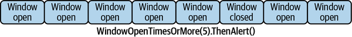

# Chapter 13. The Future

Pulsar began with the goal of being a general-purpose system for event streams and queues. Today the goals for Pulsar are more ambitious. Pulsar aims to be not just a messaging system, but a general-purpose storage engine and complete event platform. Pulsar also aims to support anyone on their streaming journey by supporting a proxy framework. What components are needed to make this ambitious goal a reality? This chapter isn’t a comprehensive look at Pulsar’s future; instead, it’s my opinion of the areas worth tackling next. My opinions are colored by my experience building systems that use Pulsar or similar technology.

# Programming Language Support

Pulsar has support for Java, Python, and Go officially, with many unofficial clients for other programming languages provided by the community. *Official* language support means that the Pulsar open source project maintains the implementation for that client. Pulsar’s adoption in the broader ecosystem hinges partially on its ability to reach programmers with whatever tools they are comfortable with. Language support extends beyond client libraries to Pulsar Functions and even Pulsar IO implementations. Supporting the top 25 most popular programming languages is an undertaking that shouldn’t be placed solely on the shoulders of Pulsar source contributors. Providing a native, language-specific implementation is a time-consuming ordeal and not necessarily a core function of Pulsar. With these limitations, how should Pulsar expand its reach and support for more programming languages? An improved approach is building a native implementation of the Pulsar client wrapped via a foreign function interface (FFI) and implemented across the board.

## Extension Interface

The Python implementation of the Pulsar client library utilizes a shared native implementation of the Pulsar client. This native implementation enables the Python client to have parity in performance with the Java client and keep in lockstep with the client without reimplementation (see [Figure 13-1](https://learning.oreilly.com/library/view/mastering-apache-pulsar/9781492084891/ch13.html#the_pulsar_common_interface_is_a_c_code)). This model for building client libraries is similar to other client library implementations for databases, message queues, and other driver-based software.[^i] Many of these systems have needs that make them good candidates for using the interface pattern.

[^i]: Apache Kafka, RabbitMQ, and Redis are some examples of open source projects that take this approach.


*Figure 13-1. The Pulsar Common Interface is a C codebase enabling language extension via foreign function interfaces.*


First, each of these driver-based software implementations has performance requirements. We expect our database to return data quickly, our message queue to receive data at imperceptible speeds, and our printer to receive our print job quickly. Second, we expect these implementations to be efficient. We want to run with as few resources as possible and maybe in constrained environments like an A/V system. Third, we want these systems to run in as many places as possible. We want polyglot implementations of our database and message clients, and we want our printers to work on Macs, Windows, and Linux. To accomplish this, a native implementation is often required (one written in C or C++).

An excellent native client library implementation enables other programming languages to tap into their ecosystems to provide a performant and idiomatically acceptable implementation. In the long term, I see all Pulsar client libraries developed using this pattern.

## Enhancements to Pulsar Functions

Pulsar Functions provide a simple programmatic interface for stream processing in Pulsar. The beauty of Pulsar Functions is their simplicity, small runtime, and flexible scale-out model. Pulsar Functions are not suitable for every stream processing problem, only those that involve complex state management. I don’t think it’s wise for Pulsar Functions to build the same capabilities of a stream processing framework as Apache Flink. Still, I do think a few extensions might improve the usability for complex use cases.

### Watermarks

Stream processing systems are concerned with processing messages quickly. However, they are also concerned with correctness. Correctness means the data processed by the stream processing engine reflects the state of the real world. A discrepancy might arise when the stream processing system is late or out of order. Consider a stream processing application that sums the count of events every 10 seconds to provide a rolling count. If events arrive outside of that 10-second window, the stream processing system is attributing the count to messages that arrived late but belonged to an earlier window (see [Figure 13-2](https://learning.oreilly.com/library/view/mastering-apache-pulsar/9781492084891/ch13.html#windows_over_an_immutable_streamdot_the)).


*Figure 13-2. Windows over an immutable stream. The windows are finite sets of elements that can be determined by code.*


To deal with the issue of late-arriving data, stream processing engines have a concept known as watermarks. Watermarks allow the stream processing engine to deal with its timer and the time in the events and then deal with late-arriving data. I think Pulsar Functions should include some notion of optional watermarks. I think it would allow for richer interactions and support use cases that would traditionally go to a system like Apache Flink.

### Windowing

Pulsar Functions support windowing via the Java SDK. Windows allow you to perform a stream processing task on a finite set of data bounded by time (see [Figure 13-3](https://learning.oreilly.com/library/view/mastering-apache-pulsar/9781492084891/ch13.html#a_time-based_window_on_a_one-second_int)). My only improvement suggestion for the future of Pulsar is to extend this functionality to the other programming languages in the Pulsar Functions ecosystem. Enabling this kind of capability across all languages creates a polyglot utopia of sorts where all programmers can be introduced to ideas of stream processing in a friendly and inviting environment.


*Figure 13-3. A time-based window on a one-second interval. Messages M1–M8 would be processed by the window function.*

### Complex event processing

Complex event processing (CEP) is a subset of event processing that builds complex state machines from stream processing jobs. A large amount of business logic may be required to execute some event pipelines. This logic may include many failure and retry conditions, circuit breakers, and other complex behaviors. Utilizing higher-level event processing APIs for this task can be cumbersome and error prone. CEP APIs try to pull the complexity away from the user and provide an abstraction with built-in mechanisms for retry and other required behaviors for fault tolerance.

To solidify the concept of CEP, let’s talk about a concrete example. Suppose you are creating a home security system. In a home security system, there are sensors (window, door, glass break) and these sensors help provide a state of the home. As the home security company, you can search for anomalies in the state of the sensors to determine whether something is wrong. For example, if it’s late at night and glass breaks, then maybe it was a burglary. Within a home, there are many complex interactions and reasons for sensors to be in different states (see [Figure 13-4](https://learning.oreilly.com/library/view/mastering-apache-pulsar/9781492084891/ch13.html#a_home_with_sensorsdot_windowscomma_doo)), so it may be advantageous to look at events in conjunction with each other to determine where the anomalies are. Wherever there are complex patterns in event streaming systems is where CEP thrives.


*Figure 13-4. A home with sensors. Windows, doors, and the camera all have sensors and in conjunction lead to the home being in different states that can be monitored by the security company.*


Apache Flink is a system I’ve mentioned a few times in this book. Flink has a robust set of CEP APIs to find patterns in streams. For example, if you wanted to check a stream for an event happening two or more times, it would be represented like this:

```
start.timesOrMore(2);
```

We could use patterns like this to build a rudimentary system for monitoring a home (see [Figure 13-5](https://learning.oreilly.com/library/view/mastering-apache-pulsar/9781492084891/ch13.html#going_from_right_to_leftcomma_we_see_fi)) and get much more sophisticated in time.



*Figure 13-5. Going from right to left, we see five “window open” events which would trigger an alert.*


More than simple pattern matching, Flink also supports logical operators like `where` and `or` in the CEP API:

```
pattern.where(new SimpleCondition<Event>() {
    @Override
    public boolean filter(Event value) {
       return true
    }
}).or(new SimpleCondition<Event>() {
    @Override
    public boolean filter(Event value) {
        return false
    }
});
```

It is possible to represent this kind of logic with Pulsar Functions, but it would be difficult and might vary from implementation to implementation. As I mentioned throughout this book, one of the notable features of Pulsar Functions is their simplicity. I think some of the pattern matching used in CEP would be a welcome addition, but all of it would be too much to adopt.

### WebAssembly (WASM)

So far in this chapter we’ve focused on Pulsar interoperability. Similar to the Pulsar client, Pulsar Functions should be extended to every programming language. [Chapter 7](https://learning.oreilly.com/library/view/mastering-apache-pulsar/9781492084891/ch07.html#pulsar_io-id000027) talked in depth about Pulsar Functions and how complex it is to create runtimes for different languages. Performing the same exercise across multiple programming languages would take a lifetime of effort. Instead of approaching it piecemeal, Pulsar can utilize a similar approach to a native client library.

WebAssembly (WASM) is an efficient binary instruction format and a suitable compilation target for any language. This means any programming language should be able to compile to WebAssembly. If the Pulsar Functions runtime were changed to a WASM runtime, any programming language with a WASM target could write a Pulsar function (see [Figure 13-6](https://learning.oreilly.com/library/view/mastering-apache-pulsar/9781492084891/ch13.html#pulsar_functions_can_be_written_in_many)). The implications for this change are massive. Not only would Pulsar Functions benefit from the performance gains of WASM, but Pulsar Functions would be language agnostic. I should note that WASM is in its infancy and not every language supports it as a compilation target. That said, there is plenty of momentum around it, and [other streaming technology platforms have adopted it for specific workloads](https://oreil.ly/Zdukb).


*Figure 13-6. Pulsar Functions can be written in many native implementations, and can be compiled to a common WASM runtime and run as Pulsar Functions.*

## Architectural Simplification/Expansion

One unfair criticism you’ll find in reviews of Apache Pulsar is that the architecture and deployment are too complex. Throughout this book, I’ve shown how every decision in Pulsar is carefully considered and every component of the system serves a well-defined purpose. That said, as the Pulsar ecosystem evolves and use cases continue to expand, some modularity in Pulsar will be welcome. Two examples are Pulsar’s metadata management and append-only log implementation.

### Metadata management

In a Pulsar deployment, Apache ZooKeeper is where the lion’s share of metadata is stored. ZooKeeper is purpose built for storing metadata. However, ZooKeeper is a dependency that requires attention on behalf of its operators. While Pulsar is inextricably linked to ZooKeeper today, there may be good reasons to move away from utilizing ZooKeeper in the future.

In [Chapter 4](https://learning.oreilly.com/library/view/mastering-apache-pulsar/9781492084891/ch04.html#pulsar_internals) we talked a little bit about Kafka’s move away from utilizing ZooKeeper and moving metadata management and its consensus algorithm to the Kafka brokers themselves. As Confluent (a maintainer of Kafka) [noted in an article](https://oreil.ly/hAMNC), removing ZooKeeper simplified the development process of Kafka and allowed Kafka to go in a different direction for the future of the project. Pulsar utilizes ZooKeeper in some of the same ways that Kafka did, and there may be some benefit from going in a similar direction (see [Figure 13-7](https://learning.oreilly.com/library/view/mastering-apache-pulsar/9781492084891/ch13.html#in_this_scenariocomma_pulsar_manages_it)).


*Figure 13-7. In this scenario, Pulsar manages its own metadata to keep track of ledgers and communicates with BookKeeper.*


The goals of Pulsar are modularity, user choice, and configurability. Instead of removing ZooKeeper altogether, the Pulsar maintainers may provide an API that can allow the Pulsar operator to use other systems to store metadata and configurations. Systems like HashiCorp Consul, ETCD, and distributed key–value databases may all be good options for storing metadata for Pulsar (see [Figure 13-8](https://learning.oreilly.com/library/view/mastering-apache-pulsar/9781492084891/ch13.html#in_this_pulsar_clustercomma_metadata_st)).


*Figure 13-8. In this Pulsar cluster, metadata storage is replaced by alternative systems like ETCD, HashiCorp Consul, and a key–value database.*

### Log expansion

In [Chapter 5](https://learning.oreilly.com/library/view/mastering-apache-pulsar/9781492084891/ch05.html#consumers), we talked in depth about Apache BookKeeper. BookKeeper provides the storage mechanism for Pulsar topics, Pulsar Functions’ state, and other data necessary for operating a Pulsar cluster. Utilizing BookKeeper for data storage and retrieval has been successful for Pulsar; however, new implementations might enable new deployment topologies and use cases.

We know that BookKeeper’s implementation of a distributed log is reliable, scalable, and relatively easy to deploy on cloud native platforms, so why would Pulsar ever want to get rid of it? The only reasonable answer to that question is if an even *better* ZooKeeper came along; that is, a new implementation of a distributed log that was faster, more scalable, and cheaper to operate. At this point, it’s an academic exercise, but should the day come when the interface between Pulsar and BookKeeper is well defined and modular, moving to that better ZooKeeper wouldn’t be a stretch or overly burdensome.

## Messaging Platform Bridges

One mechanism that aids in Pulsar adoption is Pulsar bridges. The three most popular bridges are Kafka-on-Pulsar (see [Figure 13-9](https://learning.oreilly.com/library/view/mastering-apache-pulsar/9781492084891/ch13.html#in_kafka-on-pulsarcomma_a_kafka_proxy_r)), MQTT-on-Pulsar (see [Figure 13-10](https://learning.oreilly.com/library/view/mastering-apache-pulsar/9781492084891/ch13.html#in_mqtt-on-kafkacomma_an_mqtt_proxy_run)), and AMQP-on-Pulsar [^ii] (see [Figure 13-11](https://learning.oreilly.com/library/view/mastering-apache-pulsar/9781492084891/ch13.html#in_amqp-on-pulsarcomma_the_pulsar_broke)).

[^ii]: AMQP 0.9.1 Protocol, and not AMP 1.0 Protocol.


*Figure 13-9. In Kafka-on-Pulsar, a Kafka proxy runs within the Pulsar broker to enable communication with the Kafka protocol without interfering with the existing Pulsar communication.*


*Figure 13-10. In MQTT-on-Kafka, an MQTT proxy runs within the Pulsar broker to enable communication with the MQTT protocol without impacting Pulsar clients communicating with the broker.*


*Figure 13-11. In AMQP-on-Pulsar, the Pulsar broker runs an AMQP protocol proxy so that traffic from AMQP 0.9.1 clients can communicate with the Pulsar cluster without interfering with existing Pulsar protocol traffic.*


These bridges enable the user to use Kafka, AMQP 0.9.1, or MQTT, and messages are translated into the Pulsar protocol. Platform bridges ease transitions from other message platforms to Pulsar. They also provide a mechanism for users to try their existing system and Pulsar in conjunction. In addition to the bridges provided today, there is some room for expanding these bridges in Pulsar.

The purpose of the bridges is not only to increase the adoption of Pulsar, but with Pulsar’s storage model, they also allow users to enjoy both systems and leverage them for their semantics. Two places where I see value for platform bridges are with NATS and AMQP 1.0 Protocol.

### NATS

NATS is a popular messaging system focused on lightweight and edge deployments. The core NATS protocol does not have a concept of event streams. However, NATS has a subproject called [JetStream](https://oreil.ly/kpp3y) that does include an event streams implementation. Where NATS excels is in resource-constrained environments and at the edge where bandwidth for the protocol has a considerable impact on performance. NATS JetStream implementation has some similar limitations to other event streaming systems because it doesn’t separate the storage and compute parts of its platform (see [Figure 13-12](https://learning.oreilly.com/library/view/mastering-apache-pulsar/9781492084891/ch13.html#in_this_nats_jetstream_topologycomma_na)).


*Figure 13-12. In this NATS JetStream topology, NATS brokers are stateful (each broker has some responsibility for the topics stored in NATS, including storing the data).*


A NATS-on-Pulsar bridge would allow NATS to continue to excel at what it does best while enabling access to the greater Pulsar ecosystem and storage primitives (see [Figure 13-13](https://learning.oreilly.com/library/view/mastering-apache-pulsar/9781492084891/ch13.html#in_this_example_of_a_nats_bridge_for_pu)).


*Figure 13-13. In this example of a NATS bridge for Pulsar, the NATS protocol is translated to and from the Pulsar protocol. Messages are stored in Pulsar, but only the NATS protocol is accessible from this message path.*


### AMQP 1.0

Advanced Message Queuing Protocol (AMQP) 1.0 is an open protocol for messages and exchanges. AMQP 1.0 implementations span both open source and proprietary message brokers. AMQP 1.0 is the default protocol for Microsoft Azure messaging systems and for ActiveMQ Artemis. Currently, AMQP 1.0 does not have a concept of event streams[^iii]  as part of the protocol, making it a good bridge for Pulsar. An AMQP 1.0 Pulsar bridge would enable workloads on ActiveMQ to have some long-term storage and additional failover modes (see [Figure 13-14](https://learning.oreilly.com/library/view/mastering-apache-pulsar/9781492084891/ch13.html#in_this_examplecomma_workloads_that_tra)).

[^iii]: Oasis Open, the foundation that oversees the AMQP 1.0 Protocol, is actively working on [adding an event stream concept to the protocol](https://oreil.ly/c5OAY).


*Figure 13-14. In this example, workloads that traditionally are hosted on ActiveMQ Artemis can be ported to Pulsar.*

# Summary

In this book you learned about Apache Pulsar, not only about its components but also the ecosystem that has emerged as a consequence of its success. As a project, Pulsar has pushed the industry forward. I would summarize the most impactful ideas in Pulsar as follows:

- Separating the concerns of storage from the messaging system
- A distributed log as the base implementation for storage

Pulsar separates the needs of storage from the other needs in the messaging system. This decision makes Pulsar more fault tolerant as a node in a Pulsar cluster can fail and the responsibilities of that node will move to another in the cluster. This design decision has wide-reaching implications, including making it easier to support tiered storage.

In [Chapter 2](https://learning.oreilly.com/library/view/mastering-apache-pulsar/9781492084891/ch02.html#event_streams_and_event_brokers) we talked about the novelty of the distributed log. With Pulsar, it’s a distributed log “all the way down,” meaning that not only are topics stored in a distributed log, but metadata about the cluster and storage for cursors is stored there as well. Pulsar’s distributed log implementation is unique and sets it apart from others in the field. It’s why I was able to spend the pages of this book expounding on the ecosystem and the tooling in Pulsar.

In 2021, Pulsar is a project that is growing in popularity, as companies big and small are adopting it and contributing to the open source project. Several companies are packaging the open source project with value-added services and creating thriving businesses. The future is bright for Pulsar, but the ecosystem will continue to evolve to meet the needs of this community. It’s been a pleasure to spend a year writing this book, getting to know members of the community, and becoming intimately familiar with Pulsar. I’ve spent countless hours looking at code, reading articles, and determining the best way to share this project. I hope this book can serve as a reference guide for those who are familiar with Pulsar, and I hope that it serves as a great introduction to newcomers.

